# Absolute Positioning


The layout system (flexbox or traditional CSS document flow) is good at arranging the items relative to each other, one after another:

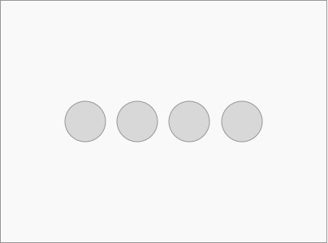


Sometimes, the items are not relative to each other, but relative to their container. You can use absolute positioning to specify where these items should be. For example, put the items at the corners:

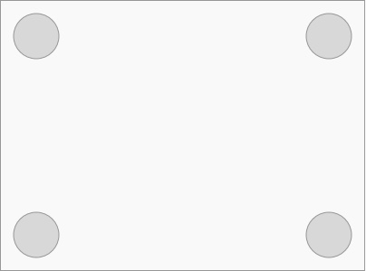


In the same container you can have mix items that are positioned by the layout system with items that are absolutely positioned:

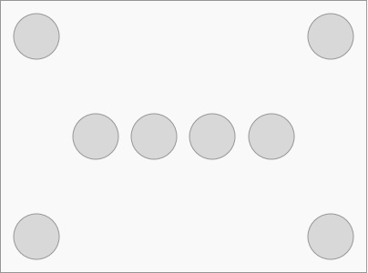


Absolutely positioned items are like stickers. They might cover over what's below them:

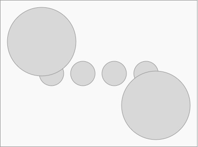

Finally, you can position items outside of the container:

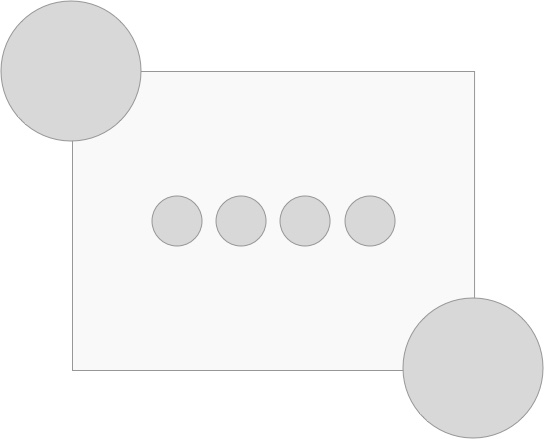


### Your Mission

Embed the app demo in the iPhone frame:


Add a transparent gradient overlay to the background image transitions smoothly to the background color of the page:


Add the Android robot at the bottom right corner of the last section:


# Static vs Relative

Usually an absolutely positioned item is relative to its container. Let's position a red box inside a green box:


```html
<div class="green">
  <div class="red">
  </div>
</div>
```

```css
.red {
  position: absolute;

  top: 10px;
  left: 10px;
}
```


If the green box is `position: relative`, it works as expected:

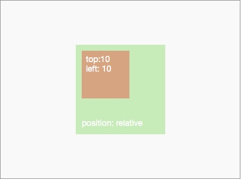


If the green box is `position: static`, the red box now is positioned oustide the green box, as though the green box is not there:


(Demo: http://codepen.io/hayeah/pen/ZbOzWV?editors=110)


`position: static` is the CSS default, but it's almost never useful. When using absolute positioning, you'd always have to remember to set the parent container to `position: relative`.

ReactNative changes the default to `position: relative` so we don't have to worry about this problem:


```css
/* ReactNative defaults */
body, div, span {
  box-sizing: border-box;

  /******************/
  position: relative;
  /******************/

  display: flex;
  flex-direction: column;
  align-items: stretch;
  flex-shrink: 0;
  align-content: flex-start;

  border: 0 solid black;
  margin: 0;
  padding: 0;
}
```


### Exercise: iPhone Demo

Use absolute positioning to embed the demo image inside the iPhone frame. The measurements are:


Add to the "Native Experience" section:

```html

```


Add to the "Touch & Gestures" section:

```html

```


Your result:


# Percentage Positioning

For responsive design, you'd often have to use percentage (%) to position elements, so their positions are relative to size of the window/screen.

It's easy to move an item to the center of a container:

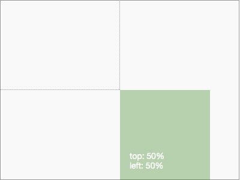


There is a problem, though... `top, left` moves the top-left corner of the positioned item. More often than not, you'd want the center of the positioned item to be centered. The easiest way to move the center of the item is to use the transform property, and move it by 50% of the item's size:

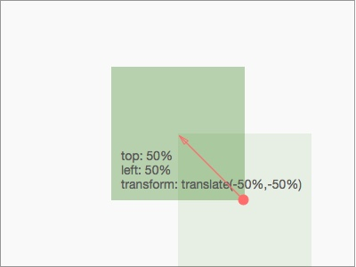


This technique works regardless of the size of the positioned item. To center items along the edge of a container:

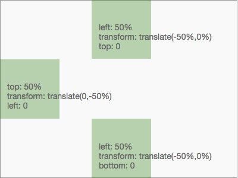


It's confusing that percentage means different things for different CSS properties, but they are mostly what you'd expect:

+ `left, right` - percentage refers to the width of the container.
+ `top, bottom` - percentage refers to the height of the container.
+ `translate(x%,y%)` - percentage refers to the width & height of the transformed item.
+ `padding, margin` - percentage refers to the width of the container.
  + Useful horizontally. Useless vertically.


> Note: Vertically centering is hard to achieve with traditional CSS layout techniques because `margin-top` and `margin-bottom` refer to the width of the container, not the height!
>
> If you can't use CSS3 `transform` for compatibility reasons, then you need to know the width & height of a positioned item in order to offset it with a negative margin...
>
> In summary, it sucks.


### Exercise: Android Robot

Position the android robot at the bottom right corner.

```html

```

+ `overflow: hidden` - the container should hide the robot if it's outside.
+ `rotate(-45deg)` - rotate the robot.

Your result:

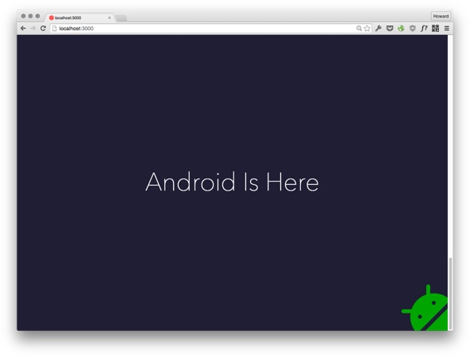


# Fixed Positioning

`position: fixed` is similar to `position: absolute`. The only difference is that a fixed item is relative to the screen/window, not the container. The item stays at the same place even when you scroll. It's perfect for UI, navigation, and menus.


### Exercise: Slider Control

Add html:


```html
<div id="slider-control">
  <a href="#native" class="active">
    <div class="dot"></div>
  </a>

  <a href="#touch">
    <div class="dot"></div>
  </a>

  <a href="#async">
    <div class="dot"></div>
  </a>

  <a href="#flex">
    <div class="dot"></div>
  </a>
</div>
```


Some basic stylings:

```css
#slider-control {
  padding: 3px;
}

#slider-control a {
  padding: 3px;
}

#slider-control .dot {
  width: 16px;
  height: 16px;
  border: 1px solid #fff;
  border-radius: 8px;
}

#slider-control .active .dot {
  background-color: #fff;
}
```


Your Result:

<video src="fixed-slider-control.mp4" controls autoplay loop></video>


# Overlay

Without this overlay the background transition looks abrupt:


We need to create a gradient overlay to smoothly transition from the background image to the background color. Like this:


There are three layers that should be stacked:

1. Bottom - The background image.
2. Middle - The linear gradient overlay.
3. Top - The content (title, navigation links).


There is another pitfall with static elements you should know.

+ `absolute, relative`: these elements have z-index.
+ `static`: these elements don't have z-index. Even if you assigned a z-index, this property is ignored.


The `img` and `h1` elements are `position: static`, so `z-index` doesn't work. They will appear behind all `absolute` or `relative` positioned elements:

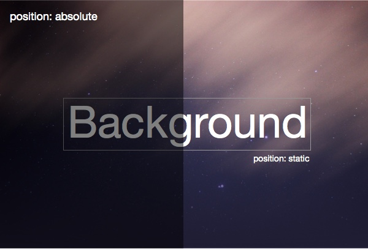

You should set the title to `position: relative` to give it a z-index. Now the title would appear above the overlay:

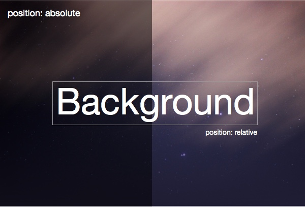


### Exercise: Intro Section Background

Set the background to an image:

```css
#intro-section {
  background-image: url(../img/background.jpg);
  background-size: cover;
  background-position: center;
}
```


Your Result:


### Exercise: Linear Gradient Overlay

The style for the overlay is:

```css
.overlay {
  background-image: linear-gradient(rgba(0,0,0,0),rgba(31,30,52,1));
}
```


Make sure that the logo and title aren't covered over by the overlay:


Your Result:


# Summary

`position: static` is useless, and sometimes evil. It might not be a bad idea to set globally:

```css
* {
  position: relative;
}
```


+ Container should not be `position: static`.
+ Use percentage to position items responsively.
+ Use CSS transform's `translate` function to offset an element by percentage of its own size.
+ If an element is `position: static`, it doesn't have z-index.


