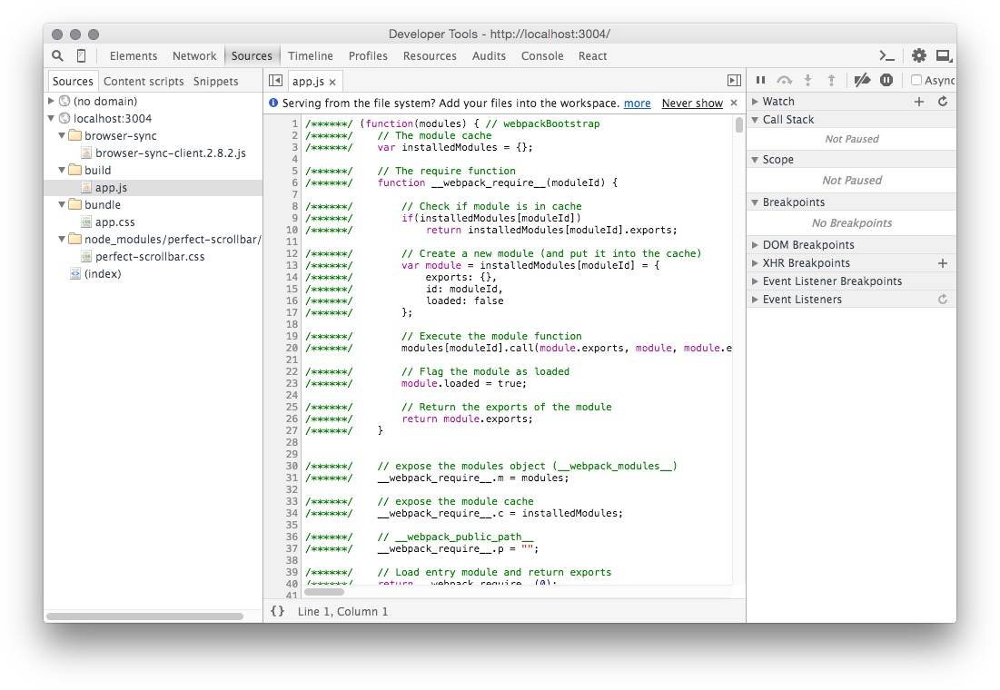
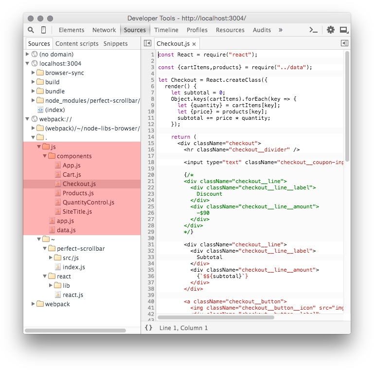

# Modular JavaScript With CommonJS

<cn>
# 模块化 JavaScript 和 CommonJS
</cn>

JavaScript is broken by default. `let` fixes common bugs caused by `var`, and `=>` fixes common bugs caused by `this`.

Up to now, we've been using `<script>` to load the JavaScript files we need. This is yet another big problem that needs fixing. The problems are:

+ Each `<script>` tag is one extra HTTP request. Slows down page load.
+ No explicit dependency tree between files.
+ You need to specify the correct loading order.
+ All script shares the same namespace.

In this lesson we'll use CommonJS break up `app.js` into smaller modules.

<cn>
JavaScript 生来有一些缺陷。`let` 修复了由 `var` 造成的常见问题，而 `=>` 修复了由 `this` 造成的常见问题。

目前为止，我们一直用 `<script>` 标签来加载我们需要的 JavaScript 文件。但还有一个大问题需要我们解决。这些问题包括：

+ 每个 `<script>` 标签都是是一次额外的 HTTP 请求，使得页面加载速度下降。
+ 在文件之间没有显式依赖树。
+ 你需要指定正确的加载顺序。
+ 所有的脚本都共享同一个命名空间。

在这一课中，我们将使用 CommonJS 来将 `app.js` 分解为小模块。
</cn>

# CommonJS Introduction

<cn>
# CommonJS 介绍
</cn>

CommonJS is the module system adopted by NodeJS. It's probably the most popular module system for JavaScript, and most tools ([Browserify](http://browserify.org), [Webpack](webpack.github.io), [TypeScript](http://www.typescriptlang.org/), [Flow](http://flowtype.org/), etc.) has builtin support for CommonJS.


Don't confuse CommonJS with NPM, though.

+ CommonJS - Breaks a project into smaller modules.
+ NPM - Create and install packages, which may or may not use CommonJS.

CommonJS doesn't introduce any new syntax to JavaScript. The CommonJS API adds just two things:

+ `require` - A function used to load a module.
+ `module.exports` - The module's exported content.

Like ES6, you need to compile your CommonJS project into normal JavaScript that the browser can understand.

<cn>
CommonJS 是 NodeJS/NPM 使用的模块系统。它也许是最流行的模块系统，有着最好的工具支持。不过，不要将 CommonJS 和 NPM 搞混了。

+ CommonJS - 将一个项目分解为小模块
+ NPM - 创建和安装包，不一定用到 CommonJS

CommonJS 不引入任何 JavaScript 的新语法。CommonJS API 只添加两个新东西：

+ `require` - 一个用于加载模块的函数
+ `module.exports` - 模块导出的内容

像在 ES6 一样，你需要将你的 CommonJS 项目编译成标准的 JavaScript 让浏览器能理解并执行。
</cn>

### CommonJS Interop With ES6 Modules

<cn>
### CommonJS 和 ES6 模块的相互操作
</cn>

ES6 module's design is heavily influenced by CommonJS. Because they are so similar, Babel allows you to use either interchangeably.

```js
// CommonJS
let foo = require("foo");

// ES6
import foo from "foo";
```

Babel will compile the ES6 `import` syntax to `require`.

<cn>
ES6 模块的设计深受 CommonJS 的影响。因为它们非常相似，Babel 允许你交叉使用它们。

```js
// CommonJS
let foo = require("foo");

// ES6
import foo from "foo";
```

Babel 将会把 ES6 的 `import` 编译成 `require`。
</cn>

# Using CommonJS Module

<cn>
# 使用 CommonJS 模块
</cn>

Since CommonJS is built into NodeJS, we can use the `node` interpreter to experiment with it. Let's start with a simple module that provides mathematical constants.

In CommonJS, each file you create is a module, there's no special syntax. Create the file `constants.js`:

```js
// constants.js
var pi = 3.14159;
var e = 2.71828;

var secretAnswer = 42;

module.exports = {
  pi: pi,
  e: e,
};
```

<cn>
由于 CommonJS 是内置在 NodeJS 中的，我们可以使用 `node` 解释器来做实验。让我们从一个简单的模块开始，这个模块提供一些数学常量。

在 CommonJS 中，每个你创建的文件都是一个模块，没有任何的特殊语法。创建一个 `constants.js` 文件：

```js
// constants.js
var pi = 3.14159;
var e = 2.71828;

var secretAnswer = 42;

module.exports = {
  pi: pi,
  e: e,
};
```
</cn>

This file is different from a file loaded with `<script>` in two ways:

+ The file has its own namespace. No need to wrap your code in a closure.
+ There is the special object `module.exports`.

CommonJS modules don't have names; they are just files. To load them, you use the `require` function, and specify which file you want to load. When the module is loaded, the `require` function returns `module.exports` as the result.

Let try to `require` the module `constants.js`. The value should be:

```js
{
  pi: pi,
  e: e,
}
```

<cn>
该文件和一个通过 `<script>` 加载的文件有两处不同：

+ 这个文件有自己的命名空间。不需要将你的代码包裹在一个闭包内。
+ 有一个特殊的对象 `module.exports`。

CommonJS 模块没有名字；它们只是文件而已。要加载它们，你需要使用 `require` 函数，同时指定你需要加载哪个文件。当模块被载入时，`require` 函数返回 `module.exports` 作为返回值。

让我们来尝试 `require` 模块 `constants.js`。它的值应该是：

```js
{
  pi: pi,
  e: e,
}
```
</cn>

### Exercise: Load a module with require

<cn>
### 练习：用 require 来加载一个模块
</cn>

First open a node shell:

```
// babel-node supports ES6
$ babel-node
```

<cn>
首先打开一个 node shell：

```
// babel-node supports ES6
$ babel-node
```
</cn>

Call `require` with the path to the module file:

```
> require("./constants")
{ pi: 3.14159, e: 2.71828 }
```

<cn>
调用 `require` 函数，传入模块文件的路径：

```
> require("./constants")
{ pi: 3.14159, e: 2.71828 }
```
</cn>

The value of `module.exports` is returned. If you try to use `pi`, you get an error:

```
> pi
ReferenceError: pi is not defined
```

<cn>
返回 `module.exports` 的值。如果你尝试使用 `pi`，你会得到一个错误：

```
> pi
ReferenceError: pi is not defined
```
</cn>

This is because `require` doesn't modify the current scope. It only returns the value of the loaded module.

Create a new local variable `pi`:

```js
> let pi = require("./constants").pi;
> pi
3.14159
```

<cn>
这是因为 `require` 函数不会修改当前的作用域。它只会返回加载模块的值。

新建一个本地变量 `pi`：

```js
> let pi = require("./constants").pi;
> pi
3.14159
```
</cn>

Using ES6's destructuring we can create variables more concisely:

```js
let {pi,e} = require("./constants");
var pie = pi + e;
```

<cn>
使用 ES6 的解构语法，我们可以更加简洁地新建变量：

```js
let {pi,e} = require("./constants");
var pie = pi + e;
```
</cn>

### Exercise: ES6 import syntax

<cn>
### 练习：ES6 import 语法
</cn>

The `import` is similar to CommonJS:

```js
> import "./constants";
{ pi: 3.14159, e: 2.71828 }
```

<cn>
`import` 语法和 CommonJS 相似：

```js
> import "./constants";
{ pi: 3.14159, e: 2.71828 }
```
</cn>

And to create multiple variables at the same time:

```js
import {pi,e} from "./constants";
var pie = pi + e;
```

<cn>
同时新建多个变量：

```js
import {pi,e} from "./constants";
var pie = pi + e;
```
</cn>

Use `babel` to compile the above code, you should see:

```js
var _constants = require("./constants");
var pie = _constants.pi + _constants.e;
```

<cn>
使用 `babel` 来编译上述代码，你应该看到：

```js
var _constants = require("./constants");
var pie = _constants.pi + _constants.e;
```
</cn>

### Exercise: Add a new export value

<cn>
### 练习：添加一个新的导出值
</cn>

Add a new number to `constants.js`:

```js
// The golden ratio
let phi = 1.61803;
```

<cn>
添加一个新的数字到 `constants.js` 中：

```js
// 黄金分割比例
let phi = 1.61803;
```
</cn>

From `babel-node`:

```
> import "./constants";
{ pi: 3.14159, e: 2.71828, phi: 1.61803 }
```

<cn>
在 `babel-node` 中：

```
> import "./constants";
{ pi: 3.14159, e: 2.71828, phi: 1.61803 }
```
</cn>

Note: Remember to restart `babel-node`, or else you wan't see the new module value.

Question: If you `require` a module 3 times, how many times is the file evaluated?

<cn>
注意：记得要重启 `babel-node`，否则你不会看到新的模块值。

问题：如果 `require` 一个模块三次，文件会执行几次？
</cn>

# Bundling With Webpack

<cn>
# 使用 Webpack 打包
</cn>

[Webpack](http://webpack.github.io/) is a tool that turns a CommonJS project into normal JavaScript that the browser can understand.

There are other older/mature/popular tools like [Grunt](http://gruntjs.com/), [Gulp](http://gulpjs.com/), and [Browserify](https://github.com/substack/node-browserify), is it safe to use a relatively new tool like Webpack? Maybe next week another build tool would become popular. If your project is already using an existing tool, it's likely not worth the effort to convert to Webpack.

<cn>
[Webpack](http://webpack.github.io/) 是一个将 CommonJS 项目转换成浏览器可读的标准 JavaScript 的工具。

既然已经有了其他 旧的/成熟的/流行的工具如 [Grunt](http://gruntjs.com/)，[Gulp](http://gulpjs.com/)，和 [Browserify](https://github.com/substack/node-browserify)， 使用一个像 Webpack 的相对新的工具安全吗？说不定下一周又会有一个新的工具流行起来。如果你的项目已经在使用某个已有的工具，转换到 Webpack 并不是太值得。
</cn>

Webpack is a complicated tool, with lots of [features](http://webpack.github.io/docs/) and [configuration options](http://webpack.github.io/docs/configuration.html). We'll avoid using the more advanced stuff, and focus on the core functionalities that all build tools would have:

+ Collects all CommonJS modules into a single file.
+ Provides fake `require` in the browser.
+ Ensures that a module is evaluated only once, and in the right order.
+ Converts ES6/JSX to ES5 (normal JavaScript).

Because any future build tools should have these features, there is less risk of being locked into Webpack. Indeed, it takes almost no work to convert between using Browserify and Webpack!

<cn>
Webpack 是一个复杂的工具，有很多的 [功能](http://webpack.github.io/docs/) 和 [配置项](http://webpack.github.io/docs/configuration.html)。我们将避免使用高级的内容，而集中在所有构建工具都有的核心功能上：

+ 将所有 CommonJS 模块转换一个文件。
+ 在浏览器中提供一个虚拟的 `require` 函数。
+ 保证每个模块只执行一次，且按照正确的顺序。
+ 将 ES6/JSX 转换为 ES5（标准的 JavaScript）。

因为任何未来的构建工具都会有这些功能，这样我们被限制在 Webpack 上的风险就很小了。事实上，在 Browserify 和 Webpack 之间切换几乎不需要任何工作！
</cn>

Install:

```
npm install webpack@1.12.2 --save-dev
```

<cn>
安装：

```
npm install webpack@1.12.2 --save-dev
```
</cn>

To be able to convert ES6/JSX to ES5, we'd also need to install the Webpack Babel plugin:

```
npm install babel-loader@5.3.3 --save-dev
```

Note: Babel has just [upgraded to 6.0](https://babeljs.io/blog/2015/10/29/6.0.0/), to be compatible with the former lesson we lock `babel-loader` to 5.x.

<cn>
要将 ES6/JSX 转换为 ES5，我们还需要安装 Webpack Babel 插件：

```
npm install babel-loader@5.3.3 --save-dev
```

注意：Babel 刚刚[升级到了 6.0](https://babeljs.io/blog/2015/10/29/6.0.0/)。为了和之前的课程一致，我们在这里将 `babel-loader` 的版本限定在 5.x。
</cn>

### Exercise: Bundling pie.js

<cn>
### 练习：打包 pie.js
</cn>

Let's try create a bundle with webpack. First, create the `pie.js` file:

```js
let {pi,e} =  require("./constants");
console.log("pie =",pi + e);
```

<cn>
让我们来尝试用 Webpack 来创建一个打包文件。首先，创建 `pie.js` 文件：

```js
let {pi,e} =  require("./constants");
console.log("pie =",pi + e);
```
</cn>

Evaluating `pie.js` with NodeJS should print out its value:

```
$ babel-node pie.js
pie = 5.85987
```

<cn>
在 NodeJS 中执行 `pie.js` 将输出它的值：

```
$ babel-node pie.js
pie = 5.85987
```
</cn>

Now let's make this work for the browser.

```
# webpack [entry-file] [bundle-file]
$ webpack pie.js pie-bundle.js --module-bind "js=babel"
webpack pie.js pie-bundle.js
Hash: c499792d1a74823ee7da
Version: webpack 1.12.2
Time: 65ms
        Asset     Size  Chunks             Chunk Names
pie-bundle.js  1.69 kB       0  [emitted]  main
   [0] ./pie.js 67 bytes {0} [built]
   [1] ./constants.js 145 bytes {0} [built]
```

+ The `entry-file` - The entry of the project. Put `window.onload` here.
+ The `bundle-file` - The bundled file.
+ `--module-bind` - All files with the `.js` extension should be compiled with Babel.

<cn>
现在让我们来让它在浏览器上也能运行。

```
# webpack [entry-file] [bundle-file]
$ webpack pie.js pie-bundle.js --module-bind "js=babel"
webpack pie.js pie-bundle.js
Hash: c499792d1a74823ee7da
Version: webpack 1.12.2
Time: 65ms
        Asset     Size  Chunks             Chunk Names
pie-bundle.js  1.69 kB       0  [emitted]  main
   [0] ./pie.js 67 bytes {0} [built]
   [1] ./constants.js 145 bytes {0} [built]
```

+ `entry-file` - 项目的入口文件。将 `window.onload` 放在这里。
+ `bundle-file` - 打包后的文件。
+ `--module-bind` - 所有拓展名为 `.js` 的文件都应该用 Babel 来编译。
</cn>

The bundled project is like:

```js
/******/ (function(modules) {

/* webpack loader. omitted */

/******/ })
/************************************************************************/
/******/ ([
/* 0 */
/***/ function(module, exports, __webpack_require__) {

  "use strict";

  var _require = __webpack_require__(1);

  var pi = _require.pi;
  var e = _require.e;

  console.log("pie =", pi + e);

/***/ },
/* 1 */
/***/ function(module, exports) {

  // constants.js
  "use strict";

  var pi = 3.14159;
  var e = 2.71828;

  module.exports = {
    pi: pi,
    e: e
  };

/***/ }
/******/ ]);
```

<cn>
打包后的项目应该像是这样的：

```js
/******/ (function(modules) {

/* webpack loader. 此处忽略 */

/******/ })
/************************************************************************/
/******/ ([
/* 0 */
/***/ function(module, exports, __webpack_require__) {

  "use strict";

  var _require = __webpack_require__(1);

  var pi = _require.pi;
  var e = _require.e;

  console.log("pie =", pi + e);

/***/ },
/* 1 */
/***/ function(module, exports) {

  // constants.js
  "use strict";

  var pi = 3.14159;
  var e = 2.71828;

  module.exports = {
    pi: pi,
    e: e
  };

/***/ }
/******/ ]);
```
</cn>

Run the bundled code in the browser to verify that it works!

Notice how the modules are wrapped in a function to ensure a new scope:

```
function(module,exports,__webpack_require__){
  // module code.
}
```

<cn>
在浏览器中运行打包后的代码以检验它能正常工作！

留意模块是如何被包裹在一个函数中，以保证一个新的作用域的：

```
function(module,exports,__webpack_require__){
  // module code.
}
```
</cn>

Also, the `require` function is replaced with `__webpack_require__`.

<cn>
以及，`require` 函数被 `__webpack__require__` 所取代。
</cn>

## Webpack Bootstrap

<cn>
## Webpack Bootstrap
</cn>

Reading the `webpackBootstrap` code is a good way to understand exactly how CommonJS works.

Modules are closures:

```js
// (function(modules) { ... })([modules])
let modules = [
/* 0 */
/***/ function(module, exports, __webpack_require__) {

  "use strict";

  var _require = __webpack_require__(1);

  var pi = _require.pi;
  var e = _require.e;

  console.log("pie =", pi + e);

/***/ },
/* 1 */
/***/ function(module, exports) {

  // constants.js
  "use strict";

  var pi = 3.14159;
  var e = 2.71828;

  module.exports = {
    pi: pi,
    e: e
  };

/***/ }
/******/ ]
```

<cn>
阅读 `webpackBootstrap` 代码是一个很好的方式来学习 CommonJS 具体是如何工作的。

模块就是闭包：

```js
// (function(modules) { ... })([modules])
let modules = [
/* 0 */
/***/ function(module, exports, __webpack_require__) {

  "use strict";

  var _require = __webpack_require__(1);

  var pi = _require.pi;
  var e = _require.e;

  console.log("pie =", pi + e);

/***/ },
/* 1 */
/***/ function(module, exports) {

  // constants.js
  "use strict";

  var pi = 3.14159;
  var e = 2.71828;

  module.exports = {
    pi: pi,
    e: e
  };

/***/ }
/******/ ]
```
</cn>

The definition for `require` is like this:

```js
var installedModules = {};

// The require function
function __webpack_require__(moduleId) {

  // Check if module is in cache
  if(installedModules[moduleId])
    return installedModules[moduleId].exports;

  // Create a new module (and put it into the cache)
  var module = installedModules[moduleId] = {
    exports: {},
    id: moduleId,
    loaded: false
  };

  // Execute the module function
  modules[moduleId].call(module.exports, module, module.exports, __webpack_require__);

  // Return the exports of the module
  return module.exports;
}
```

<cn>
`require` 函数的定义如下：

```js
var installedModules = {};

// require 函数
function __webpack_require__(moduleId) {

  // 检查模块是否在缓存中
  if(installedModules[moduleId])
    return installedModules[moduleId].exports;

  // 新建一个模块（并将其放入缓存中）
  var module = installedModules[moduleId] = {
    exports: {},
    id: moduleId,
    loaded: false
  };

  // 执行模块函数
  modules[moduleId].call(module.exports, module, module.exports, __webpack_require__);

  // 返回 module 的 exports 对象
  return module.exports;
}
```
</cn>

+ It caches the module in `installedModules`, so each module is executed just once.
+ It returns the value of `module.exports` at the end.

The most interesting line is the module execution:

```js
modules[moduleId].call(
  // `this` is module.exports
  module.exports,
  // Make `module` available to the module code
  module,
  // Make `exports` available to the module code
  module.exports,
  // For recursive require.
  __webpack_require__
);
```

<cn>
+ 它将模块缓存在 `installedModules`，所以每个模块只执行一次。
+ 它在最后返回 `module.exports` 的值。

最有趣的是模块执行的这一行代码：

```js
modules[moduleId].call(
  // `this` 是 module.exports
  module.exports,
  // 使得 `module` 在模块代码中能被引用
  module,
  // 使得 `exports` 在模块代码中能被引用
  module.exports,
  // 为了能够递归地使用 require
  __webpack_require__
);
```
</cn>

The only difference is that `__webpack_require__`  uses webpack's internal module id, which is the position of the module in the `modules` array.

And what is the "entry file"? It's the module that is automatically evaluated when the bundle is loaded:

```js
return __webpack_require__(0);
```

<cn>
（译者注：和 CommonJS 中的 `require`相比）唯一的不同在于 `__webpack_require__` 使用 webpack 的内部模块 id，也就是模块在 `modules` 数组中的位置下标。

那 "entry file" 是什么？它是在打包代码加载时自动执行的一个模块：

```js
return __webpack_require__(0);
```
</cn>

# Bundling BuyShoes Dependencies

<cn>
# 打包 BuyShoes 项目的依赖文件
</cn>

Let's bundle PerfectScrollbar and React with `app.jsx`.

<cn>
让我们来打包 PerfectScroolbar 以及 React 和 `app.jsx`。
</cn>

### Exercise: Bundling PerfectScrollbar and React

<cn>
### 练习：打包 PerfectScroolbar 和 React
</cn>

Remove from `index.html`:

```html
<script type="text/javascript" src="node_modules/perfect-scrollbar/dist/js/perfect-scrollbar.js"></script>
<script type="text/javascript" src="node_modules/react/dist/react.js"></script>
```

<cn>
在 `index.html` 中去掉它们：

```html
<script type="text/javascript" src="node_modules/perfect-scrollbar/dist/js/perfect-scrollbar.js"></script>
<script type="text/javascript" src="node_modules/react/dist/react.js"></script>
```
</cn>

In `app.jsx` add:

```js
const Ps = require("../node_modules/perfect-scrollbar/index");
const React = require("../node_modules/react/react");
```

<cn>
在 `app.jsx` 中添加：

```js
const Ps = require("../node_modules/perfect-scrollbar/index");
const React = require("../node_modules/react/react");
```
</cn>

Use Webpack to create the bundle to `build/app.js`. Bundling now takes somewhat longer because React is pretty big. Add the `--progress` option to the `webpack` command to see how many modules webpack had bundled.

Note: Add `--module-bind jsx=babel` so Webpack would use babel for .jsx files.

Note: The require paths are relative to the module file. Depending on where a file is, the relative path to `node_modules` is different:

+ `app.jsx` - require("./node_modules/...")
+ `a/app.jsx` - require("../node_modules/...")
+ `a/b/app.jsx` - require("../../node_modules/...")

<cn>
使用 Webpack 来新建打包文件到 `build/app.js`。现在打包需要稍微长一点的时间，因为 React 实在是有点大。在 `webpack` 命令中添加 `--progress` 指令可以查看 webpack 已经打包了多少模块。

注意：加上 `--module-bind jsx=babel`，这样 Webpack 才会用 Babel 来编译 .jsx 文件.

注意：require 的路径是和模块文件相关的。根据文件的位置，`node_modules` 的相对路径是不同的：

+ `app.jsx` - require("./node_modules/...")
+ `a/app.jsx` - require("../node_modules/...")
+ `a/b/app.jsx` - require("../../node_modules/...")
</cn>

# Require By Package Name

<cn>
# 根据包名来 require
</cn>

We can also use the package name to `require` React and PerfectScrollbar:

```js
const Ps = require("perfect-scrollbar");
const React = require("react");
```

<cn>
我们也可以用包名来 `require` React 和 PerfectScroolbar。

```js
const Ps = require("perfect-scrollbar");
const React = require("react");
```
</cn>

Usually `require` loads a file by its path. If it's a package name, NodeJS uses the `require.resolve` function to find which file to load. See which file `require("react")` would load:

```
$ node
> require.resolve("react")
./node_modules/react/react.js
```

<cn>
通常 `require` 根据其路径来加载文件。如果给出的是包名字，NodeJS 会使用 `require.resolve` 函数来找到哪个文件需要被加载。让我们看看 `require("react")` 是要加载哪个文件：

```
$ node
> require.resolve("react")
./node_modules/react/react.js
```
</cn>

### Exercise: Use package name to bundle React and PerfectScrollbar

<cn>
### 练习：使用包名来打包 React 和 PerfectScroolbar
</cn>

The result should be the same as before.

<cn>
结果应该和上一节一样。
</cn>

# Live-Edit

<cn>
# Live-Edit
</cn>

Webpack can automatically rebundle the project when you make changes. Just add the `--watch` option:

```
$ webpack --watch --progress ...
```

Because Webpack caches all the modules in memory, it needs to recompile only the module that had changed. In one of my projects, browserify+watchify takes 3~4 seconds to rebundle, but Webpack can do it in ~300ms.

<cn>
当你修改文件时，Webpack 可以自动对项目进行重新打包，只需要加入 `--watch` 选项：

```
$ webpack --watch --progress ...
```

因为 Webpack 将所有的模块都缓存在内存中，所以它只对变化了的模块进行重新编译。在我的一个项目中，browserify+watchify 要花 3~4 秒来重新打包，而 Webpack 能在大约 300ms 内完成。
</cn>

### Exercise: Modify Makefile for live-edit.

<cn>
### 练习：修改 Makefile 来实现 live-edit
</cn>

When you edit a file,

1. Webpack should compile and bundle the project.
2. BrowserSync should see that bundle file had changed, and reload the browser.

Change `make js` to make this happen.

<cn>
当你修改一个文件时，

1. Webpack 应该编译和打包项目。
2. BrowserSync 应察觉到打包的文件发生变化，重新加载浏览器页面。

修改 `make js` 任务来实现该效果。
</cn>

# Modularize BuyShoes

<cn>
# 模块化 Buyshoes
</cn>

Our goal is to reduce `app.jsx` to just this:

```js
// When the window is loaded, render the App component.
const App = require("./components/App");

window.onload = () => {
  React.render(<App/>,document.querySelector("#root"));
}
```

<cn>
我们的目标是将 `app.jsx` 缩减到以下所示：

```js
// 当窗口页面加载时，渲染 App 组件
const App = require("./components/App");

window.onload = () => {
  React.render(<App/>,document.querySelector("#root"));
}
```
</cn>

### Exercise: Modularize Fake Data

<cn>
### 练习：模块化假数据
</cn>

Create the file `js/data.js`:

```js
module.exports = {
  cartItems: ...
  products: ...
}
```

Then import data into `js/app.jsx`.

<cn>
新建一个文件 `js/data.js`：

```js
module.exports = {
  cartItems: ...
  products: ...
}
```

然后导入数据到 `js/app.jsx`。
</cn>

### Exercise: Modularize SiteTitle

<cn>
### 练习：模块化 SiteTitle
</cn>

Put the `SiteTitle` component into its own module. We'll put all components in the `js/components` directory.

First, create the directory `js/components`.

Then create the file `js/components/SiteTitle.js`:

```js
const React = require("react");
let SiteTitle = React.createClass({
  render() {
    return (
      <div className="title">
        <h2>Buy Me Shoes</h2>
        
      </div>
    );
  }
});

module.exports = SiteTitle;
```

<cn>
将 `SiteTitle` 组件放到它自己的模块中。我们将所有的模块都放到 `js/components` 文件夹中。

首先，创建文件夹 `js/components`。

然后新建文件 `js/components/SiteTitle.js`：

```js
const React = require("react");
let SiteTitle = React.createClass({
  render() {
    return (
      <div className="title">
        <h2>Buy Me Shoes</h2>
        
      </div>
    );
  }
});

module.exports = SiteTitle;
```
</cn>

Modify `app.jsx` to import this component.

Note: The extension must be `.js`, not `.jsx`.

<cn>
修改 `app.jsx` 来导入这个组件。

注意：扩展名必须是 `.js` 而不是 `.jsx`。
</cn>

### Exercise: Modularize Everything Else

<cn>
### 练习：模块化其他所有内容
</cn>

Turn all the components into modules.

It'd be easier to start with a simple App, then migrate the components one by one. Start with the components commented out:

```html
<div className="site">
  <div className="bg">
    <div className="bg__img">
    </div>
  </div>

  <div className="site__main">
    <div className="site__left-sidebar">
      <SiteTitle/>
    </div>
    <div className="site__content">
      {/* <Products/> */}
    </div> {/* site__content */}
  </div> {/* site__main */}
  <div className="site__right-sidebar">
    {/* <Cart/> */}
    {/* <Checkout/> */}
  </div> {/* site__right-sidebar */}
  <a className="site__right-sidebar-toggle">
    
  </a>
</div>
```

<cn>
将所有的组件转换为模块。

从一个简单的 App 开始会容易一点，然后再逐个逐个转移组件。从注释掉的组件开始吧：

```html
<div className="site">
  <div className="bg">
    <div className="bg__img">
    </div>
  </div>

  <div className="site__main">
    <div className="site__left-sidebar">
      <SiteTitle/>
    </div>
    <div className="site__content">
      {/* <Products/> */}
    </div> {/* site__content */}
  </div> {/* site__main */}
  <div className="site__right-sidebar">
    {/* <Cart/> */}
    {/* <Checkout/> */}
  </div> {/* site__right-sidebar */}
  <a className="site__right-sidebar-toggle">
    
  </a>
</div>
```
</cn>

+ `App` in `js/components/App.js`
+ `Cart` in `js/components/Cart.js`
+ `Products` in `js/components/Products.js`
+ etc.

<cn>
+ `App` 转移到 `js/components/App.js`
+ `Cart` 转移到 `js/components/Cart.js`
+ `Products` 转移到 `js/components/Products.js`
+ 等等
</cn>

# Source Map For Debugging

<cn>
# Source Map 用于调试
</cn>

The bundled `build/app.js` is a huge file, making it hard to debug.



<cn>
打包后的 `build/app.js` 是一个巨大的文件，使得调试非常困难。


</cn>

Thankfully, we can ask Webpack to generate [source map](http://www.html5rocks.com/en/tutorials/developertools/sourcemaps/), so Chrome can correlate between the JavaScript that runs in the browser, and the original source files you've written.

Add the `-d` option to the `webpack` command to enable the "development mode", which generates source map for your project.

See: [Webpack CLI - development shortcut -d](https://webpack.github.io/docs/cli.html#development-shortcut-d)

<cn>
幸好我们可以让 Webpack 来生成 [source map](http://www.html5rocks.com/en/tutorials/developertools/sourcemaps/)，这样 Chrome 就可以将浏览器中执行的 JavaScript 代码和你写的源代码对应起来。

在 `webpack` 命令中添加 `-d` 选项来启用 "开发模式"，该模式会为你的项目生成 source map。

查阅：[Webpack CLI - development shortcut -d](https://webpack.github.io/docs/cli.html#development-shortcut-d)
</cn>

With source map enabled, Chrome can now shows you the original source files:



<cn>
有了 source map，Chrome 现在就可以向你展示源代码了：


</cn>

# Minified JavaScript

<cn>
# 压缩版 JavaScript
</cn>

For production, you'd want to:

1. Make the bundle smaller. Removing comments and whitespace, etc.
2. Obfuscate the source so it's harder for other people to borrow/steal it.

<cn>
在生产环境中，你希望：

1. 将打包代码的体积变小，比如去掉注释和空格等。
2. 混淆代码，这样其他人会更难 借用/窃取 它。
</cn>

[Uglify](https://github.com/mishoo/UglifyJS2) is the most popular tool for minifying JavaScript. Webpack make it super easy. Just add the `-p` option to enable production mode, and you'd get a final output like:

```js
!function(e){function t(o){if(n[o])return n[o].exports;var r=n[o]={exports:{},id:o,loaded:!1};return e[o].call(r.exports,r,r.exports,t),r.loaded=!0,r.exports}var n={};return t.m=e,t.c=n,t.p="",t(0)}
```

<cn>
[Uglify](https://github.com/mishoo/UglifyJS2) 是最流行的压缩 JavaScript 的工具。 在 Webpack 下使用它超级容易，只需要添加 `-p` 选项启用生产模式，你就能得到如下输出：

```js
!function(e){function t(o){if(n[o])return n[o].exports;var r=n[o]={exports:{},id:o,loaded:!1};return e[o].call(r.exports,r,r.exports,t),r.loaded=!0,r.exports}var n={};return t.m=e,t.c=n,t.p="",t(0)}
```
</cn>

Comparing the `-p` (production) vs `-d` (development), the file decreased from 710k to 188k:

```
-rw-r--r--  1 howard  staff   188K 12 Oct 19:57 bundle/app.js
-rw-r--r--  1 howard  staff   710K 12 Oct 19:49 build/app.js
```

<cn>
将 `-p`（生产模式）和 `-d`（开发模式）进行对比，文件的大小从 710k 减少到 188k：

```
-rw-r--r--  1 howard  staff   188K 12 Oct 19:57 bundle/app.js
-rw-r--r--  1 howard  staff   710K 12 Oct 19:49 build/app.js
```
</cn>

### Exercise: Create the minjs task

<cn>
### 练习：新建 minjs 任务
</cn>

Add the `minjs` task to Makefile. It should create `bundle/app.js`, which is the minified version of `build/app.js`.

<cn>
在 Makefile 中添加 `minjs` 任务。该任务应该新建 `bundle/app.js`，它是 `build/app.js` 的压缩版本。
</cn>

# Summary

<cn>
# 总结
</cn>

We've seen how we can break a big file into modules.

+ Every file is a CommonJS module.
+ CommonJS adds `require` and `module.exports`.
+ ES6 modules adds the `import` and `export` syntax.
+ Load a package by calling `require` with the path to a file, or with a package name.
+ The `require` path is relative to the requiring file.
+ Use Webpack to bundle a CommonJS for the browser.

<cn>
在本课中，我们了解了如何将一个大文件分解成模块。

+ 每个文件都是一个 CommonJS 模块。
+ CommonJS 添加了 `require` 和 `module.exports`。
+ ES6 模块添加了 `import` 和 `export` 语法。
+ 调用 `require` 函数来加载模块，传入文件的路径或者包名。
+ `require` 使用的路径是关于调用 `require` 的文件的相对路径。
+ 使用 Webpack 来打包 CommonJS 模块，使得可以在浏览器中运行。
</cn>
