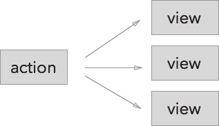

# Action To Store PubSub With Dispatcher

We've seen how Flux uses EventEmitter to connect stores and views, so if a piece of data changes, multiple views would update:



In this lesson we'll add pubsub between actions and stores, so one action can trigger multiple stores to update:


Usually there is a single dispatcher for the app. The dispatcher basically an EventEmitter that glues together an action and stores.

# So Much Loose Coupling!


Why so much pubsub?

+ It's "plug and play" architecture, so we can add and remove modules without changing any other code.
+ Modules are better isolated. The only way to communicate with a module is by sending it an event. In other words, [Message Passing](https://en.wikipedia.org/wiki/Message_passing).
+ Modules can control exactly how they could be triggered, by choosing which events to listen to.

Even though there is more boilerplate to write, the app as a whole is simpler.

But for a small to medium sized app, the benefits of action-store pubsub could feel more theoretical than real. In this lesson we'll make these ideas more concrete by building two additional features:

+ Logging service. To log all actions a user have taken.
+ Undo service. To be able to undo add to cart and remove from cart actions.

# The Central Dispatcher

The dispatcher is essentially an EventEmitter:

```js
import EventEmitter from "events";

const EVENT_NAME = "action";

module.exports = class Dispatcher {
  constructor() {
    this.emitter = new EventEmitter();
  }

  register(handler) {
    this.emitter.addListener(EVENT_NAME, handler);
  }

  unregister(handler) {
    this.emitter.removeListener(EVENT_NAME,handler);
  }

  dispatch(action) {
    this.emitter.emit(EVENT_NAME,action);
  }
}
```

By convention, an action is an object with the `type` property. And to pass arguments, you add additional properties to the object:

```js
function addCartItem(productId) {
  let actionObject = {
    // Type of the action.
    type: "addCartItem",

    // Arguments
    productId: productId,
  }
  dispatcher.dispatch(actionObject);
}
```

Then dispatcher passes action objects to stores. The store may look at the action object's type, and decide whether to handle the action or to ignore it. The CartStore looks like:

```js
// CartStore.js
// Listens to "action" events.
AppDispatcher.register((action) => {
  let handler = handlers[action.type];
  // Ignores the action if the store doesn't have a handler for it.
  handler && handler(action);
})

let handlers = {
  // Private Writer API. Don't export these functions!
  addCartItem(action) {
    let {productId} = action;
    _cartItems[productId] = {
      id: productId,
      quantity: 1,
    };

    emitChange();
  },
}
```

Previously we allowed views to call the store's writer API, now the only way to trigger store update is by passing action events through dispatchers.

# Multiple Plug And Play Services

The previous example is one action, one dispatcher, and one store. It may seem superflous to turn it into a pubsub architecture. Now let's look at an example that involves multiple actions and multiple action receivers.

We have the `addCartItem` and `removeCartItem` actions. These actions should trigger 3 different services:

1. CartStore should update the shopping cart's data.
2. The logging service should print the actions taken.
3. UndoStore should save the history, so we can revert to a previous state.

Without using the dispatcher, we'd wire in three different services directly into the actions:

```js
// hardwired actions
function addCartItem(productId) {
  CartStore.addCartItem(productId);

  LoggingService.log(...)

  UndoStore.saveHistory(...);
}

function removeCartItem(productId) {
  CartStore.removeCartItem(productId);

  LoggingService.log(...)

  UndoStore.saveHistory(...);
}
```

There are two problems.

1. The logic is centralized in these functions.
2. LoggingService and UndoStore has to be repeated for each action.

We can use the dispatcher to decentralize, by making the actions to only emit events:

```js
function addCartItem(productId) {
  dispatcher.dispatcher({type: "addCartItem", productId: productId});
}

function removeCartItem(productId) {
  dispatcher.dispatcher({type: "removeCartItem", productId: productId});
}
```

Then it's up to individual modules to decide how the actions should be handled:

```js
// plug-and-play modules:

// CartStore.js
dispatcher.register(action => {
  // ...
});

// LoggingService.js
dispatcher.register(action => {
  // ...
});

// UndoStore.js
dispatcher.register(action => {
  // ...
});
```

# Modify Search Suggestions To Use Dispatcher

[Search Suggestions With Dispatcher Demo](http://codepen.io/hayeah/pen/qOoqov?editors=001)

First create a dispatcher for the app:

```
let dispatcher = new Dispatcher();
```

The `updateSearchQuery` function dispatches the `updateSearchQuery` action. It also calls `receiveSuggestions` when the RemoteAPI returns with data:

```
function updateSearchQuery(query) {
  dispatcher.dispatch({type: "updateSearchQuery", query: query});

  RemoteAPI.fetchSuggestions(query,(suggestions) => {
    receiveSuggestions(suggestions);
  });
}
```

The `receiveSuggestions` action no longer calls the store method directly:

```js
function receiveSuggestions(suggestions) {
  dispatcher.dispatch({type: "receiveSuggestions", suggestions: suggestions});
  // suggestionsStore.setSuggestions(suggestions);
}
```

The suggestionsStore listens to action events from the dispatcher, and its writer methods is no longer visible to the outside:

```js
let suggestionsStore = (() => {
  let _suggestions = [];

  let emitter = new EventEmitter();

  // The writer API is now private.
  function setSuggestions({suggestions}) {
    _suggestions = suggestions;
    emitter.emit("change");
  }

  // The only way to call the writer method is by listening to action.
  dispatcher.register((action) => {
     if(action.type === "receiveSuggestions") {
       setSuggestions(action);
     }
  });

  // Only the Reader API is exported.
  return {
    getSuggestions() {
      return _suggestions;
    },

    addChangeListener(callback) {
      emitter.addListener("change",callback);
    },
  };
})();
```

The views stay the same as before.

# Logging Service

Let's create a logging service so we can monitor all the action events that are being emitted.

### Exercise: Implement Logging Service

The logging service itself is super simple:

```js
let AppDispatcher = require("./AppDispatcher");

module.exports = function enableLogging() {
  AppDispatcher.register((action) => {
    console.log(JSON.stringify({
      timestamp: new Date(),
      action
    },undefined,2));
  })
}
```

Please modify the following three actions to use the dispatcher:

+ addCartItem
+ removeCartItem
+ updateCartItemQuantity

You'll need to make quite a few changes:

+ `actions.js` -  Dispatch action objects to the dispatcher.
+ `AppDispatcher.js` -  An instance of Dispatcher, shared by the whole app.
+ Modify the views to call functions exported by `actions.js`
+ `LoggingService.js` is the logging service as defined above.
  + Call `enableLogging` to start the logging service.
+ Modify the `CartStore.js` writer API to be private.

Triggering any of these 3 actions should update the UI, as well as printing to the console.

Your result:

<video src="buyshoes-logging.mp4" controls></video>

# Specify Update Order With waitFor

While the dispatcher is essentially an event-emitter, you sometimes want to make sure that a store gets to process a message before another store. Facebook's Flux Dispatcher adds the `waitFor` method to ensure exactly that.

Install it with npm.

```
npm install flux@2.1.1
```

You can replace the DIY Dispatcher with the Dispatcher from Flux (they have the same API):

```
const {Dispatcher} = require("flux");
```

Your code should still work.

Now let's see in what order the subscribers receive an event. Create the file `test-dispatch-order.js`,

```
let dispatcher = new Dispatcher();

dispatcher.register((action) => {
  console.log("A", action);
});

dispatcher.register((action) => {
  console.log("C", action);
});

dispatcher.register((action) => {
  console.log("B", action);
});


dispatcher.dispatch({type: "test"});
```

Run with babel:

```
babel-node test-dispatch-order.js
```

You should see the output:

```
A { type: 'test' }
C { type: 'test' }
B { type: 'test' }
```

Try changing the order of the subscribers to get this output:

```
C { type: 'test' }
A { type: 'test' }
B { type: 'test' }
```

We can use `waitFor` to enforce an order. Here C waits for B, and B waits for A:

```
let tokenC = dispatcher.register((action) => {
  dispatcher.waitFor([tokenB]);
  console.log("C", action);
});

let tokenA = dispatcher.register((action) => {
  console.log("A", action);
});

let tokenB = dispatcher.register((action) => {
  dispatcher.waitFor([tokenA]);
  console.log("B", action);
});
```

This setup gurantees that the subscribers will run in the order of A, B, C:

```
A { type: 'test' }
B { type: 'test' }
C { type: 'test' }
```

Without `waitFor`, the order of action handling depends on the order in which modules are loaded. Using `waitFor` is a much better solution than trying to get one particular module to load before other modules.

In general, stores should be designed so it doesn't matter which one get to run the action first. You should only use `waitFor` for special circumstances.

# Undo Service

We'll add an undo button beside the "shopping cart" title:


+ If you've just added an item, undo should remove that item.
+ If you've just removed an item, undo should add that item.

### Exercise: Implement Shopping Cart Undo

The HTML structure looks like:

```html
<div className="cart">
  <h3 className="cart__title">Shopping Cart</h3>
  <div className="cart__content">
    ...
  </div>

  <h3 className="cart__undo"><a onClick={this.undo}>undo</a></h3>
</div>
```

And the CSS for `cart__undo`:

```css
.cart__undo {
  position: absolute;
  top: 0; right: 0;
  padding: 15px 0;
  justify-content: center;
  z-index: 20;
}
```

The `UndoStore` has a history array that stores snapshots of CartStore:

```js
// UndoStore.js

// Array of cartItems
let history = [
];
```

The idea to implement this feature is simple. Everytime `UndoStore` receives the `addCartItem` and `removeCartItem` actions, it should copy `CartStore.cartItems`, and store it in the history. Use the [cloneDeep](https://lodash.com/docs#cloneDeep) utility function to copy cartItems.

The `undoShoppingCart` action is like this:

```
function undoShoppingCart() {
  let carItems = UndoStore.lastHistoryItem();
  dispatcher.emit({type: "undoShoppingCart", cartItems: cartItems})
}
```

This action should trigger two changes:

+ CartStore should restore its internal data to the snapshot.
+ UndoStore's history items should decrease by 1.

If there's no more history to undo, the "undo" button should be hidden.

Hint: `CartStore` and `UndoStore` will need to require each other, but circular dependency is a bit broken for the CommonJS module syntax. For these two modules, don't use CommonJS export syntax:

```js
module.exports = {
  ...
}
```

Replace the above with ES6 module syntax:

```js
export default {
  ...
}
```

Use `import` to use these modules:

```
// In UndoStore.js
import CartStore from "./CartStore"

// In CartStore.js
import UndoStore from "./UndoStore"
```

Your result:

<video src="undo.mp4" controls></video>

# Summary

This lesson concludes our introduction to Flux.

Flux has two different pubsubs, solving two different sets of problems.

+ Store-View pubsub connects many views to the same data.
+ Action-Store pubsub connects many functionalities to the same action.

Facebook is at one end of the extreme, where one action could trigger many stores, and each store could trigger many views to update.

A framework like Redux is at the other end of the extreme, where one action could trigger one store, and one store could trigger one view to update.

Common to all Flux frameworks, though, is the unidirection flow from action to store, and from store to view.

And remember, NEVER allow stores to update other stores.


