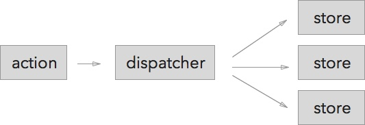

# Action To Store PubSub With Dispatcher

We've seen how Flux uses EventEmitter to connect stores and views, so if a piece of data changes, multiple views would update:


In this lesson we'll add pubsub between actions and stores, so one action can trigger multiple stores to update:



Usually there is a single dispatcher for the app. The dispatcher basically an EventEmitter that glues together an action and stores.

<cn>
# Action To Store PubSub With Dispatcher

我们已经看到 Flux 是如何使用 EventEmitter 来连接 store 和 view 的，如果一个数据发生了变化，会更新多个 view：


在本课中，我们将在 action 和 store 中添加发布订阅，这样一个 action 就可以触发多个 store 进行更新：


通常一个应用中有一个 dispatcher。Dispatcher 基本上就是一个连接 action 和 view 的 EventEmitter。
</cn>

# So Much Loose Coupling!


<cn>
# 好多松耦合啊！


</cn>

Why so much pubsub?

+ It's "plug and play" architecture, so we can add and remove modules without changing any other code.
+ Modules are better isolated. The only way to communicate with a module is by sending it an event. In other words, [Message Passing](https://en.wikipedia.org/wiki/Message_passing).
+ Modules can control exactly how they could be triggered, by choosing which events to listen to.

<cn>
为啥有这么多的发布订阅？

+ 它是一个 “即插即用” 的结构，所以我们可以在不修改任何代码的情况下添加和移除模块。
+ 模块被更好的隔离开来。和一个模块交流的唯一方式就是向其传递一个消息。换句话说，[消息传送](https://en.wikipedia.org/wiki/Message_passing)
+ 模块可以通过选择监听哪些事件，来准确控制它们被触发的方式。
</cn>

Even though there is more boilerplate to write, the app as a whole is simpler.

But for a small to medium sized app, the benefits of action-store pubsub could feel more theoretical than real. In this lesson we'll make these ideas more concrete by building two additional features:

+ Logging service. To log all actions a user have taken.
+ Undo service. To be able to undo add to cart and remove from cart actions.

<cn>
尽管还可以写很多的样板，但整个应用其实简单点。（译者注：说的是啥。。）

但对于一个中小型应用来说，action-store 发布订阅的好处更多的是理论上的，而不在实际中。在本课中，我们将通过构建两个额外的功能，让这些思想（译者注：发布订阅）更加的具体：

+ 日志 service，记录一个用户所做的所有行为。
+ 撤销操作 service，可以撤销动作如“添加到购物车”或”从购物车删除“。
</cn>

# The Central Dispatcher

The dispatcher is essentially an EventEmitter:

```js
import EventEmitter from "events";

const EVENT_NAME = "action";

module.exports = class Dispatcher {
  constructor() {
    this.emitter = new EventEmitter();
  }

  register(handler) {
    this.emitter.addListener(EVENT_NAME, handler);
  }

  unregister(handler) {
    this.emitter.removeListener(EVENT_NAME,handler);
  }

  dispatch(action) {
    this.emitter.emit(EVENT_NAME,action);
  }
}
```

<cn>
# 中心 Dispatcher

Dispatcher 本质上就是一个 EventEmitter：

```js
import EventEmitter from "events";

const EVENT_NAME = "action";

module.exports = class Dispatcher {
  constructor() {
    this.emitter = new EventEmitter();
  }

  register(handler) {
    this.emitter.addListener(EVENT_NAME, handler);
  }

  unregister(handler) {
    this.emitter.removeListener(EVENT_NAME,handler);
  }

  dispatch(action) {
    this.emitter.emit(EVENT_NAME,action);
  }
}
```
</cn>

By convention, an action is an object with the `type` property. And to pass arguments, you add additional properties to the object:

```js
function addCartItem(productId) {
  let actionObject = {
    // Type of the action.
    type: "addCartItem",

    // Arguments
    productId: productId,
  }
  dispatcher.dispatch(actionObject);
}
```

<cn>
按照惯例，一个 action 就是一个有 `type` 属性的对象。为了传递参数，你可以在对象中添加额外的属性：

```js
function addCartItem(productId) {
  let actionObject = {
    // action 的类型
    type: "addCartItem",

    // 参数
    productId: productId,
  }
  dispatcher.dispatch(actionObject);
}
```
</cn>

Then dispatcher passes action objects to stores. The store may look at the action object's type, and decide whether to handle the action or to ignore it. The CartStore looks like:

```js
// CartStore.js
// Listens to "action" events.
AppDispatcher.register((action) => {
  let handler = handlers[action.type];
  // Ignores the action if the store doesn't have a handler for it.
  handler && handler(action);
})

let handlers = {
  // Private Writer API. Don't export these functions!
  addCartItem(action) {
    let {productId} = action;
    _cartItems[productId] = {
      id: productId,
      quantity: 1,
    };

    emitChange();
  },
}
```

<cn>
Dispatcher 将 action 对象传递给 store. Store 可能会查看 action 对象的类型，然后决定是处理这个 action 还是忽略之。CartStore 看上去是这样的：

```js
// CartStore.js
// 监听 "action" 事件
AppDispatcher.register((action) => {
  let handler = handlers[action.type];
  // 如果 store 没有对应的句柄，忽略该 action
  handler && handler(action);
})

let handlers = {
  // 私有的写 API。不要暴露这些函数！
  addCartItem(action) {
    let {productId} = action;
    _cartItems[productId] = {
      id: productId,
      quantity: 1,
    };

    emitChange();
  },
}
```
</cn>

Previously we allowed views to call the store's writer API, now the only way to trigger store update is by passing action events through dispatchers.

<cn>
之前我们允许 view 调用 store 的写 API。现在触发 store 更新的唯一方法就是通过 dispatcher 传递 action 事件。
</cn>

# Multiple Plug And Play Services

<cn>
# 多个“即插即用” Service
</cn>

The previous example is one action, one dispatcher, and one store. It may seem superfluous to turn it into a pubsub architecture. Now let's look at an example that involves multiple actions and multiple action receivers.

We have the `addCartItem` and `removeCartItem` actions. These actions should trigger 3 different services:

1. CartStore should update the shopping cart's data.
2. The logging service should print the actions taken.
3. UndoStore should save the history, so we can revert to a previous state.

<cn>
刚才的例子是一个 action，一个 dispatcher，一个 store。将它变成一个发布订阅的架构看上去有点多余。现在让我们来看一个栗子，这个栗子包括多个 action 和多个 action 的接受者。

我们有 `addCartItem` 和 `removeCartItem` action。这些 action 会触发3个不同的 service：

1. CartStore 应该更新购物车的数据
2. 日志 service 应该将执行的操作打印出来
3. UndoStore 应该保存历史状态，这样我们可以倒退到前一个状态中。
</cn>

Without using the dispatcher, we'd wire in three different services directly into the actions:

```js
// hardwired actions
function addCartItem(productId) {
  CartStore.addCartItem(productId);

  LoggingService.log(...)

  UndoStore.saveHistory(...);
}

function removeCartItem(productId) {
  CartStore.removeCartItem(productId);

  LoggingService.log(...)

  UndoStore.saveHistory(...);
}
```

<cn>
在不使用 dispatcher 时，我们将这三个 service 直接放置在 action 中：

```js
// 硬编码的 actions
function addCartItem(productId) {
  CartStore.addCartItem(productId);

  LoggingService.log(...)

  UndoStore.saveHistory(...);
}

function removeCartItem(productId) {
  CartStore.removeCartItem(productId);

  LoggingService.log(...)

  UndoStore.saveHistory(...);
}
```
</cn>

There are two problems.

1. The logic is centralized in these functions.
2. LoggingService and UndoStore has to be repeated for each action.

<cn>
这里有两个问题：

1. 逻辑集中在这些函数里面。
2. LoggingService 和 UndoStore 不得不在每个 action 中重复一次。
</cn>

We can use the dispatcher to decentralize, by making the actions to only emit events:

```js
function addCartItem(productId) {
  dispatcher.dispatcher({type: "addCartItem", productId: productId});
}

function removeCartItem(productId) {
  dispatcher.dispatcher({type: "removeCartItem", productId: productId});
}
```

<cn>
我们可以用 dispatcher 来让这些 action 只触发事件，来去中心化：

```js
function addCartItem(productId) {
  dispatcher.dispatcher({type: "addCartItem", productId: productId});
}

function removeCartItem(productId) {
  dispatcher.dispatcher({type: "removeCartItem", productId: productId});
}
```
</cn>

Then it's up to individual modules to decide how the actions should be handled:

```js
// plug-and-play modules:

// CartStore.js
dispatcher.register(action => {
  // ...
});

// LoggingService.js
dispatcher.register(action => {
  // ...
});

// UndoStore.js
dispatcher.register(action => {
  // ...
});
```

<cn>
这样一来，如何处理这些 action 就由独立的模块来决定：

```js
// 即插即用的模块：

// CartStore.js
dispatcher.register(action => {
  // ...
});

// LoggingService.js
dispatcher.register(action => {
  // ...
});

// UndoStore.js
dispatcher.register(action => {
  // ...
});
```
</cn>

# Modify Search Suggestions To Use Dispatcher

<cn>
# 用 Dispatcher 修改 “搜索建议”
</cn>

[Search Suggestions With Dispatcher Demo](http://codepen.io/hayeah/pen/qOoqov?editors=001)

First create a dispatcher for the app:

```
let dispatcher = new Dispatcher();
```

<cn>
[用 Dispatcher 的 ”搜索建议“ Demo](http://codepen.io/hayeah/pen/qOoqov?editors=001)

首先为应用创建一个 dispatcher：

```
let dispatcher = new Dispatcher();
```
</cn>

The `updateSearchQuery` function dispatches the `updateSearchQuery` action. It also calls `receiveSuggestions` when the RemoteAPI returns with data:

```
function updateSearchQuery(query) {
  dispatcher.dispatch({type: "updateSearchQuery", query: query});

  RemoteAPI.fetchSuggestions(query,(suggestions) => {
    receiveSuggestions(suggestions);
  });
}
```

<cn>
`updateSearchQuery` 函数分发 `updateSearchQuery` 这个 action。它还在 RemoteAPI 返回数据时调用 `receiveSuggestions`：

```
function updateSearchQuery(query) {
  dispatcher.dispatch({type: "updateSearchQuery", query: query});

  RemoteAPI.fetchSuggestions(query,(suggestions) => {
    receiveSuggestions(suggestions);
  });
}
```
</cn>

The `receiveSuggestions` action no longer calls the store method directly:

```js
function receiveSuggestions(suggestions) {
  dispatcher.dispatch({type: "receiveSuggestions", suggestions: suggestions});
  // suggestionsStore.setSuggestions(suggestions);
}
```

<cn>
`receiveSuggestions` action 不再直接调用 store 的方法：

```js
function receiveSuggestions(suggestions) {
  dispatcher.dispatch({type: "receiveSuggestions", suggestions: suggestions});
  // suggestionsStore.setSuggestions(suggestions);
}
```
</cn>

The suggestionsStore listens to action events from the dispatcher, and its writer methods is no longer visible to the outside:

```js
let suggestionsStore = (() => {
  let _suggestions = [];

  let emitter = new EventEmitter();

  // The writer API is now private.
  function setSuggestions({suggestions}) {
    _suggestions = suggestions;
    emitter.emit("change");
  }

  // The only way to call the writer method is by listening to action.
  dispatcher.register((action) => {
     if(action.type === "receiveSuggestions") {
       setSuggestions(action);
     }
  });

  // Only the Reader API is exported.
  return {
    getSuggestions() {
      return _suggestions;
    },

    addChangeListener(callback) {
      emitter.addListener("change",callback);
    },
  };
})();
```

The views stay the same as before.

<cn>
suggestionsStore 监听由 dispatcher 传来的 action 事件，它的写方法也不再能够从外围访问到：

```js
let suggestionsStore = (() => {
  let _suggestions = [];

  let emitter = new EventEmitter();

  // 写 API 现在是私有的了
  function setSuggestions({suggestions}) {
    _suggestions = suggestions;
    emitter.emit("change");
  }

  // 调用写方法的唯一途径是监听某个事件
  dispatcher.register((action) => {
     if(action.type === "receiveSuggestions") {
       setSuggestions(action);
     }
  });

  // 只有读 API 被导出
  return {
    getSuggestions() {
      return _suggestions;
    },

    addChangeListener(callback) {
      emitter.addListener("change",callback);
    },
  };
})();
```

view 部分和之前一样。
</cn>

# Logging Service

<cn>
# 日志 Service
</cn>

Let's create a logging service so we can monitor all the action events that are being emitted.

<cn>
让我们来创建一个日志 service 这样我们可以监控所有被触发的 action 事件。
</cn>

### Exercise: Implement Logging Service

<cn>
### 练习：实现日志 Service
</cn>

The logging service itself is super simple:

```js
let AppDispatcher = require("./AppDispatcher");

module.exports = function enableLogging() {
  AppDispatcher.register((action) => {
    console.log(JSON.stringify({
      timestamp: new Date(),
      action
    },undefined,2));
  })
}
```

<cn>
日志 service 本身超简单：

```js
let AppDispatcher = require("./AppDispatcher");

module.exports = function enableLogging() {
  AppDispatcher.register((action) => {
    console.log(JSON.stringify({
      timestamp: new Date(),
      action
    },undefined,2));
  })
}
```
</cn>

Please modify the following three actions to use the dispatcher:

+ addCartItem
+ removeCartItem
+ updateCartItemQuantity

<cn>
请使用 dispatcher 修改以下3个 action：

+ addCartItem
+ removeCartItem
+ updateCartItemQuantity
</cn>

You'll need to make quite a few changes:

+ `actions.js` -  Dispatch action objects to the dispatcher.
+ `AppDispatcher.js` -  An instance of Dispatcher, shared by the whole app.
+ Modify the views to call functions exported by `actions.js`
+ `LoggingService.js` is the logging service as defined above.
  + Call `enableLogging` to start the logging service.
+ Modify the `CartStore.js` writer API to be private.

<cn>
你需要做一些改动：

+ `actions.js` -  将 action 对象分派给 dispatcher。
+ `AppDispatcher.js` -  一个 Dispatcher 实例，由全局共享。
+ 修改 view，调用 `actions.js` 导出的函数。
+ `LoggingService.js` 是之前定义的日志 service。
  + 调用 `enableLogging` 来启动日志 service
+ 修改 `CartStore.js` 的写 API，让它变为私有的。
</cn>

Triggering any of these 3 actions should update the UI, as well as printing to the console.

Your result:

<video src="buyshoes-logging.mp4" controls></video>

<cn>
调用这3个 action 的任意一个都会更新 UI，同时在控制台中打印日志。

你的结果应该是：

<video src="buyshoes-logging.mp4" controls></video>
</cn>

# Specify Update Order With waitFor

<cn>
# 用 waitFor 指定更新订单
</cn>

While the dispatcher is essentially an event-emitter, you sometimes want to make sure that a store gets to process a message before another store. Facebook's Flux Dispatcher adds the `waitFor` method to ensure exactly that.

Install it with npm.

```
npm install flux@2.1.1
```

<cn>
在 dispatcher 已经是一个 event-emitter 的情况下，你有时候还需要确保一个 store 在另一个 store 之前处理消息。Facebook 的 Flux Dispatcher 添加了一个 `waitFor` 方法来确保这个功能。

用 npm 安装：

```
npm install flux@2.1.1
```
</cn>

You can replace the DIY Dispatcher with the Dispatcher from Flux (they have the same API):

```
const {Dispatcher} = require("flux");
```

Your code should still work.

<cn>
你可以用 Flux 的 Dispatcher 来取代我们自己 DIY 的 Dispatcher（它们的 API 是一样的）：

```
const {Dispatcher} = require("flux");
```

你的代码一样可以工作。
</cn>

Now let's see in what order the subscribers receive an event. Create the file `test-dispatch-order.js`,

```
let dispatcher = new Dispatcher();

dispatcher.register((action) => {
  console.log("A", action);
});

dispatcher.register((action) => {
  console.log("C", action);
});

dispatcher.register((action) => {
  console.log("B", action);
});


dispatcher.dispatch({type: "test"});
```

<cn>
现在让我们来看订阅者接收一个事件时的顺序如何。创建一个名为 `test-dispatch-order.js` 的文件：

```
let dispatcher = new Dispatcher();

dispatcher.register((action) => {
  console.log("A", action);
});

dispatcher.register((action) => {
  console.log("C", action);
});

dispatcher.register((action) => {
  console.log("B", action);
});


dispatcher.dispatch({type: "test"});
```
</cn>

Run with babel:

```
babel-node test-dispatch-order.js
```

<cn>
在 babel 下运行：

```
babel-node test-dispatch-order.js
```
</cn>

You should see the output:

```
A { type: 'test' }
C { type: 'test' }
B { type: 'test' }
```

<cn>
你看到的结果应该如下：

```
A { type: 'test' }
C { type: 'test' }
B { type: 'test' }
```
</cn>

Try changing the order of the subscribers to get this output:

```
C { type: 'test' }
A { type: 'test' }
B { type: 'test' }
```

<cn>
尝试修改订阅者的先后顺序，得到这个输出：

```
C { type: 'test' }
A { type: 'test' }
B { type: 'test' }
```
</cn>

We can use `waitFor` to enforce an order. Here C waits for B, and B waits for A:

```
let tokenC = dispatcher.register((action) => {
  dispatcher.waitFor([tokenB]);
  console.log("C", action);
});

let tokenA = dispatcher.register((action) => {
  console.log("A", action);
});

let tokenB = dispatcher.register((action) => {
  dispatcher.waitFor([tokenA]);
  console.log("B", action);
});
```

<cn>
我们可以用 `waitFor` 方法来强制顺序。在这里，C 等待 B，B 等待 A：

```
let tokenC = dispatcher.register((action) => {
  dispatcher.waitFor([tokenB]);
  console.log("C", action);
});

let tokenA = dispatcher.register((action) => {
  console.log("A", action);
});

let tokenB = dispatcher.register((action) => {
  dispatcher.waitFor([tokenA]);
  console.log("B", action);
});
```
</cn>

This setup guarantees that the subscribers will run in the order of A, B, C:

```
A { type: 'test' }
B { type: 'test' }
C { type: 'test' }
```

<cn>
这样的设置保证了订阅者能够按 A，B，C 的顺序执行：

```
A { type: 'test' }
B { type: 'test' }
C { type: 'test' }
```
</cn>

Without `waitFor`, the order of action handling depends on the order in which modules are loaded. Using `waitFor` is a much better solution than trying to get one particular module to load before other modules.

In general, stores should be designed so it doesn't matter which one get to run the action first. You should only use `waitFor` for special circumstances.

<cn>
没有 `waitFor`，action 的顺序就依赖于哪个模块先被加载。相比于让一个特定的模块在另一个模块之前加载，使用 `waitFor` 是一个更好的解决方案。（译者注：也不是不可以让模块依赖，但这样需要额外的工作）

总的来说，store 应该被设计为哪个先运行 action 都不要紧的状态（译者注：尽量去除 store 间的依赖关系）。你只应该在某些特殊的情形下使用 `waitFor`。
</cn>

# Undo Service

<cn>
# 撤销操作 Service
</cn>

We'll add an undo button beside the "shopping cart" title:


+ If you've just added an item, undo should remove that item.
+ If you've just removed an item, undo should add that item.

<cn>
我们将在 "shopping cart" 标题旁边添加一个 ”撤销“ 按钮：


+ 如果你刚刚添加了一个商品，撤销操作会去掉这个商品；
+ 如果你刚刚去掉了一个商品，撤销操作会添加这个商品；

### Exercise: Implement Shopping Cart Undo

<cn>
### 练习：实现购物车的撤销操作
</cn>

The HTML structure looks like:

```html
<div className="cart">
  <h3 className="cart__title">Shopping Cart</h3>
  <div className="cart__content">
    ...
  </div>

  <h3 className="cart__undo"><a onClick={this.undo}>undo</a></h3>
</div>
```

<cn>
HTML 结构是这样的：

```html
<div className="cart">
  <h3 className="cart__title">Shopping Cart</h3>
  <div className="cart__content">
    ...
  </div>

  <h3 className="cart__undo"><a onClick={this.undo}>undo</a></h3>
</div>
```
</cn>

And the CSS for `cart__undo`:

```css
.cart__undo {
  position: absolute;
  top: 0; right: 0;
  padding: 15px 0;
  justify-content: center;
  z-index: 20;
}
```

<cn>
`cart__undo` 的 CSS：

```css
.cart__undo {
  position: absolute;
  top: 0; right: 0;
  padding: 15px 0;
  justify-content: center;
  z-index: 20;
}
```
</cn>

The `UndoStore` has a history array that stores snapshots of CartStore:

```js
// UndoStore.js

// Array of cartItems
let history = [
];
```

<cn>
`UndoStore` 有一个历史数据，记录 CartStore 的快照：

```js
// UndoStore.js

// cartItem 的数组
let history = [
];
```
</cn>

The idea to implement this feature is simple. Everytime `UndoStore` receives the `addCartItem` and `removeCartItem` actions, it should copy `CartStore.cartItems`, and store it in the history. Use the [cloneDeep](https://lodash.com/docs#cloneDeep) utility function to copy cartItems.

The `undoShoppingCart` action is like this:

```
function undoShoppingCart() {
  let carItems = UndoStore.lastHistoryItem();
  dispatcher.emit({type: "undoShoppingCart", cartItems: cartItems})
}
```

<cn>
实现这个功能的想法很简单。每次 `UndoStore` 接收到 `addCartItem` 和 `removeCartItem` action 时，它应该复制 `CartStore.cartItems`，并储存在历史数据中。使用 [cloneDeep](https://lodash.com/docs#cloneDeep) 函数来复制 cartItems。

`undoShoppingCart` action 是这样的：

```
function undoShoppingCart() {
  let carItems = UndoStore.lastHistoryItem();
  dispatcher.emit({type: "undoShoppingCart", cartItems: cartItems})
}
```
</cn>

This action should trigger two changes:

+ CartStore should restore its internal data to the snapshot.
+ UndoStore's history items should decrease by 1.

<cn>
这个 action 应该触发两个变化：

+ CartStore 应该将它的内部数据恢复到快照时的数据。
+ UndoStore 的历史数据应该减少1个。
</cn>

If there's no more history to undo, the "undo" button should be hidden.

Hint: `CartStore` and `UndoStore` will need to require each other, but circular dependency is a bit broken for the CommonJS module syntax. For these two modules, don't use CommonJS export syntax:

```js
module.exports = {
  ...
}
```

Replace the above with ES6 module syntax:

```js
export default {
  ...
}
```

<cn>
如果没有历史记录供撤销操作的话，那么 "撤销" 按钮应该隐藏起来。

提示：`CartStore` 和 `UndoStore` 需要相互 require，但 CommonJS 模块语法的循环引用有点问题。对于这两个模块，不要用 CommonJS 的 export 语法：

```js
module.exports = {
  ...
}
```

用 ES6 的模块语法代替以上代码：

```js
export default {
  ...
}
```
</cn>

Use `import` to use these modules:

```
// In UndoStore.js
import CartStore from "./CartStore"

// In CartStore.js
import UndoStore from "./UndoStore"
```

Your result:

<video src="undo.mp4" controls></video>

<cn>
用 `import` 来使用这些模块：

```
// 在 UndoStore.js
import CartStore from "./CartStore"

// 在 CartStore.js
import UndoStore from "./UndoStore"
```
</cn>

# Summary

This lesson concludes our introduction to Flux.

Flux has two different pubsubs, solving two different sets of problems.

+ Store-View pubsub connects many views to the same data.
+ Action-Store pubsub connects many functionalities to the same action.

Facebook is at one end of the extreme, where one action could trigger many stores, and each store could trigger many views to update.

A framework like Redux is at the other end of the extreme, where one action could trigger one store, and one store could trigger one view to update.

Common to all Flux frameworks, though, is the unidirection flow from action to store, and from store to view.

And remember, NEVER allow stores to update other stores.

<cn>
# 总结

这一课之后，我们对 Flux 的介绍就结束了。

Flux 有两种不同的发布订阅，解决两类不同的问题。

+ Store-View 发布订阅连接多个 view 和相同的数据。
+ Action-Store 发布订阅把同一个 action 和多个功能连接起来。

Facebook 走到一个极端：一个 action 可以触发多个 store，而每个 store 可以触发多个 view 的更新。

像 Redux 的框架则在另一个极端：一个 action 可以触发一个 store，一个 store 可以触发一个 view 的更新。

尽管如此，但所有的 Flux 框架的共同点是从 action 到 store，再从 store 到 view 的单向流。（译者注：Flux 除了是一个框架，也是一种模式，Redux 是应用这种模式的一个框架）

以及记住，**永远** 不要让 store 更新别的 store。
</cn>
