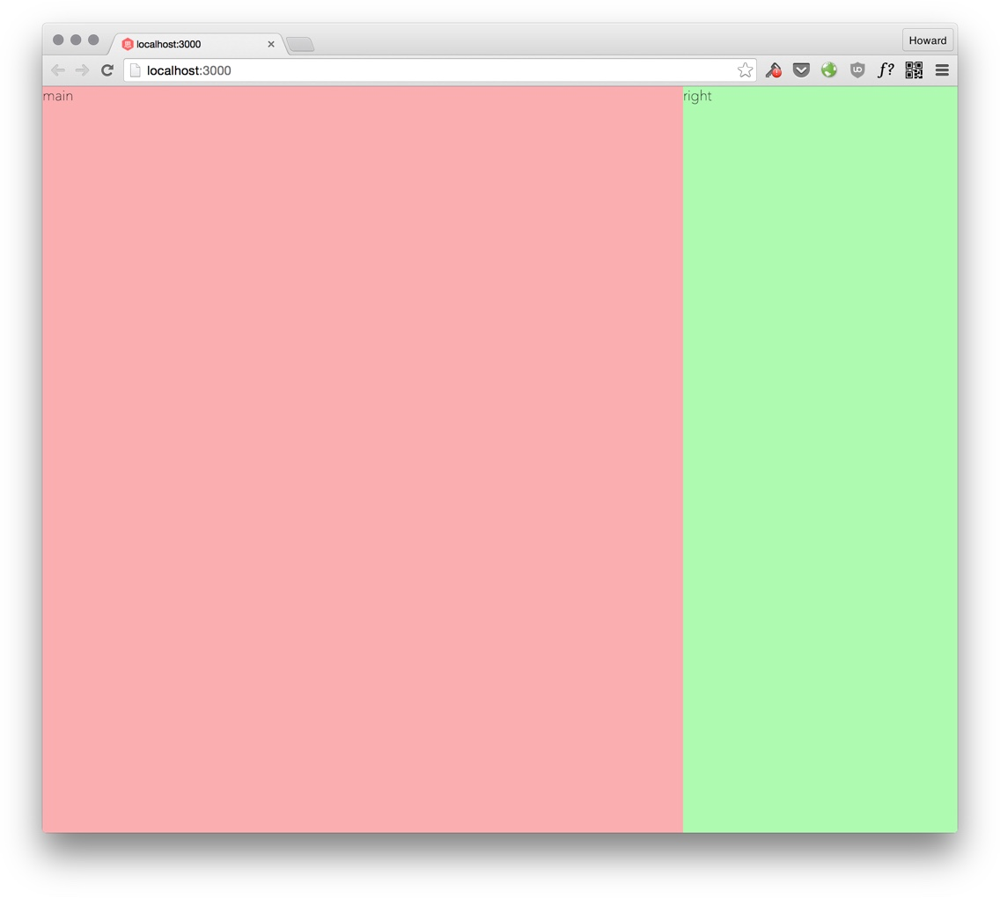

# Buy Shoes Site Layout

<cn>
# Buy Shoes 网页布局
</cn>

In the first week we learned to use flexbox to build a simple webpage. This week, we are going to build a more complex page with flexbox, a percentage-based responsive shopping cart.

<cn>
在第一周，我们已经学习了如何使用 flexbox 来搭建一个简单的网页。这一周，我们将继续学习使用 flexbox 来制作一个更加复杂的、基于百分比的响应式商品购物车网页。
</cn>

# Starter Kit

<cn>
# 基础项目
</cn>

To help you get started faster, download the starter kit for the `buyshoes` project:

```
git clone https://github.com/hayeah/sikeio-buyshoes-startkit.git buyshoes
```

<cn>

为了帮助你更快上手 `buyshoes`，开始之前，下载这个基础项目：

```
git clone https://github.com/hayeah/sikeio-buyshoes-startkit.git buyshoes
```

</cn>

After you've cloned the project, run `npm install` to install the project dependencies declared in `package.json`:

```
npm install
```

<cn>

在你克隆完项目之后，运行 `npm install` 来安装项目在 `package.json` 中所声明过的依赖：

```
npm install
```

</cn>

It's basically the same setup as the previous project. It has the same flexbox settings:

```css
/* Add more for your favourite HTML5 tags if you'd like */
body, div, span, a, img, h1, h2, h3, h4, h5 {
  box-sizing: border-box;
  position: relative;

  display: flex;
  flex-direction: column;
  align-items: stretch;
  flex-shrink: 0;
  align-content: flex-start;

  border: 0 solid black;
  margin: 0;
  padding: 0;
}

* {
  position: relative;
}
```

<cn>

配置基本上和前面一个项目一样，这个项目也有类似的 flexbox 设置：

```css
/* 如果你乐意的话，可以增加更多你所喜欢的 HTML5 标签 */
body, div, span, a, img, h1, h2, h3, h4, h5 {
  box-sizing: border-box;
  position: relative;

  display: flex;
  flex-direction: column;
  align-items: stretch;
  flex-shrink: 0;
  align-content: flex-start;

  border: 0 solid black;
  margin: 0;
  padding: 0;
}

* {
  position: relative;
}
```

</cn>

The `Makefile` is has the same tasks. To start development, open two separate terminals:

```
# terminal 1 - run browser-sync
make server

# terminal 2 - run the css compiler
make css
```

<cn>

`Makefile` 的作用也相类似。在开工之前，请打开两个不同的终端窗口：

```
# 终端 1 - 运行 browser-sync
make server

# 终端 2 - 运行 css 编译器
make css
```

</cn>

# BEM CSS Naming Convention

<cn>
# BEM CSS 命名约定
</cn>

For this project, we will use the awkward "BEM" naming convention. It seems ugly, but in reality it works great! Let's first see a problem that a more traditional CSS naming convention might have.

<cn>
在这个项目中，我们将使用一个看上去丑极了，事实上使用起来却效果很好的命名约定：BEM 命名约定。
</cn>

Suppose you have a company component:

```html
<div class="company">
  <div class="name">Google</div>
</div>
```

<cn>

假设有一个 company 模块：

```html
<div class="company">
  <div class="name">Google</div>
</div>
```
</cn>

The css for the company component looks like:

```css
.company {
  border: 1px solid blue;
}

.company .name {
  color: blue;
}
```

<cn>

company 模块的 css 是这样的：

```css
.company {
  border: 1px solid blue;
}

.company .name {
  color: blue;
}
```
</cn>

And you have a person component:


```html
<div class="person">
  <div class="name">Larry Page</div>
</div>
```

<cn>

同时，你有一个 person 模块：

```html
<div class="person">
  <div class="name">Larry Page</div>
</div>
```
</cn>

The CSS for the person component:

```css
.person {
  border: 1px solid red;
}

.person .name {
  color: red;
}
```

<cn>
person 的 css：

```css
.person {
  border: 1px solid red;
}

.person .name {
  color: red;
}
```
</cn>

The goal of componentizing html fragments is that you can embed a component anywhere. What if you embed the `person` component inside `company`:


```html
<div class="company">
  <div class="name">Google</div>

  <div class="about">
    <div class="person">

      <!-- Is Larry Page red or blue? -->
      <div class="name">Larry Page</div>

    </div>
  </div>
</div>
```

<cn>
像这样模块化 HTML 片段的目的就是为了能够把任何一个元素嵌入到网页的任何一个地方。如果当 `person` 模块放在 `company` 内会发生什么呢：

```html
<div class="company">
  <div class="name">Google</div>

  <div class="about">
    <div class="person">

      <!-- Larry Page 是红色还是蓝色？ -->
      <div class="name">Larry Page</div>

    </div>
  </div>
</div>
```
</cn>

It's not clear whether the color of "Larry Page" is red or blue. Although `.person .name` sets the color to red, the color could also be set by `.company .name`. BEM solves this problem with a brute force approach.

<cn>
在这里，并不能清楚地知道「Larry Page」究竟是红色还是蓝色的字。尽管 `.person .name` 把字的颜色设成了红色，但是与此同时 `.company .name` 也改变了字的颜色。打趣地说，BEM 可谓是使用暴力方式解决了这个问题。
</cn>

Since `name` is ambiguous, BEM prefixes all the elements that belong to a component with the component's name:

+ `.company .name` becomes `.company__name`
+ `.person .name` becomes `.person__name`

```html
<div class="company">
  <div class="company__name">Google</div>

  <div class="about">
    <div class="person">

      <div class="person__name">Larry Page</div>

    </div>
  </div>
</div>
```

<cn>
`name` 的定义是模棱两可的，所以 BEM 在所有元素前加上了其相对应模块的模块名：

+ `.company .name` 变成了 `.company__name`
+ `.person .name` 变成了 `.person__name`

```html
<div class="company">
  <div class="company__name">Google</div>

  <div class="about">
    <div class="person">

      <div class="person__name">Larry Page</div>

    </div>
  </div>
</div>
```
</cn>

Now it's clear what color "Larry Page" is.

With BEM, you never have to worry that embedding a component inside a container might inadvertently inherit styles from the parent container.

<cn>
到这里你应该很清楚「Larry Page」的颜色了吧。

有了 BEM，不必再担心所嵌入容器内的模块可能会在不经意间继承父容器的样式了。
</cn>

If you need different styles for different types of person, you create a modifier. For example:

+ `person--employee`
+ `person--founder`
+ `person--investor`

Using a modifier looks like:

```html
<div class="person person--founder">
  <div class="person__name">Larry Page</div>
</div>
```

<cn>
如果对于不同类型的 person 需要不同的样式，只需要创建一个修饰符。例如：

+ `person--employee`
+ `person--founder`
+ `person--investor`

使用起來看上去像下面这个例子：

```html
<div class="person person--founder">
  <div class="person__name">Larry Page</div>
</div>
```
</cn>

In summary BEM means:

+ Block - A component.
+ Element - An element in a component.
+ Modifier - Extra styles to create a variant of a component.

Read more about BEM: [BEM 101](https://css-tricks.com/bem-101/)

<cn>
总结一下，BEM 的三个字母分别代表了：

+ 块（Block） - 对应一个模块。
+ 元素（Element） - 对应了模块中的一个元素。
+ 修饰符（Modifier） - 对应了模块的不同属性。

进一步了解 BEM: [BEM 101](https://css-tricks.com/bem-101/)
</cn>

# Site Layout

<cn>
# 网站布局
</cn>

We'll start building the frame of the shoes store.

<cn>
接下来开始构建 shoes store 网站的框架。
</cn>

## Exercise: 2 Columns

<cn>
## 练习：双栏显示
</cn>

Divide the page into two containers:


<cn>
把整个页面划分成两个容器：


</cn>

For responsive design on different screen sizes, we could adjust the 2 columns to be have different shares:

+ 60/40 (to make the sidebar bigger for narrow screens).
+ 70/30.
+ 80/20 (to make the sidebar smaller for wider screens).

<cn>
对于在不同屏幕大小下的响应式布局，我们可以调节两栏的比例：

+ 60/40（更大的侧边栏，适应更窄的屏幕(bad translation)）。
+ 70/30。
+ 80/20（更小的侧边栏，适应更宽的屏幕(bad translation)）。
</cn>

Use this html:

```html
<div class="site">
  <!-- 70% main area -->
  <div class="site__main">
    main
  </div>

  <!-- 30% sidebar -->
  <div class="site__right-sidebar">
    right
  </div> <!-- site__right-sidebar -->
</div> <!-- site -->
```

<cn>
使用下面这个 HTML：

```html
<div class="site">
  <!-- 70% 的主要区域 -->
  <div class="site__main">
    main
  </div>

  <!-- 30% 的侧边栏 -->
  <div class="site__right-sidebar">
    right
  </div> <!-- site__right-sidebar -->
</div> <!-- site -->
```
</cn>

Your result:



<cn>
你的结果：


</cn>

## Exercise: Subdivision

<cn>
## 练习：子划分
</cn>

Quite often you'd want to divide a container left/right or top/down. Here we need to do both.

+ Divide `site__main` to left and right parts.
+ Divide `site__right-sidebar` to top and bottom parts.


<cn>
通常你会面临把一个容器划分成上下或者左右两部分的问题。接下来我们会解决这两个问题。

+ 将 `site__main` 划分为左右两部分。
+ 将 `site__right-sidebar` 划分为上下两部分。


</cn>

The html:

```html
<div class="site">
  <div class="site__main">
    <div class="site__left-sidebar">
      <h2>Buy Some Shoes</h2>
    </div>

    <div class="site__content">
      <div class="products">
        <div class="product">Product</div>
        <div class="product">Product</div>
        <div class="product">Product</div>
        <div class="product">Product</div>
      </div> <!-- products -->
    </div> <!-- site__content -->
  </div>

  <div class="site__right-sidebar">
    <div class="cart">Shopping Cart</div>
    <div class="checkout">Checkout</div>
  </div> <!-- site__right-sidebar -->
</div> <!-- site -->
```

<cn>
HTML 文件：

```html
<div class="site">
  <div class="site__main">
    <div class="site__left-sidebar">
      <h2>Buy Some Shoes</h2>
    </div>

    <div class="site__content">
      <div class="products">
        <div class="product">Product</div>
        <div class="product">Product</div>
        <div class="product">Product</div>
        <div class="product">Product</div>
      </div> <!-- products -->
    </div> <!-- site__content -->
  </div>

  <div class="site__right-sidebar">
    <div class="cart">Shopping Cart</div>
    <div class="checkout">Checkout</div>
  </div> <!-- site__right-sidebar -->
</div> <!-- site -->
```
</cn>

Question: What's the difference between `flex-basis: 0`  and `flex-basis: auto`? If you used `flex-basis: auto`, what problem would you run into if there is a lot of content in `site__content` or `cart`?

<cn>
问题：`flex-basis: 0` 和 `flex-basis: auto` 的区别在哪里？当 `site__content` 或者 `cart` 中内容很多的时候，使用了 `flex-basis: auto` 的你将面临什么问题？
</cn>

Your result:


<cn>
你的结果：


</cn>

# Products Layout

<cn>
# 商品布局
</cn>

Next, we want to fill `site__content` with products. Just make each `product` container 50%, so two of these would fill their parent container:


<cn>
接下来我们要用商品来填充 `site__content` 这一部分。将每个 `product` 元素调整为容器的 50%，使得两个商品并列着排列能够填充满整个容器。


</cn>

+ `flex-wrap: wrap` tells the container to break into multiple lines if the content is too long.

<cn>
+ 当内容过长时，`flex-wrap: wrap` 让容器划分成多行显示。
</cn>

### Exercise: Products Layout

<cn>
### 练习：商品布局
</cn>

We'll fill in the product content (image, title, price) later. For now, let's use explicit width and height to create the product placeholders:

```css
.product {
  width: 50%;
  height: 250px;
}
```

<cn>
现在我们先使用固定的宽度和高度来给产品预留位置。之后，我们将插入商品的图片、标题和价格等内容。

```css
.product {
  width: 50%;
  height: 250px;
}
```
</cn>

When we add content to the `product` containers we'll remove the `height` property, so that their heights would fit the content.

<cn>
当我们向 `product` 容器添加内容的时候，记得移除 `height` 属性。这样商品能够根据内容的多少来自适应高度。
</cn>

Your result:


<cn>
你的结果：


</cn>

# Fixed Sidebars

<cn>
# 固定侧边栏
</cn>

We don't want the sidebars to move when we scroll the page.

<cn>
滚动网页的时候，我们并不想看到侧边栏滚动的场景。
</cn>

### Exercise: Make Sidebars Fixed

<cn>
### 练习：让侧边栏固定
</cn>

Set sidebars to `position: fixed`. When an element is `fixed` or `absolute`, it is "taken out of the layout", as though it doesn't exist. This is why `site__content` expands into the space that was occupied by the left sidebar:


<cn>
给侧边栏设置 `position: fixed` 的属性。当一个元素是 `fixed` 或者是 `absolute` 的时候，**它会被移出布局流**，就好像不存在一样。这就能解释 `site__content` 向左扩张到左侧侧边栏所占据的位置的原因了。


</cn>

There are two ways to fix that. You could:

1. Reserve the sidebar space by adding padding to the container.
2. Reserve the sidebar space by adding margin to the content.

Choose whichever that's more convenient. In this case it doesn't matter.

<cn>
有两种方式能够修复这个问题，你可以：

1. 对于容器：通过增加 padding 来保留侧边栏的位置。
2. 对于容器中的内容：通过增加 margin 来保留侧边栏的位置。

任选一种更加方便的实现方式。在这个例子中，无论哪一种都可以使用。
</cn>

Your result:

<video src="fixed-sidebars.mp4" controls autoplay loop></video>

<cn>
你的结果：

<video src="fixed-sidebars.mp4" controls autoplay loop></video>
</cn>

# Scrollable Shopping Cart

<cn>
# 可以上下滚动的购物车列表
</cn>

If there many items in the cart, we want to be able to scroll through them. For now, we'll specify an explicit height for the cart items, so we can work on the layout before working on the details.

<cn>
想象一下购物车中有很多商品，我们需要上下滚动它们。现在，我们给这些加到购物车中的商品设置一个固定的高度，这样就能够在深入下一步之前调整布局了。
</cn>

### Exercise: Make Shopping Cart Scrollable

<cn>
### 练习：让购物车列表上下滚动起来
</cn>

Add the following HTML:

```html
<div class="cart">
  <h3 class="cart__title">Shopping Cart</h3>
  <div class="cart__content">
    <div class="cart-item">cart item</div>
    <div class="cart-item">cart item</div>
    <div class="cart-item">cart item</div>
    <div class="cart-item">cart item</div>
    <div class="cart-item">cart item</div>
    <div class="cart-item">cart item</div>
    <div class="cart-item">cart item</div>
  </div>
</div>

<div class="checkout">
</div> <!-- checkout -->
```

<cn>
在 HTML 中加入以下内容：

```html
<div class="cart">
  <h3 class="cart__title">Shopping Cart</h3>
  <div class="cart__content">
    <div class="cart-item">cart item</div>
    <div class="cart-item">cart item</div>
    <div class="cart-item">cart item</div>
    <div class="cart-item">cart item</div>
    <div class="cart-item">cart item</div>
    <div class="cart-item">cart item</div>
    <div class="cart-item">cart item</div>
  </div>
</div>

<div class="checkout">
</div> <!-- checkout -->
```
</cn>

There isn't anything in cart-item or checkout yet. We'll temporarily give them a height:

```css
.cart-item {
  height: 150px;
  margin-bottom: 20px;
  background: rgba(0,255,0,0.3);
}

.checkout {
  height: 300px;
  background: rgba(0,0,255,0.3);
}
```

<cn>
现在购物车内还没有任何等待付款的商品。我们暂时先设置一个固定的高度：

```css
.cart-item {
  height: 150px;
  margin-bottom: 20px;
  background: rgba(0,255,0,0.3);
}

.checkout {
  height: 300px;
  background: rgba(0,0,255,0.3);
}
```
</cn>

The CSS property you need is [overflow](https://developer.mozilla.org/en-US/docs/Web/CSS/overflow). It controls what happens when there's too much content to fit inside a container.

<cn>
在这里你需要了解的一个 CSS 属性叫做 [overflow](https://developer.mozilla.org/en-US/docs/Web/CSS/overflow)。当容器内部有过多的内容时，由 `overflow` 来控制内容的显示方式。
</cn>

Your result:

<video src="scrollable-cart.mp4" controls loop autoplay></video>

<cn>
你的结果：

<video src="scrollable-cart.mp4" controls loop autoplay></video>
</cn>

# Better Shopping Cart Scrolling

<cn>
# 更好的购物车滚动列表实现
</cn>

There are two problems with the shopping cart scrolling:

+ There are two scrollbars. One for the window, and one for the shopping cart. Very ugly.
+ When you scroll to the end of the shopping cart, the window scrolls.

<cn>
购物车列表上下滚动的时候有两个问题：

+ 显示的时候会有两个滚动条。一个是窗口的滚动条，还有一个是购物车的滚动条。其丑无比！
+ 当购物车滚动到底部时，窗口继续接着滚动。
</cn>

Let's replace the default scrollbar with the JavaScript plugin [perfect-scrollbar](http://noraesae.github.io/perfect-scrollbar/). It looks like:

<video src="perfect-scroll-demo.mp4" controls loop autoplay></video>

<cn>
我们用一个 JavaScript 插件 [perfect-scrollbar](http://noraesae.github.io/perfect-scrollbar/) 来替换掉默认的滚动条。它看上去像视频里这个样子：

<video src="perfect-scroll-demo.mp4" controls loop autoplay></video>
</cn>

Install it:

```
npm install perfect-scrollbar@0.6.4 --save
```

<cn>
安装：

```
npm install perfect-scrollbar@0.6.4 --save
```
</cn>

### Exercise: Use Perfect Scrolling

<cn>
### 练习：使用 Perfect Scrolling
</cn>

Use a `<script>` tag to load perfect-scroll. Then in `app.js`:

```js
function makeCartScrollNicely() {
  var cart = document.querySelector(...);
  Ps.initialize(cart);
}
```

<cn>
使用 `<script>` 标签来载入 perfect-scroll。然后在 `app.js` 添加:

```js
function makeCartScrollNicely() {
  var cart = document.querySelector(...);
  Ps.initialize(cart);
}
```
</cn>

Your result:

<video src="scrollable-cart-perfect.mp4" controls loop autoplay></video>

<cn>
你的结果：

<video src="scrollable-cart-perfect.mp4" controls loop autoplay></video>
</cn>

### Exercise: Don't Scroll The "Shopping Cart" Title

<cn>
### 练习：购物车的标题不要跟着一起滚动
</cn>

Finally, we don't want the title to move when we scroll the cart's content. You need to:

1. Keep the title in the same place.
2. Reserve space at the the top of the scrollable content, so the title doesn't cover the first item.

<cn>
最后，我们并不希望看到购物车的标题跟着一起滚动。你需要做的是：

1. 让标题固定在同一处。
2. 为购物车列表的头部留出一个标题的空间。这样不会让标题覆盖到列表中的第一个商品。
</cn>

Your result:

<video src="cart-scroll-fixed-title.mp4" controls></video>

<cn>
你的结果：

<video src="cart-scroll-fixed-title.mp4" controls></video>
</cn>

# Summary

<cn>
# 总结
</cn>

+ `flex-grow: 1; flex-basis: 0` is a useful pattern to create a container that grows to fill its parent, but does not grow bigger than its parent even if there is a lot of content.
+ Use `perfect-scrollbar` is a good replacement for the browser built-in scrollbar.

<cn>
+ `flex-grow: 1; flex-basis: 0` 通常作为一种范式来创建一个能够充满其父元素的容器，并且能够在有大量内容填充的时候，该容器不会超过其父元素的容器大小。
+ 使用 `perfect-scrollbar` 插件是一种很好的替代浏览器内置的滚动条的方式。
</cn>

