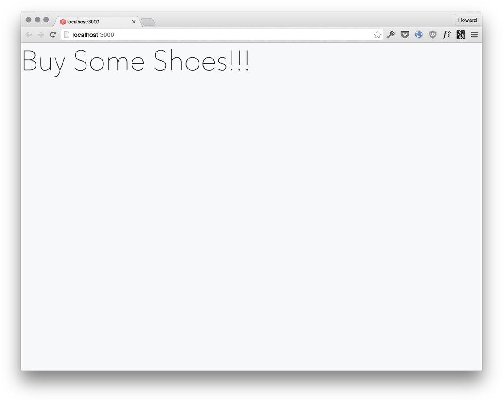
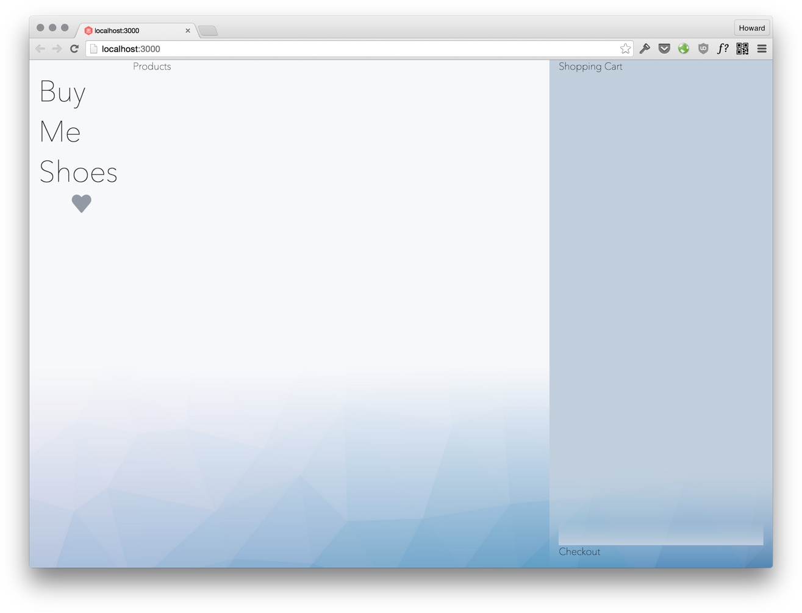
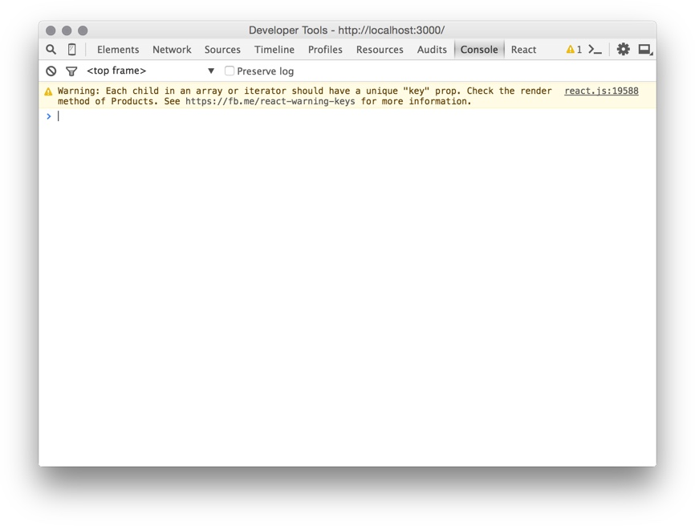

# Reactify The Buy Shoes Page

<cn>
# React 化 Buy Shoes 页面
</cn>

In this lesson we are going to rewrite the `buyshoes` page in React. We'll cover the following:

+ Compile ES6 & JSX with Babel.
+ Virtual DOM with JSX.
+ Writing React components.
+ Using the `key` property to allow reordering.

[Why React?](../why-react)

# Lesson StarterKit

For this lesson, we have provided a reference implementation for the `buyshoes` page. It includes the HTML and css.

```
git clone https://github.com/hayeah/sikeio-buyshoes-startkit.git sikeio-buyshoes-react
cd sikeio-buyshoes-react
git checkout styled
```

You could use your own if you want.

## Project Assets

We'll add different kinds of shoes.

Download images here: https://github.com/hayeah/sikeio-buyshoes-assets/tree/master/shoes

# Full Page Refresh And Virtual DOM

A browser refresh is the simplest way to update a page. The server renders the new page with the latest data, and the browser loads the new page. There is no need for client-side code to manipulate the DOM.

React's Virtual DOM is like server-side rendering for the client-side. Every time user clicks a button, or enters some text that changes the data, React generates the new UI using the latest data. A render in React is essentially the same as replacing the body's `innerHTML` with the new UI:

```js
document.body.innerHTML = updatedHTML;
```

Like a browser refresh, there is no DOM manipulation. But setting innerHTML is inefficient because it destroys the old DOM tree and rebuilds an entirely new DOM tree.

The virtual DOM makes the "full page refresh" technique efficient. React detects what had changed, and only updates the DOM elements that had changed. It also adds, removes, and reorders DOM elements as necessary.

With React, you get the simplicity of programming client-side as though you are always doing a full-page refresh, yet with the efficiency of direct DOM manipulation.

Let's look at an example that contrasts DOM manipulation with "full page refresh".

Here's a snippet that generates a greeting message:

```js
var name = "Howard";

var view = (
  '<div>' +
    '<p>Hello, <b>' + name + '</b></p>'+
    '<p>Current Time: ' + new Date() + '</p>'+
  '</div>'
);

document.body.innerHTML = view;
```

[Codepen Demo](http://codepen.io/hayeah/pen/LpWVXa?editors=001)

If we want to update the time every second, we might manipulate the DOM like this:

```js
var name = "Howard";

var view = (
  '<div>' +
    '<p>Hello, <b>' + name + '</b></p>'+
    '<p class="current-time">Current Time: ' + new Date() + '</p>'+
  '</div>'
);

document.body.innerHTML = view;

function updateTime() {
  var $currentTime = document.querySelector(".current-time");
  $currentTime.innerHTML = "Current Time: " + new Date();
}

setInterval(updateTime,1000);
```

[Codepen Demo](http://codepen.io/hayeah/pen/KdWpjX?editors=001)

But as soon as we start to manipulate DOM, the code gets ugly. The `view` no longer tells you everything about what is shown to the user, because now you have to know how other pieces of code could change the view.

A much simpler programming model is to regenerate the whole UI every second:

```js
var name = "Howard";

function render() {
  var view = (
    '<div>' +
      '<p>Hello, <b>' + name + '</b></p>'+
      '<p>Current Time: ' + new Date() + '</p>'+
    '</div>'
  );

  document.body.innerHTML = view;
}

setInterval(render,1000);
```

[Codepen Demo](http://codepen.io/hayeah/pen/rOyVov?editors=001)

There is no DOM manipulation. The `view` tells us exactly what the UI is. While the "full page refresh" programming model is simple, it is too inefficient. Setting the innerHTML destroys the old DOM tree and replaces it with an newly built DOM tree:

<video src="setting-innerHTML.mp4" controls autoplay loop></video>

React avoids the expenses of rebuilding the DOM tree. The code in React looks almost the same:

```js
var name = "Howard";

function render() {
  var view = (
    <div>
      <p>Hello, <b>{name}</b></p>
      <p>Current Time: {(new Date()).toString()}</p>
    </div>
  );

  // document.body.innerHTML = view;
  React.render(view,document.body);
}

setInterval(render,1000);
```

But React detects that only the time had changed, and updates only that specific DOM element:

<video src="dom-reconciliation.mp4" controls autoplay loop></video>

Efficient "full page refresh" is React's most important idea.

# Babel Compiler For ES6 And JSX

Babel is the ES6 compiler that is most closely linked with React. It has great support for React right out of the box.

+ CommonJS support.
+ JSX syntax for virtual dom.
+ ES6 and ES7 features.
+ Compiles to readable ES5 that can run anywhere.

To install Babel:

```
npm install babel@5.8.23 --save-dev
```

Verify that Babel is installed:

```
$ babel --version
5.8.21 (babel-core 5.8.22)
```

For a good summary of ES6 features see: [ES6 Features](https://github.com/lukehoban/es6features).

You can see all the ES6 & ES7 features that Babel supports in its [list of transformers](https://babeljs.io/docs/advanced/transformers/). It's possible to turn on/off individual features to control exactly what you'd allow your team to use.

The two most important ES6 features are `let` and `=>`. You should always use them.

+ Use `let` to replace `var`. Always.
+ Use `=>` to replace anonymous functions. Always.

ES6 helps you to write more succinct code. See [ES6 With React](../es6-with-react).

# Getting Started With React Virtual DOM

Our first task is to get React running. Install React:

```
npm install react@0.13.3 --save-dev
```

Let's create the component `App` in a new file called `js/app.jsx`:

```js
// The App component.
let App = React.createClass({
  // The `render` method will generate the `buyshoes` site's virtual DOM.
  render() {
    return (
      <div className="site">
        <h1>Buy Some Shoes!!!</h1>
      </div>
    );
  },
});

window.onload = () => {
  // Replace innerHTML of `#root` with the App component.
  React.render(<App/>,document.querySelector("#root"));
}
```

Use Babel to compile `js/app.jsx`, we can see the result in the terminal:

```js
$ babel js/app.jsx
var App = React.createClass({
  displayName: "App",

  render: function render() {
    return React.createElement(
      "div",
      { className: "site" },
      React.createElement(
        "h1",
        null,
        "Buy Some Shoes!!!"
      )
    );
  }
});

window.onload = function () {
  React.render(React.createElement(App, null), document.querySelector("#root"));
};
```

JSX is just a simple mapping from HTML onto `React.createElement` calls. The first argument is the type of element. The second argument is a map of properties.

The `React.createElement` API:

```js
ReactElement createElement(
  string/ReactClass type,
  [object props],
  [children ...]
)
```

### Virtual DOM Is Side-Effect Free

JSX may resemble other conventional template languages, like PHP:

```html
<html>
   <head>
      <title>Online PHP Script Execution</title>
   </head>

   <body>

      <?php
         echo "<h1>Hello, PHP!</h1>";
      ?>

   </body>
</html>
```

But in fact, JSX is a thin syntatic sugar coating for the virtual DOM API, which has a
completely different programming model. The virtual DOM is a tree of ordinary JavaScript objects. There is a lot of flexibility in how we build the virtual DOM.

For example, we could break render into two separate methods:

```js
// The App component.
let App = React.createClass({
  renderTitle() {
    return (
      <h1>Buy Some Shoes!!!</h1>
    );
  },

  render() {
    return (
      <div className="site">
        {this.renderTitle()}
      </div>
    );
  },
});
```

Or we can generate three titles using `map`:

```js
let App = React.createClass({
  renderTitle() {
    return (
      <h1>Buy Some Shoes!!!</h1>
    );
  },

  render() {
    return (
      <div className="site">
        {[1,2,3].map(this.renderTitle)}
      </div>
    );
  },
});
```

Or we could move the three titles outside the `.site` div:

```js
let App = React.createClass({
  renderTitle() {
    return (
      <h1>Buy Some Shoes!!!</h1>
    );
  },

  render() {
    let titles = [1,2,3].map(this.renderTitle);

    return (
      <div className="site">
        {titles}
      </div>
    );
  },
});
```

Using functional programming jargon, the virtual DOM API is "side-effect free". Being side-effect free gives you three important guarantees:

+ You can call render methods many times.
+ You can call render methods in any order.
+ As long as the inputs are the same (state, props), the virtual DOM output is the same.

These guarantees gives you a lot of flexibilty in how you could refactor your code.

Conventional templating languages aren't this flexible. For example, if we reordered `document.write`, we'd get the wrong output:

```js
renderTitle() {
  document.write('<h1>Buy Some Shoes!!!</h1>');
}

render() {
  [1,2,3].forEach(this.renderTitle);

  document.write('<div className="site">');
  document.write('<div>');
}
```

Don't let the familiar HTML syntax deceive you. The essence of JSX is the `React.createElement` method.

### Exercise: Create The App Component

Create the file `js/app.jsx`:

```js
$ babel js/app.jsx
var App = React.createClass({
  displayName: "App",

  render: function render() {
    return React.createElement(
      "div",
      { className: "site" },
      React.createElement(
        "h1",
        null,
        "Buy Some Shoes!!!"
      )
    );
  }
});

window.onload = function () {
  React.render(React.createElement(App, null), document.querySelector("#root"));
};
```

Previously we used `babel` to output the compiled result to the terminal. Now we want to save the compiled result to `build/app.js`:

```
# Make sure that the `build` directory exists.
mkdir -p build

# Compiles js/app.jsx
babel js/app.jsx --out-file build/app.js
```

Next, load React and `build/app.js`:

```js
<script type="text/javascript" src="node_modules/react/dist/react.js"></script>
<script type="text/javascript" src="build/app.js"></script>
```

Note: Rendering React onto body would remove elements added by BrowserSync. To avoid that,we render the App component onto the element `#root`.

Your result:



### Exercise: Get LiveReload To Work

The project configuration is slightly more complicated. We need to:

1. Automatically compile `js/app.jsx`.
2. Create the `make js` task to compile jsx.
3. Modify BrowserSync to watch the compiled jsx.

Add the `--watch` option so Babel would automatically recompile `js/app.jsx` when it changed:

```
$ babel --watch js/app.jsx --out-file build/app.js
```

Open three terminals, and run:

1. `make css` - rebuild css.
2. `make js` - rebuild jsx.
3. `make server` - reload the browser.

### Exercise: `make all`

It's annoying to have to open three terminals to run three different processes. You could add an `all` task that runs all three at the same time:

```
.PHONY: all
all:
  (make css & make js & make server & wait)
```

Hit `Ctrl-C` to stop them all at the same time.

# React Components

```
npm install react@0.13.3 --save-dev
```

Instead of one big render method, you should break a page into multiple components so each one is responsible for a smaller part of the page. Generally speaking there are three uses for components:

+ If a UI element is reused, then it should be a component.
  + `.cart-item` and `.product`.
+ A container that holds a list of items should be its own component.
  + `.products` is a component that holds a list of `.product` components.
+ If a a component gets too big or to complicated, you could try to break it into subparts.

You should try to keep the `render` method between 50~80 lines of code.

It's up to you to judge whether it's worth the effort to turn a fragment of HTML into its own component. Sometimes it might make more sense to create a helper method instead.

Consider the `.bg` element:

```html
<div class="site">
  <div class="bg">
    <div class="bg__img">
    </div>
  </div>
  <!-- other stuff -->
</div>
```

You could create a component:

```html
<div className="site">
  <Background/>
</div>
```

Or you could create a helper method:

```html
<div className="site">
  {this.renderBackground()}
</div>
```

# Reactify The App

The React components we'll create mirror closely the BEM components we already have. Let's start with the site layout.

### Exercise: The App should define the layout

Your App component should have a structure like this:

```js
<div class="site">
  <div class="bg">
    <div class="bg__img">
    </div>
  </div>

  <div class="site__main">
    <div class="site__left-sidebar">
      <!-- <SiteTitle/> -->
    </div>

    <div class="site__content">
      <!-- <Products/> -->

    </div> <!-- site__content -->
  </div> <!-- site__main -->

  <div class="site__right-sidebar">

  <!-- <Cart/> -->
  <!-- <Checkout/> -->

  </div> <!-- site__right-sidebar -->

  <a class="site__right-sidebar-toggle">
    
  </a>

</div> <!-- site -->
```

First, translate the HTML into JSX.

Then you need to create 4 new React components: "SiteTitle", "Products", "Cart", and "Checkout". Leave these components empty for now. We'll fill in the details later.

Note: If you are lazy like me, you'd probably Google for a tool that automatically converts HTML to React. See: [HTML to JSX Compiler](https://facebook.github.io/react/html-jsx.html)

Note: In JSX, comments must be a JavaScript coment: `{/* I am a JavaScript comment */}`. Check the Babel compilation result to see how it works.

Your result:



# Componentize Products

We'll do this in two steps:

1. Display a single product.
2. Display list of different products.

### Exercise: Create the Product component

Let's convert the `.product` HTML to a component:

```html
<div class="product">
  <div class="product__display">
    <div class="product__img-wrapper">
      
    </div>

    <a class="product__add">
      
    </a>

    <div class="product__price">
      $299
    </div>
  </div>

  <div class="product__description">
    <div class="product__name">
      Marana E-Lite
    </div>

    
  </div>
</div> <!-- product -->
```

We want the Product component to render the product object:

```js
let product = {
  name: "Jameson Vulc",
  price: 64.99,
  imagePath: "img/shoes/jameson-vulc-brown-gum-orig.png",
  gender: "man",
};
```

For now, we'll hardwire the `Products` container to render a single product:

```js
let Products = React.createClass({
  render() {
    let product = {
      name: "Jameson Vulc",
      price: 64.99,
      imagePath: "img/shoes/jameson-vulc-brown-gum-orig.png",
      gender: "man",
    };

    return (
      <div className="products">
        <Product product={product}/>
      </div>
    );
  }
});
```

The most important piece of code in the `Products` container is:

```js
<Product product={product}/>
```

It creates a Product component, with `product` as a property. The `Product` component looks like:

```js
let Product = React.createClass({
  render() {
    // This component requires the `product` property.
    let {name,price,imagePath} = this.props.product;

    ...
  }
});
```

Your result:


### Exercise: Render multiple products

Now we want the `Products` container to render a list of products, not just one. Add the following as a global variable to `js/app.jsx`:

```js
let products = {

  "jameson-vulc": {
    id: "jameson-vulc",
    name: "Jameson Vulc",
    price: 64.99,
    imagePath: "img/shoes/jameson-vulc-brown-gum-orig.png",
    gender: "man",
  },

  ...

  "corby-womens-2": {
    id: "corby-womens-2",
    name: "Corby Women's",
    imagePath: "img/shoes/corby-womens-2-tan-white-orig.png",
    price: 44.99,
    gender: "woman",
  },
};
```

Download the full list of products: [products.js](products.js)

Note: Remember that a JSX element is just a value. You can put it in a variable, return it from a function, or put it in an array:

```js
let children = [
  <div>1</div>,
  <div>2</div>,
  <div>3</div>,
];

return (
  <div className="container">
    {children}
  </div>
);
```

Your result:


Note: If you look at the console, React complains that `key` prop is missing.

```
Warning: Each child in an array or iterator should have a unique "key" prop. Check the render method of Products. See https://fb.me/react-warning-keys for more information.
```

We'll fix this problem in the next section.



# Component Key

Suppose you have 6 divs:

```html
<div>1</div>
<div>2</div>
<div>3</div>
<div>4</div>
<div>5</div>
<div>6</div>
```

And you want to move the first div to the end:

```html
<div>2</div>
<div>3</div>
<div>4</div>
<div>5</div>
<div>6</div>
<div>1</div>
```

If you don't use the `key` prop, React would update the divs like this:

1. update div 1 to be 2
1. update div 2 to be 3
1. update div 3 to be 4
1. update div 4 to be 5
1. update div 5 to be 6
1. update div 6 to be 1

The `key` prop gives a child a unique identity, so React knows that that it can reorder these children rather than updating them.

Let's consider this example in actual code. `Numbers` is component that moves the first number to the end, once every second:

```js
let Numbers = React.createClass({
   getInitialState() {
    return {
      numbers: [1,2,3,4,5,6,7,8,9,0]
    };
  },

  // Cycle numbers every second.
  componentDidMount() {
    setInterval(this.cycleNumbers,1000);
  },

  // Move the first number to the end.
  cycleNumbers() {
    let {numbers} = this.state;
    let copiedNumbers = shuffle(numbers.slice());

    let firstNumber = copiedNumbers.shift();
    copiedNumbers.push(firstNumber);

    // Change this.state.numbers. Would cause `render` to calculate the new virtual DOM.
    this.setState({numbers: copiedNumbers});
  },

  render() {
    let {numbers} = this.state;

    let children = numbers.map(n => {
      return (
        <div>{n}</div>
      );
    });

    return (
      <div>{children}</div>
    )
  }
});
```

[Codepen Demo](http://codepen.io/hayeah/full/dYvNXy)

But if you look in Chrome Inspector, you'd see that all the divs are being updated:

<video src="number-cycle-updates-all.mp4" controls autoplay loop></video>

Instead of updating all the divs, we want them to be reordered. To enable reordering, add the `key` property to each div:

```js
let children = numbers.map(n => {
  return (
    <div key={n}>{n}</div>
  );
});
```

[Codepen Demo](http://codepen.io/hayeah/full/KdWWPb/)

<video src="numbers-cycle-movement.mp4" controls autoplay loop></video>

Each key uniquely identifies a div element, so React is now able to reorder them. You should always provide the `key` property to an array of children.

### Exercise: Fix the "should have a unique key prop" error

# Reactify Cart

Now let's create the `Cart` component. It follows a similar structure as `Products`.

### Exercise: Implement the Cart component

Again, let's fake the data (for now) by declaring a global variable:

```js
let cartItems = {
  "jameson-vulc": {
    id: "jameson-vulc",
    quantity: 1,
  },

  "scout-womens-6": {
    id: "scout-womens-6",
    quantity: 2,
  },
};
```

Remember to add a "x 2" if the quantity is greater than 1.

Your result:


# Reactify Checkout

Finally, let's create the `Checkout` component. For now, we'll just calculate the subtotal of all the cart items. Later we'll implement coupon verification and discount.

### Exercise: Implement the Checkout component

Your result:


# Summary

+ JSX is a syntatic sugar for `React.createElement`.
  + Can put virtual DO created JSX in variables, arrays, or return from function.
+ Virtual DOM construction should be side-effects free.
  + Given the same `this.state` and `this.props`, `render` should calculate the same virtual DOM.
+ Parent component passes data to child components using the `this.props` property.
  + Use ES6 destructuring to make your code more concise.
+ Use `key` to give child components a unique identity so React can reorder them.
