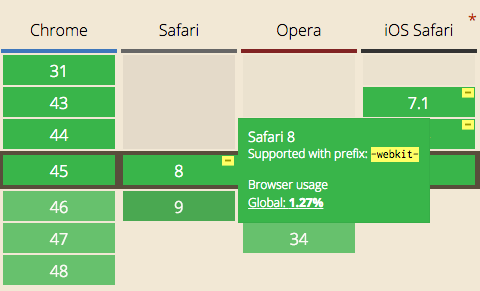

# CSS Base

Before we start working on the project, we should add some CSS to solve common cross-browser problems.

Furthermore, to make CSS layout easier, we'll adopt the ReactNative's flexbox settings.

<cn>

# CSS 基础

在我们开始这个项目前，我们应该添加一些 CSS 来解决常见的跨浏览器问题。

此外，为了让 CSS 布局更简单，我们会采用 ReactNative 的 flexbox 设置。

</cn>

# PostCSS

For this project, we just want two additional CSS features:

1. `@import` to create a bundle from many CSS files.
2. Use `autoprefix` plugin to generate browser prefix for newer CSS properties

<cn>
# PostCSS

对于这个项目，我们只想要两个 CSS 补充特性：

1. `@import` 把多个 CSS 文件汇集成包。
2. 使用 `autoprefix` 插件自动为较新的 CSS 属性生成浏览器前缀。

</cn>

[Sass](http://sass-lang.com/) and [Less](http://lesscss.org/) are the two most popular CSS preprocessors. They are complete languages with lots of features (variables, loops, conditionals, functions) to generate complex CSS stylesheets. We won't be needing any of that.

<cn>

[Sass](http://sass-lang.com/) 和 [Less](http://lesscss.org/) 是最受欢迎的两款 CSS 预处理器。它们是完整的语言，有大量特性（变量，循环语句，条件语句，函数），可以用来生成复杂的 CSS 样式表。我们不需要这么多功能。

</cn>

An alternative to Less/Sass is [PostCSS](https://github.com/postcss/postcss). PostCSS is not a language. It is a parser that parses the standard CSS syntax. You can use plugins to transform the CSS language in different ways.

<cn>

Less/Sass 的替代品之一是 [PostCSS](https://github.com/postcss/postcss)。PostCSS 不是一种语言。它是一个语法解析器，解析标准 CSS 语言。你可以通过插件来改造 CSS 语言。

</cn>

Install the [PostCSS command line tool](https://github.com/code42day/postcss-cli):

<cn>

安装 [PostCSS command line tool](https://github.com/code42day/postcss-cli)：

</cn>

```
npm install postcss-cli@2.1.0 --save-dev
```

<cn>

```
npm install postcss-cli@2.1.0 --save-dev
```

</cn>

See help:

<cn>

查看帮助：

</cn>

```
$ postcss -h
Usage: node_modules/.bin/postcss -use plugin [--config|-c config.json] [--output
|-o output.css] [input.css]

Options:
  -c, --config       JSON file with plugin configuration
  -u, --use          postcss plugin name (can be used multiple times)
  -o, --output       Output file (stdout if not provided)
  -d, --dir          Output directory
  -s, --syntax       Custom syntax
  -p, --parser       Custom syntax parser
  -t, --stringifier  Custom syntax stringifier
  -w, --watch        auto-recompile when detecting source changes
  -v, --version      Show version number                               [boolean]
  -h, --help         Show help                                         [boolean]

Examples:
  postcss --use autoprefixer -c options.    Use autoprefixer as a postcss plugin
  json -o screen.css screen.css
  postcss --use autoprefixer --             Pass plugin parameters in plugin.
  autoprefixer.browsers "> 5%" -o screen.   option notation
  css screen.css
  postcss -u postcss-cachify -u             Use multiple plugins and multiple
  autoprefixer -d build *.css               input files
```

<cn>

```
$ postcss -h
Usage: node_modules/.bin/postcss -use plugin [--config|-c config.json] [--output
|-o output.css] [input.css]

Options:
  -c, --config       JSON file with plugin configuration
  -u, --use          postcss plugin name (can be used multiple times)
  -o, --output       Output file (stdout if not provided)
  -d, --dir          Output directory
  -s, --syntax       Custom syntax
  -p, --parser       Custom syntax parser
  -t, --stringifier  Custom syntax stringifier
  -w, --watch        auto-recompile when detecting source changes
  -v, --version      Show version number                               [boolean]
  -h, --help         Show help                                         [boolean]

Examples:
  postcss --use autoprefixer -c options.    Use autoprefixer as a postcss plugin
  json -o screen.css screen.css
  postcss --use autoprefixer --             Pass plugin parameters in plugin.
  autoprefixer.browsers "> 5%" -o screen.   option notation
  css screen.css
  postcss -u postcss-cachify -u             Use multiple plugins and multiple
  autoprefixer -d build *.css               input files
```

</cn>

# Vendor Prefix

Take a look at the browser support chart for flexbox ([Can I Use: Flexbox](http://caniuse.com/#search=flex)):



You'd see that for Safari 8 there's the note:

```
Supported with prefix: -webkit
```

That's the [vendor prefix](https://developer.mozilla.org/en-US/docs/Glossary/Vendor_Prefix) for Safari 8. Instead of writing:

```css
.a-flexible-row {
  flex-direction: row;
}
```


<cn>

# 浏览器引擎前缀 （Verdor Prefix）

看一下 flexbox 的浏览器支持表 ([Can I Use: Flexbox](http://caniuse.com/#search=flex))：


你能看到对于 Safari 8 有一个注释：

```
Supported with prefix: -webkit
```

这既是 Safari 8 的 [vendor prefix](https://developer.mozilla.org/en-US/docs/Glossary/Vendor_Prefix)。这样写是不行的：

```css
.a-flexible-row {
  flex-direction: row;
}
```

</cn>

Different browser engines have different vendor prefixes, and you need vendor prefixes for all the browsers you need to support. Your CSS rule might look like:

<cn>

每个浏览器引擎都有自己的前缀，而你需要为每个你支持的浏览器添加前缀。 这条 CSS 规则该写成这样：

</cn>

```css
.a-flexible-row {
  /* Browsers that supports flexbox without vendor prefix. */
  flex-direction: row;
  /* Safari 8, Android 4.3 or earlier, iOS Safari 7/8 */
  -webkit-flex-direction: row;
  /* IE 10 */
  -ms-flex-direction: row;
}
```

<cn>

```css
.a-flexible-row {
  /* 不用浏览器引擎前缀就支持 flexbox 的浏览器 */
  flex-direction: row;
  /* Safari 8, Android 4.3 或更早版本, iOS Safari 7/8 */
  -webkit-flex-direction: row;
  /* IE 10 */
  -ms-flex-direction: row;
}
```

</cn>

So you'll need to:

+ Know which features need vendor prefixes.
+ Remember to add these prefixes everywhere you use these features.
+ As a feature mature new browsers no longer requires the vendor prefix.
  + For example, Safari 9 and IE 11 don't need the vendor prefix for flexbox.
+ As the percetange of users that use older browser decrease, you might decide to drop vendor prefix support.
  + If you only build for mobile, you might not care for IE 10.

<cn>

你要：

+ 了解哪些特性需要浏览器引擎前缀。
+ 记得在每一处你用到这些特性的地方添加这些前缀。
+ 对于成熟的特性，新浏览器不再需要浏览器引擎前缀。
  + 比如，Safari 9 和 IE 11 不需要 flexbox 的浏览器引擎前缀。
+ 由于使用旧浏览器的用户下降，你也许可以决定停止浏览器引擎前缀支持。
  + 如果你只为移动端开发，你也许不用考虑 IE 10。

</cn>

Getting all these right is obviously very complicated. The [autoprefixer](https://github.com/postcss/autoprefixer) tool automatically adds vendor-prefixes for you. Additionally, it uses a [database of browser marketshare](https://github.com/ai/browserslist) to decide whether a particular feature still needs vendor prefixing.

To install autoprefixer:

<cn>

把这些事情做对很显然相当复杂。[autoprefixer](https://github.com/postcss/autoprefixer)  工具自动给你添加浏览器引擎前缀。另外，它使用一个 [浏览器市场占有率数据库](https://github.com/ai/browserslist) 来决定某个特殊的特性是否仍旧需要为某个浏览器添加前缀。

安装 autoprefixer：

</cn>

```
npm install autoprefixer@6.0.2 --save-dev
```

<cn>

```
npm install autoprefixer@6.0.2 --save-dev
```

</cn>

### Exercise: Use Flexbox Globally

Although ReactNative implements flexbox, it uses a different default flexbox settings than the browser. One big difference is that in ReactNative items are arranged from top-to-bottom by default, but in the browser the default is left-to-right.

It turns out that ReactNative's settings are nicer to work with, so let's make the browser behave the same way.

Add the [ReactNative flexbox settings](https://github.com/facebook/css-layout#default-values) to the file `css/app.css`:

<cn>

### 练习：在全局使用 Flexbox

虽然 ReactNative 实现了 flexbox，但是它使用了与浏览器不同的 flexbox 默认设置。一个很大的差别是 ReactNative 的元素默认的布局是由上到下排列，但是在浏览器中默认是由左到右排列。

其实 ReactNative 的设定更好用，所以让我们使浏览器表现出同样的行为。

请添加 [ReactNative flexbox settings](https://github.com/facebook/css-layout#default-values) 到这个文件 `css/app.css`:

</cn>

```css
body, div, span {
  box-sizing: border-box;
  position: relative;

  display: flex;
  flex-direction: column;
  align-items: stretch;
  flex-shrink: 0;
  align-content: flex-start;

  border: 0 solid black;
  margin: 0;
  padding: 0;
}
```

<cn>

```css
body, div, span {
  box-sizing: border-box;
  position: relative;

  display: flex;
  flex-direction: column;
  align-items: stretch;
  flex-shrink: 0;
  align-content: flex-start;

  border: 0 solid black;
  margin: 0;
  padding: 0;
}
```

</cn>

Run the `postcss` command to transform your css file:

<cn>

运行 postcss 命令来转换你的 CSS 文件：

</cn>

```
mkdir -p bundle
postcss --use autoprefixer css/app.css --output bundle/app.css
```

<cn>

```
mkdir -p bundle
postcss --use autoprefixer css/app.css --output bundle/app.css
```

</cn>

You'd see in `bundle/app.css` the auto prefixed CSS properties:

<cn>

你可以看到在 `bundle/app.css` 中有添加了前缀的 CSS 属性：

</cn>

```css
body, div, span {
  box-sizing: border-box;
  position: relative;

  display: -webkit-box;

  display: -webkit-flex;

  display: -ms-flexbox;

  display: flex;
  -webkit-box-orient: vertical;
  -webkit-box-direction: normal;
  -webkit-flex-direction: column;
      -ms-flex-direction: column;
          flex-direction: column;
  -webkit-box-align: stretch;
  -webkit-align-items: stretch;
      -ms-flex-align: stretch;
          align-items: stretch;
  -webkit-flex-shrink: 0;
      -ms-flex-negative: 0;
          flex-shrink: 0;
  -webkit-align-content: flex-start;
      -ms-flex-line-pack: start;
          align-content: flex-start;

  border: 0 solid black;
  margin: 0;
  padding: 0;
}
```

<cn>

```css
body, div, span {
  box-sizing: border-box;
  position: relative;

  display: -webkit-box;

  display: -webkit-flex;

  display: -ms-flexbox;

  display: flex;
  -webkit-box-orient: vertical;
  -webkit-box-direction: normal;
  -webkit-flex-direction: column;
      -ms-flex-direction: column;
          flex-direction: column;
  -webkit-box-align: stretch;
  -webkit-align-items: stretch;
      -ms-flex-align: stretch;
          align-items: stretch;
  -webkit-flex-shrink: 0;
      -ms-flex-negative: 0;
          flex-shrink: 0;
  -webkit-align-content: flex-start;
      -ms-flex-line-pack: start;
          align-content: flex-start;

  border: 0 solid black;
  margin: 0;
  padding: 0;
}
```

</cn>

Load `bundle/app.css` in the `head` element:

<cn>

在 `head` 元素中加载 `bundle/app.css`：

</cn>

```html
<head>
  ...
  <link rel="stylesheet" type="text/css" href="/bundle/app.css">
  ...
</head>
```

<cn>

```html
<head>
  ...
  <link rel="stylesheet" type="text/css" href="/bundle/app.css">
  ...
</head>
```

</cn>

In Chrome Inspector, you should see that `body` is now a flexbox:


<cn>

在 Chrome 审查器中，你应该能看到 `body` 现在是一个 flexbox：


</cn>

Don't worry if you don't understand what these properties do. We'll learn about them soon!

<cn>

如果你不理解这些属性的作用，不要担心。我们会很快学到它们！

</cn>

# normalize.css

Browsers can behave subtly differently from each other. [normalize.css](https://github.com/necolas/normalize.css) makes browsers behave more alike. For example, did you know that in IE 8/9/10  `img` would have a border if it's inside an `a` element?

normalize.css includes the fix for this problem:

<cn>

# normalize.css

浏览器行为表现彼此略有不同。[normalize.css](https://github.com/necolas/normalize.css) 使浏览器的行为更相似。举个例子，你以前知道在 IE 8/9/10 中，如果 `img` 在一个 `a` 元素内，它会有边框这件事吗？

normalize.css 包含了对于这个问题的修复：

</cn>

```css
/* https://github.com/necolas/normalize.css/blob/2bdda84272650aedfb45d8abe11a6d177933a803/normalize.css#L185-L187 */
img {
  border: 0;
}
```

<cn>

```css
/* https://github.com/necolas/normalize.css/blob/2bdda84272650aedfb45d8abe11a6d177933a803/normalize.css#L185-L187 */
img {
  border: 0;
}
```

</cn>

It also defines HTML5 elements:

<cn>

它也定义了 HTML5 元素：

</cn>

```css
/* https://github.com/necolas/normalize.css/blob/2bdda84272650aedfb45d8abe11a6d177933a803/normalize.css#L33-L47 */
article,
aside,
details,
figcaption,
figure,
footer,
header,
hgroup,
main,
menu,
nav,
section,
summary {
  display: block;
}
```

<cn>

```css
/* https://github.com/necolas/normalize.css/blob/2bdda84272650aedfb45d8abe11a6d177933a803/normalize.css#L33-L47 */
article,
aside,
details,
figcaption,
figure,
footer,
header,
hgroup,
main,
menu,
nav,
section,
summary {
  display: block;
}
```

</cn>

Install normalize.css with npm:

<cn>

使用 npm 安装 normalize.css：

</cn>

```
npm install --save normalize.css@3.0.3
```

<cn>

```
npm install --save normalize.css@3.0.3
```

</cn>

### Exercise: Include normalize.css

Instead of using another `link` element to load normalize.css, let's use the [postcss-import](https://github.com/postcss/postcss-import) plugin to import normalize.css.

Install `postcss-import`:

<cn>

### 练习：引入 normalize.css

让我们使用 [postcss-import](https://github.com/postcss/postcss-import) 插件来导入 normalize.css 而不是使用另外一个 `link` 元素。

安装 `postcss-import`：

</cn>

```
npm install --save-dev postcss-import@7.0.0
```

<cn>

```
npm install --save-dev postcss-import@7.0.0
```

</cn>

normalize.css is installed at `node_modules/normalize.css/normalize.css`. In `css/app.css` we can import normalize.css using relative path:

<cn>

normalize.css 被安装在 `node_modules/normalize.css/normalize.css`。在 `css/app.css` 里我们用相对路径导入 normalize.css:

</cn>

```
/* css/app.css */
@import "../node_modules/normalize.css/normalize.css";
```

<cn>

```
/* css/app.css */
@import "../node_modules/normalize.css/normalize.css";
```

</cn>

Run this command to produce the bundled css:

<cn>

运行这个命令来生成打包后的 CSS：

</cn>

```
postcss --use autoprefixer --use postcss-import css/app.css --output bundle/app.css
```

<cn>

```
postcss --use autoprefixer --use postcss-import css/app.css --output bundle/app.css
```

</cn>

You should now see normalize.css in `bundle/app.css`.

Because normalize.css is installed in the `node_modules` directory, you can actually use the package name to import it:

<cn>

你现在应该可以看到在打包完成的 `bundle/app.css` 中包含了 normalize.css。

因为 normalize.css 被安装在 `node_modules` 目录里，你其实还可以使用包的名称来导入它：

</cn>

```
@import "normalize.css";
```

<cn>

```
@import "normalize.css";
```

</cn>

> Note: PostCSS takes the output from one plugin and send it to the next plugin. The above command can be written as a unix command pipeline.

<cn>

> 注：PostCSS 从一个插件获取输出，然后输入到另一个插件中。上面的命令可以被写在一个 unix 命令管道中。

</cn>

```
cat css/app.css | postcss --use autoprefixer | postcss --use postcss-import | cat > bundle/app.css
```

<cn>

```
cat css/app.css | postcss --use autoprefixer | postcss --use postcss-import | cat > bundle/app.css
```

</cn>

# Live-Edit

Change your Makefile to the following:

<cn>

# 实时编辑

把你的 Makefile 改成下面这样：

</cn>

```
.PHONY: css
css:
  mkdir -p bundle
  postcss --watch --use autoprefixer --use postcss-import css/app.css --output bundle/app.css

.PHONY: server
server:
  browser-sync start --server --files='index.html,bundle/app.css'


.PHONY: clean
clean:
  rm -r bundle
```

<cn>

```
.PHONY: css
css:
  mkdir -p bundle
  postcss --watch --use autoprefixer --use postcss-import css/app.css --output bundle/app.css

.PHONY: server
server:
  browser-sync start --server --files='index.html,bundle/app.css'


.PHONY: clean
clean:
  rm -r bundle
```

</cn>

We've made two changes:

1. Added `--watch` option to postcss, so it rebuilds `css/app.css` whenver you make changes.
2. Added `bundle/app.css` to `--files`, so BrowserSync reloads whenever we rebuild.

Try making the background red:

<cn>

我们做了两个改动：

1. 为 postcss 添加了 `--watch` 选项，因此每当你作出改动时，它重新构建 `css/app.css`。
2. 把 `bundle/app.css` 添加到了 `--files`，因此每当我们重新构建时， BrowserSync 重新加载。

尝试把背景改为红色：

</cn>

```html
body, html {
  width: 100%;
  height: 100%;
}

body {
  background-color: rgba(255,0,0,0.3);
}
```

<cn>

```html
body, html {
  width: 100%;
  height: 100%;
}

body {
  background-color: rgba(255,0,0,0.3);
}
```

</cn>
