# Layout With Flexbox

The original CSS [visual rendering model](http://www.w3.org/TR/WD-CSS2/cover.html#toc) was drafted in 1998, at a time when most pages were documents, and making apps that runs in the browser was a radical idea. The web had evolved multiple times since then, yet we still use the same dated layout engine from 1998. CSS2 is proven technology, there is a huge body of community knowledge, but it's a huge pain.

For example, if you want to vertically center some content, there isn't one way to do it, but many different ways that only work in special circumstances:

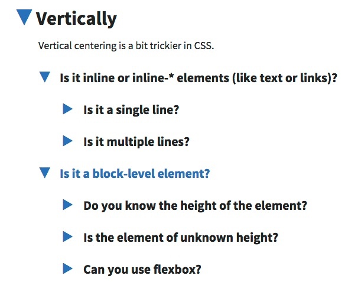

<cn>

# Flexbox 布局

最初的 CSS [可视化渲染模型](http://www.w3.org/TR/WD-CSS2/cover.html#toc) 起草与 1998 年。在当时大部分页面都是文件类型，制作运行在浏览器中的应用还是一个相当激进的想法。从那时, Web 已经有了多次的进化，但是我们仍旧用着来自 1998 年陈旧的的布局引擎。虽然说 CSS2 是被一个通用的技术，社区有巨大的知识沉淀，但开发起来实在是个巨大的痛苦。

举个例子，如果你想垂直居中些内容，CSS2 并没有一种通用的方法来做这个布局。不通的     情况可能需要不同的方法：


</cn>

To become a competent frontend developer, you have to learn all kinds of weird, ugly, unnatural tricks to handle different layout needs.

Flexbox, in contrast, was designed specifically for creating UI for the modern web. It is not simple, and just like any other complex layout engine, you'd sometime find it behaving in surprising ways. Almost always, though, there's a straightforward explanation why.

It does take practice to use flexbox well. But compared to traditional layout with CSS, Flexbox is so much easier!

<cn>

为了成为一名称职的前端开发者，你需要去学习各种各样古怪、丑陋、不自然的小技巧来处理不同的布局需求。

相比之下，Flexbox 是专门为现代 Web UI 设计的布局机制。它并不简单。和其他复杂的布局系统一样，使用的时候你可能会遇到出乎意料的布局结果。但是几乎所有情况下，“奇怪” 的布局行为总有一个简单的解释。

Flexbox 还是需要多上手才能用好。但是相比于传统 CSS 布局方法，Flexbox 简单多了！

</cn>

### Our Mission

In this lesson we'll use flexbox to implement the basic layout of our web page:

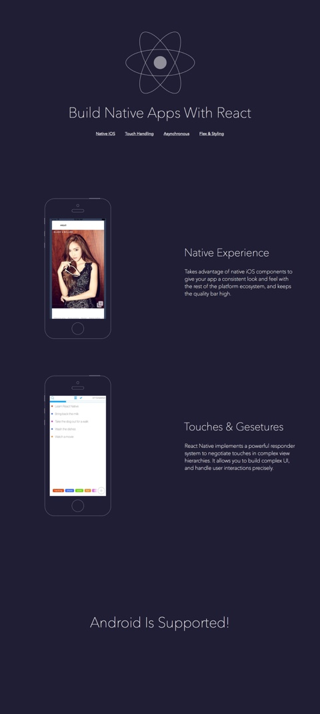

<cn>

### 我们的任务

在本次课程中我们将用 flexbox 实现 web 页面的基本布局：


</cn>

# Design Spec

If you have Sketch, you can download the original Sketch file:

[ilovereact-plain.sketch](ilovereact-plain.sketch)

If you don't have Sketch, you can download the annotated design:

[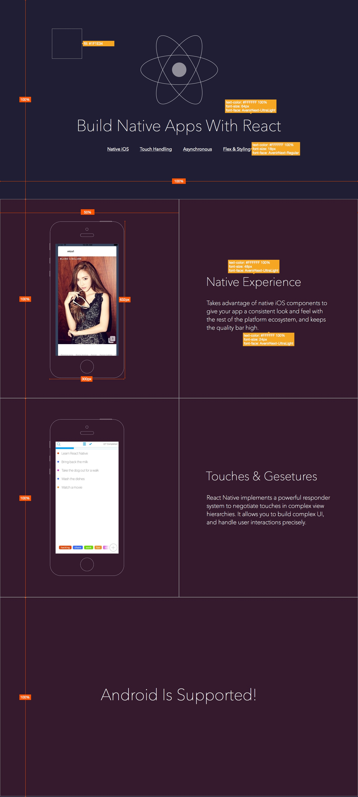](annotated-layout.jpg)

<cn>

# 设计规范

如果你有 Sketch，你可以下载原始的 Sketch 文件：

[ilovereact-plain.sketch](ilovereact-plain.sketch)

如果你没有 Sketch，你可以下载带有注解的设计：

[](annotated-layout.jpg)

</cn>

# Download Design Assets

You can download all the design assets from the repo:

[hayeah/iLoveReact-assets](https://github.com/hayeah/iLoveReact-assets)

Add these images to the `img` directory in your project.

<cn>

# 下载设计资源

你可以从这个仓库下载所有的设计资源：

[hayeah/iLoveReact-assets](https://github.com/hayeah/iLoveReact-assets)

把这些图片添加到你项目的 `img` 目录。

</cn>

# Introduction To Flex

[A Complete Guide to Flexbox](https://css-tricks.com/snippets/css/a-guide-to-flexbox/) has a good summary of all the CSS properties related to flexbox. It's a bit too much information to get started with.

We'll start with just three properties: `flex-direction`, `align-items`, `justify-content`.

<cn>

# Flex 介绍

[Flexbox 完整指南](https://css-tricks.com/snippets/css/a-guide-to-flexbox/) 里有所有和 Flexbox 的相关 CSS 属性的总结。这篇文章的讲解对于初次接触 Flexbox 来说信息量有点过大，很难一次消化。

因此，我们先挑 Flexbox 的三个属性开始介绍：`flex-direction`，`align-items`，`justify-content`。

</cn>

+ `flex-direction` - whether child items are arranged horizontally or vertically.

  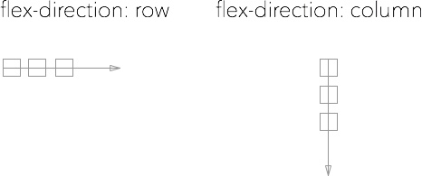

+ `align-items` and `justify-content` - controls how the children should be arranged in the parent container.

  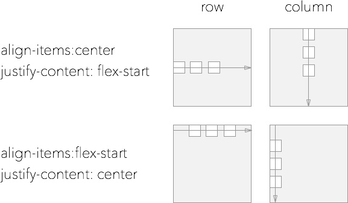


+ To center items both horizontally and vertically in a container:

  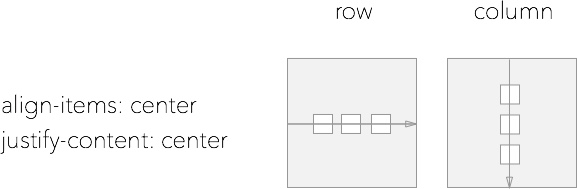

<cn>

+ `flex-direction` - 决定子元素是水平排列还是垂直排列。

  

+ `align-items` 和 `justify-content` - 控制着子元素在父容器中如何布局。

  


+ 把元素在容器里同时水平和垂直居中的姿势：

  

</cn>


The alignment properties `align-items` and `justify-content` are very easy to mix up.

+ `justify-content` - controls where the items should be on the arrow.
  + This is the "main-axis" of the flex container.
+ `align-items` - controls where the arrow should be in the container.
  + This is the "cross-axis" of the flex container.

<cn>

`align-items` 和 `justify-content` 着两个属性很容易混淆。

+ `justify-content` - 控制着元素应该放在箭头上的什么位置。
  + 这是 flex 容器的 “主轴”。
+ `align-items` - 控制着箭头本身应该放在容器的什么位置。
  + 这是 flex 容器的 “横轴”。

</cn>

So `align-items: center` could mean horizontal centering or vertical centering depending on what the flex-direction is. One trick to help us remember is by understanding the `align-self` property.

`align-self` can give a different `align-item` value to a particular item in a flex container.

<cn>

所以说 `align-items: center` 可能根据 flex-direction 的值不同，而意味着水平居中或者垂直居中。理解 `align-self` 属性这个属性的含义可以帮助我们推理出 align-items 到底是影响垂直还是水平布局。

`align-self` 可以对 Flex 容器中某个指定的元素的赋与不同的 `align-item` 值。

</cn>

```css
.container {
  flex-direction: row;
  align-items: center;
  justify-content: center;
}

.red {
  /* This is the only item that's `flex-start` */
  align-self: flex-start;
}
```

<cn>

```css
.container {
  flex-direction: row;
  align-items: center;
  justify-content: center;
}

.red {
  /* 指定该元素为 `flex-start`  */
  align-self: flex-start;
}
```

</cn>

What should `align-self` do? `align-self` should not move the item along the flex-direction (the main-axis), otherwise the order of the `.red` element would change:

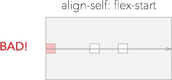

<cn>

以设计的角度来说，`align-self` 应该做什么？`align-self` 不应该把 item 沿着 flex-direction（主轴）移动，否则 `.red` 元素的顺序可能会改变：


</cn>

`align-self` should move the item cross-axially so the horizontal order of the row stays the same:

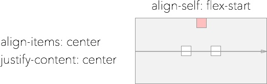

Following this reasoning, it's easy to remember which direction `align-self` is. And `align-items` must be in the same direction as `align-self`.

<cn>

`align-self` 应该把元素按照横轴的方向移动，因此保持元素的顺序:


了解了这个道理就能记住 `align-self` 的方向。而 `align-items` 理应和 `align-self` 的方向相同。

道理是这样的。现实情况还是会搞混。试试看，效果对了就好啦~

</cn>

# Page Style

Let's first define the typography and background color of the page:

<cn>

# 页面样式

让我们首先定义页面的文字样式和背景颜色：

</cn>

```css
body {
  background-color: #1F1E34;
  color: #FFF;
  font-family: "Avenir Next",
      "HelveticaNeue-Light", "Helvetica Neue Light", "Helvetica Neue", Helvetica,
      Arial, "Lucida Grande", sans-serif;
  font-weight: 100;
}

h1 {
  font-size: 64px;
  font-weight: 100;
}

h2 {
  font-size: 48px;
  font-weight: 100;
}

p {
  font-size: 24px;
}

a {
  font-weight: 400;
  color: #FFF;
}

a:hover {
  font-weight: 400;
  color: #DADADA;
  text-decoration: none;
}
```

<cn>

```css
body {
  background-color: #1F1E34;
  color: #FFF;
  font-family: "Avenir Next",
      "HelveticaNeue-Light", "Helvetica Neue Light", "Helvetica Neue", Helvetica,
      Arial, "Lucida Grande", sans-serif;
  font-weight: 100;
}

h1 {
  font-size: 64px;
  font-weight: 100;
}

h2 {
  font-size: 48px;
  font-weight: 100;
}

p {
  font-size: 24px;
}

a {
  font-weight: 400;
  color: #FFF;
}

a:hover {
  font-weight: 400;
  color: #DADADA;
  text-decoration: none;
}
```

</cn>

# Page Layout

### Exercise: Full Page Sections

There are four sections in this web page. You should make each section as tall and as wide as the screen.

To make them easier to see, you could temporarily set their background to red:

<cn>

# 页面布局

### 练习：页面的部分

这个网页有四个部分。你应该让每个章节的宽高和屏幕一样。

为了让它们可见度更高，你可以暂时把它们的背景设为红色半透明：

</cn>

```css
.section {
  background-color: rgba(255,0,0,0.3);
  border: 2px solid #FFF;
}
```

<cn>

```css
.section {
  background-color: rgba(255,0,0,0.3);
  border: 2px solid #FFF;
}
```

</cn>

The sections should look like:

<video src="fullpage-sections.mp4" controls></video>

<cn>

这些区域块应该看起来这样：

<video src="fullpage-sections.mp4" controls></video>

</cn>

### Exercise: Title And Logo

Add the following to the first section:

<cn>

### 练习：标题和 Logo

把下面的代码添加到第一个区域块：

</cn>

```html

<h1>Build Native Apps With React</h1>
```

<cn>

```html

<h1>Build Native Apps With React</h1>
```

</cn>

Your result:

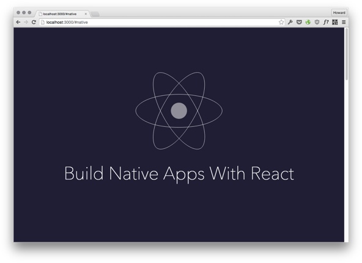

<cn>

你的结果：


</cn>

### Exercise: Navigation Links

Since items in a single flex container can only flow in one direction, you need to nest flex containers if some items are vertically arranged, and some other items are horizontally arranged:

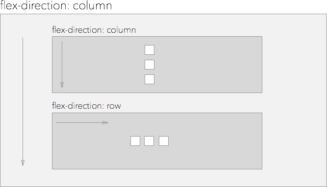

<cn>

### 练习：导航链接

因为元素在一个 flex 容器内只能按照一个方向来排列，如果你需要一些元素垂直排列，一些其他的元素水平排列，那你就要嵌套 flex 容器。


</cn>

+ Add a horizontal flex container to hold the navigation links.
+ Add padding to space them apart.

Add these internal links:

<cn>

+ 添加一个水平 flex 容器容纳导航链接。
+ 添加 padding 让它们有间隔。

</cn>

```html
<a href="#native">
  Native iOS
</a>

<a href="#touch">
  Touch Handling
</a>

<a href="#async">
  Asynchronous
</a>

<a href="#flex">
  Flex &amp; Styling
</a>
```

<cn>

```html
<a href="#native">
  Native iOS
</a>

<a href="#touch">
  Touch Handling
</a>

<a href="#async">
  Asynchronous
</a>

<a href="#flex">
  Flex &amp; Styling
</a>
```

</cn>

Your result:

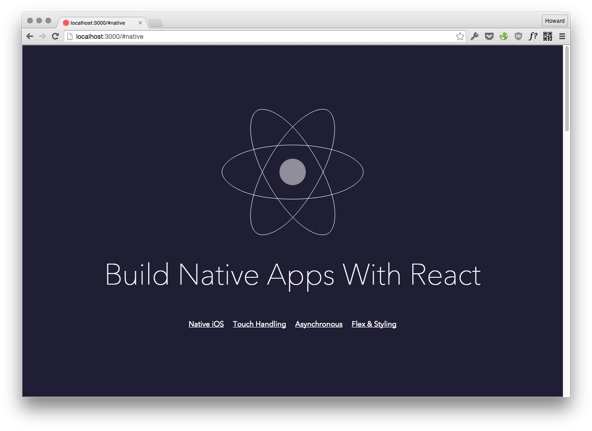

<cn>

你的结果：


</cn>

# Flex-Grow And Stretch

Our next goal is to divide the page into two equal parts:

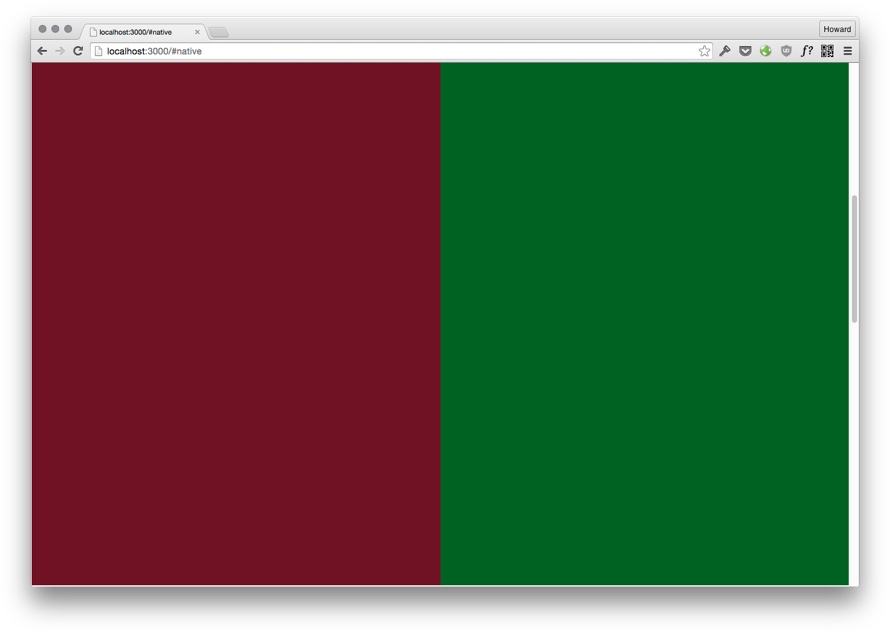

The obvious way to accomplish this is to set the width to 50%, and height to 100%. For this exercise, though, we are going to use flexbox. First, let's add the following html to the second section:

<cn>

# Flex-Grow 如何拉长元素

我们下一个目标是把页面分为两个相等的部分：


完成这项工作最直观的方式是把宽度设置为 50%，高度设置为 100%。但是为了练习，我们要用 flexbox 来做。首先，让我们把下面的 html 添加到第二个区域块：

</cn>


```html
<div class="iphone-demo">
  iphone demo
</div>

<div class="feature-description">
  awesome feature description
</div>
```

```css
.iphone-demo {
  background-color: rgba(255,0,0,0.3);
}

.feature-description {
  background-color: rgba(0,255,0,0.3);
}
```

<cn>

```html
<div class="iphone-demo">
  iphone demo
</div>

<div class="feature-description">
  awesome feature description
</div>
```

```css
.iphone-demo {
  background-color: rgba(255,0,0,0.3);
}

.feature-description {
  background-color: rgba(0,255,0,0.3);
}
```

</cn>

Initially, these two containers are just big enough to contain their text content:

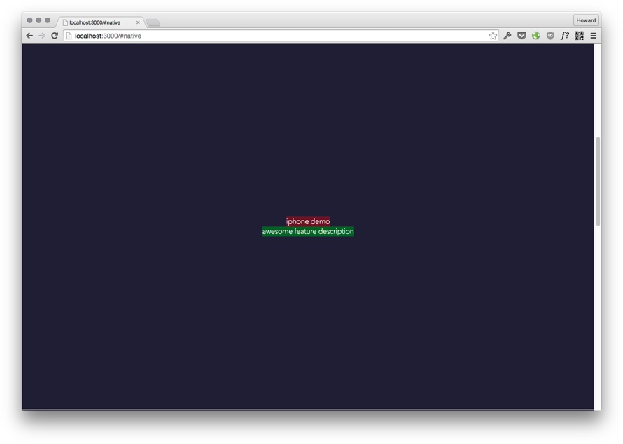

If you remove their content, they'd collapse to a 0x0 box (try it!).

<cn>

一开始，这两个容器刚好足够大包围它们的文字内容：


如果移除了它们的内容，这些容器会折叠成一个 0x0 的盒子（尝试下！）。

</cn>

There are two properties you can set to make a flexbox bigger than its content:

+ `align-self: stretch` - stretch the element along the cross-axis.
+ `flex-grow: 1` - stretch the element along the main-axis.

<cn>

你可以设置两个属性使 flexbox 比它的内容更大：

+ `align-self: stretch` - 沿着横轴的方向拉伸元素。
+ `flex-grow: 1` - 沿着主轴的方向拉伸元素。

</cn>

Like `align-items` and `justify-content`, their behaviour depends on the flex direction:

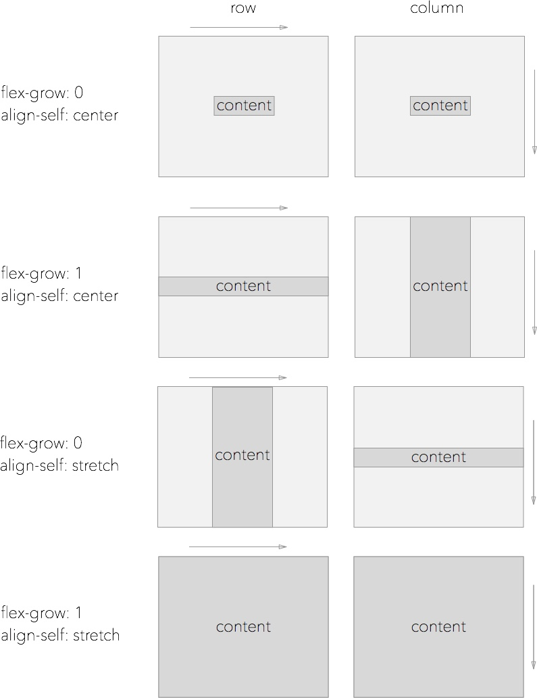

<cn>

正如 `align-items` 和 `justify-content`，它们的具体行为取决于 flex direction：


</cn>

Why is `flex-grow` a number? If `flex-grow` is 0, that element doesn't grow. Otherwise, the number is the proportion an element should stretch to fill the available space.

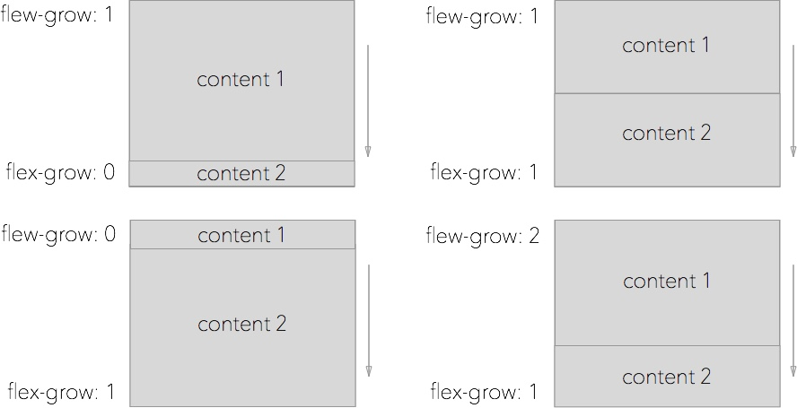

<cn>

为什么 `flex-grow` 是个数字呢？如果 `flex-grow` 为 0，那个元素就不会扩大。不为 0，这个数字代表一个元素拉伸覆盖可用空间该有的比例：


</cn>

As a concrete example, we can make the first container take up 1/3 of the space, and the second container take up 2/3 of the space:

<cn>

具体举个例子，我们可以让第一个容器占有 1/3 的空间，让第二个容器占有 2/3 的空间：

</cn>

```css
.iphone-demo {
  flex-grow: 1;
  background-color: rgba(255,0,0,0.3);
}

.feature-description {
  flex-grow: 2;
  background-color: rgba(0,255,0,0.3);
}
```

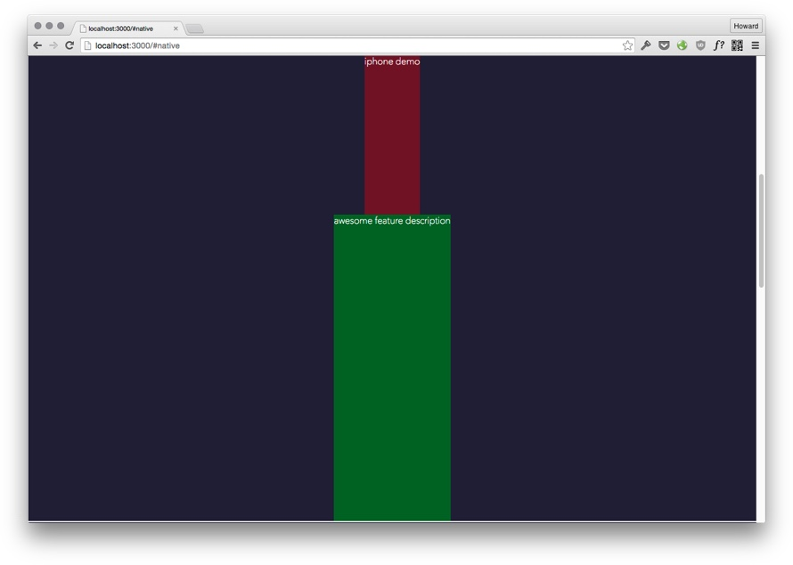

<cn>

```css
.iphone-demo {
  flex-grow: 1;
  background-color: rgba(255,0,0,0.3);
}

.feature-description {
  flex-grow: 2;
  background-color: rgba(0,255,0,0.3);
}
```


</cn>


### Exercise: Left Right Layout

Use `flex-grow` and `align-self` to divide the second section in two.

You result:


<cn>

### 练习：左右布局

使用 `flex-grow` 和 `align-self` 把第二部分分成两半。

你的结果：


</cn>

Note: Make sure these containers are empty. If the amount of content in one container is more than the other, then one container would be bigger than the other.

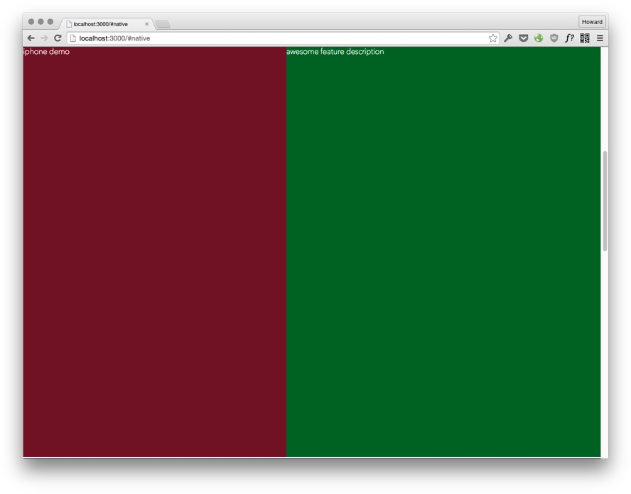

We'll fix this problem in the next exercise.

<cn>

注：你得确保这些容器是空的。如果一个容器内容比另外一个容器多，那内容多的容器就会比较大。


我们会在下个练习修复这个问题。

</cn>

# Flex Basis

The size of a flexbox is determined by two factors:

1. How much content there is in the flexbox.
2. How much free space there is in the parent container. If `flex-grow` is non-zero, grow to fill the space.

If a flexbox is allowed to grow, it would grow as much as possible to fit the content. Let's add more content to the right container:

<cn>

# Flex Basis 属性

Flexbox 容器的高宽由两个因素决定：

1. Flexbox 中有多少的内容。
2. 父容器中有多少空闲空间。如果 `flex-grow` 非零，占满所以空闲空间。

</cn>

```html
<div class="feature-description">
  <h2>Native Experience</h2>
  <p>
    Takes advantage of native iOS components to give your app a consistent look and feel with the rest of the platform ecosystem, and keeps the quality bar high.
  </p>
</div>
```

<cn>

```html
<div class="feature-description">
  <h2>Native Experience</h2>
  <p>
    Takes advantage of native iOS components to give your app a consistent look and feel with the rest of the platform ecosystem, and keeps the quality bar high.
  </p>
</div>
```

</cn>

It expands to fit the content in one line, squeezing out the left container:

<video src="flex-basis-auto-greedy.mp4" controls loop></video>

<cn>

它扩张得很长，来包围一整行的内容，结果就把左边的容器挤出去了：

<video src="flex-basis-auto-greedy.mp4" controls loop></video>

</cn>

The key to understand this behaviour is that the amount of "free space" is calculated after growing the containers to fit the content:

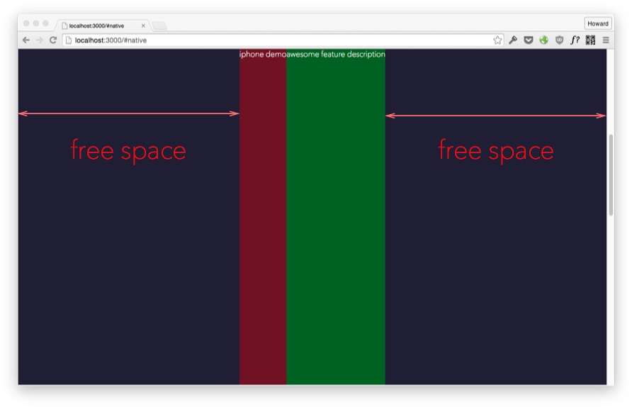

<cn>

理解这种行为的关键是 “空闲空间” 有多少是在容器适配内容之后才计算的：


</cn>

Then the free space is divided according to `flew-grow` factors. This explains why the containers are not the same width:


<cn>

然后计算出来的空闲空间会根据 `flew-grow` 因素来瓜分。这就解释了为什么之前两个容器的宽度会不一样：


</cn>

We can use the `flex-basis` property to override the size of a flexbox when calculating free space. If we set `flex-basis: 0` for both children, it is as though their widths are zero when their parent calculates the free space. The free space (the entire width of the parent) is then divided between the two children:

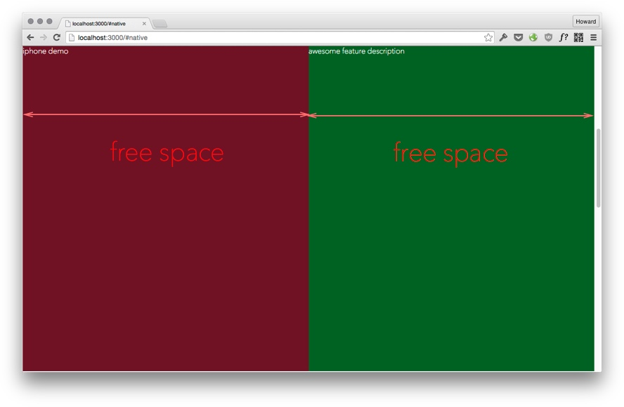

<cn>

我们可以使用 `flex-basis` 来指定计算空闲空间时 flexbox 应该是什么尺寸。如果我们给两个子元素设置了 `flex-basis: 0`，当它们的父容器计算空闲空间时，它们的宽度就好像为零一样。之后，空闲空间（整个父容器的宽度）才会被这两个子元素瓜分：


</cn>

The `flex-basis` property is like the min-width of flexbox. It determines how much space the flexbox reserves for itself. The default `flex-basis: auto` means "reserve as much space as needed to fit the content". And `flex-basis: 50px` means reserve 50px, but grow if there's more free space.

Question: Setting `flex-basis: 50%` also makes the two containers equal. Why? How is it different from `flex-basis: 0`?

<cn>

`flex-basis` 属性就好像是 flexbox 的最小值。它决定了 flexbox 给自己保留多少空间。默认的 `flex-basis: auto` 意为“保留尽可能多的空间来适配内容”。`flex-basis: 50px` 意为保留 50 像素，但是如果有更多空闲空间就会扩大。

</cn>

### Exercise: Adjust Flex-Basis

Add to section 2:

```html
<div class="iphone-demo">
  
</div>

<div class="feature-description">
  <h2>Native Experience</h2>
  <p>
    Takes advantage of native iOS components to give your app
    a consistent look and feel with the rest of the platform ecosystem,
    and keeps the quality bar high.
  </p>
</div>
```

<cn>

### 练习：适应 Flex-Basis

添加到第二区域块：

```html
<div class="iphone-demo">
  
</div>

<div class="feature-description">
  <h2>Native Experience</h2>
  <p>
    Takes advantage of native iOS components to give your app
    a consistent look and feel with the rest of the platform ecosystem,
    and keeps the quality bar high.
  </p>
</div>
```

</cn>

Add to section 3:

```html
<div class="iphone-demo">
  
</div>

<div class="feature-description">
  <h2>Touches &amp; Gestures</h2>
  <p>
    React Native implements a powerful responder system to
    negotiate touches in complex view hierarchies. It allows you
    to build complex UI, and handle user interactions precisely.
  </p>
</div>
```

Your result:

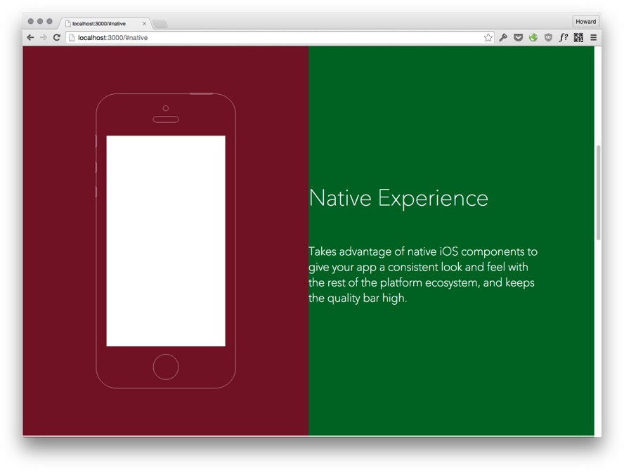

<cn>

添加到第三区域块：

```html
<div class="iphone-demo">
  
</div>

<div class="feature-description">
  <h2>Touches &amp; Gestures</h2>
  <p>
    React Native implements a powerful responder system to
    negotiate touches in complex view hierarchies. It allows you
    to build complex UI, and handle user interactions precisely.
  </p>
</div>
```

你的结果：


</cn>

# Android Is Coming

### Exercise: Add "Android Is Here"

In the last section, add:

```html
<h1>Android Is Here</h1>
```

Result:

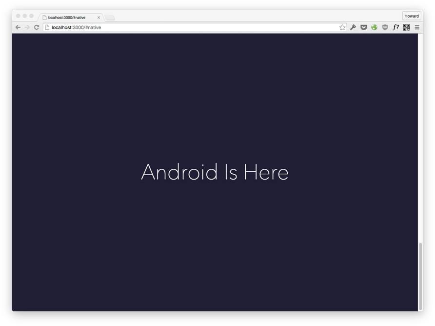

<cn>

# Android 即将到来

### 练习：添加 “Android Is Here”

在最后的区域块，添加：

```html
<h1>Android Is Here</h1>
```

结果：


</cn>

# Flex: 1

In ReactNative you'd often seen the mysterious setting `flex: 1` to grow a flexbox. `flex` is a shorthand that sets `flex-grow`, `flex-shrink`, and `flex-basis` at the same time. The default is:

```css
flex: 0 1 auto;
/*
flex-grow: 0;
flex-shrink: 1;
flex-basis: auto;
*/
```

<cn>

# Flex: 1

在使用 ReactNative 时你会经常看到一个神秘的设定 `flex: 1`，用了来扩大一个 flexbox。`flex` 是一个简写，同时设置 `flex-grow`，`flex-shrink` 和 `flex-basis` 三个属性。它们的默认值为：

```css
flex: 0 1 auto;
/*
flex-grow: 0;
flex-shrink: 1;
flex-basis: auto;
*/
```

</cn>

And `flex: 1` means `flex: 1 1 auto`, or written in full:

```css
flex-grow: 1;
flex-shrink: 1;
flex-basis: auto;
```

<cn>

`flex: 1` 意为 `flex: 1 1 auto`。全写出来如下：

```css
flex-grow: 1;
flex-shrink: 1;
flex-basis: auto;
```

</cn>

# Summary

There are many properties and many possible settings. A good reference to refresh your memory:

+ [CSS Tricks - A Complete Guide to Flexbox](https://css-tricks.com/snippets/css/a-guide-to-flexbox/)

If you run into a strange layout problem, it's often quicker to read the spec to understand the exact behaviour:

+ [CSS Flexible Box Layout Module Level 1](http://www.w3.org/TR/css-flexbox-1)

<cn>

# 总结

Flexbox 有很多属性和设定。这个参考资料可以刷新你的记忆：

+ [CSS Tricks - A Complete Guide to Flexbox](https://css-tricks.com/snippets/css/a-guide-to-flexbox/)

如果你碰到了一个奇怪的布局问题，阅读规范常常可以更快地了解到底为什么:

+ [CSS Flexible Box Layout Module Level 1](http://www.w3.org/TR/css-flexbox-1)

</cn>

Control which axis (horizontal or vertical) items are arranged:

+ `flex-direction: row`, `flex-direction: column`

<cn>

控制使用哪个轴（水平或者垂直）来排列元素的方法：

+ `flex-direction: row`, `flex-direction: column`

</cn>

Control where in the container items are (against one of the edges, or centered):

+ `align-items`, `align-self`, `justify-content`

<cn>

控制元素在容器的什么位置（对着一条边，或者居中）：

+ `align-items`, `align-self`, `justify-content`

</cn>

Control how items grow or shrink：

+ `flex-grow`, `flex-basis`, `flex-shrink`, `align-self: stretch`

<cn>

控制元素如何扩大或收缩：

+ `flex-grow`, `flex-basis`, `flex-shrink`, `align-self: stretch`

</cn>

Shorthand:

+ `flex: 1` means `flex-grow: 1; flex-shrink: 1; flex-basis: auto;`

<cn>

简写：

+ `flex: 1` 意为 `flex-grow: 1; flex-shrink: 1; flex-basis: auto;`

</cn>
