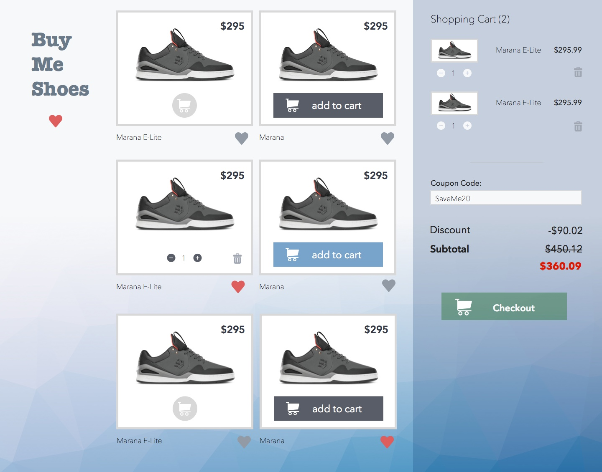

<Project name="ilovereact">
# I Love React

<Cover>
<video src="assets/scrollmagic-demo.mp4" controls></video>
</Cover>

这次训练营大家的背景都不太一样，后端，移动端，前端都有。许多同学使用过类似 Bootstrap 的框架来实现页面，但没有从零开始，自己做布局的经验。

这周我们会一起完成一个包含滚动效果的营销页面.

通过这个页面的实现，前端经验较为不足的同学们可以系统性地接触到前端开发的技巧，工具，和流程。我们的学习目标如下：

+ NPM 依赖管理。
+ 响应式设计的基本概念。
+ Flexbox 布局和绝对定位。
+ 如何用 CommonJS 模块化 JavaScript。

这是一个针对 ReactNative 的 “非主流” 前端教程。我们不会介绍 block, inline-block, float 这些前端必备的知识。我们也不用任何前端框架。我们甚至使用了一个相当激进的 CSS 预设：

```css
* {
  position: relative;
  display: flex;
  box-sizing: border-box;
  flex-direction: column;
}
```

这个预设和 ReactNative 的盒子模型一致，用起来可以避免不少常见的 CSS 坑。

最后，我们会结合 ScrollMagic 和 GreenSock 动画库来做些效果。没时间或者没精力的话可以跳过。

如果你比较少接触前端或移动端产品，开始之前你可以了解一下适用于移动端的布局思路: [What Is Responsive Design](responsive-design) [中文版](responsive-design/?lang=cn)
</Project>


<Project name="buyshoes-react">
# React Shopping Cart

<Cover>

</Cover>

暖身周大家对 Flexbox 和 CommonJS 模块有了认识，这周我们会使用 React 来实现一个购物车：

这周的学习目标如下：

+ 熟悉 React。
  + 如何组件化，props 和 state 的差别。
  + 如何处理事件。
  + 组件生命周期。
+ 练习 Flexbox 布局。
+ React 的函数式编程风格。
</Project>


<Project name="buyshoes-flux">
# Shopping Cart With Flux

用 React 完成 ”静态“ 页面后，我们会开始学习如何用 Flux 架构加上动态功能。
</Project>
