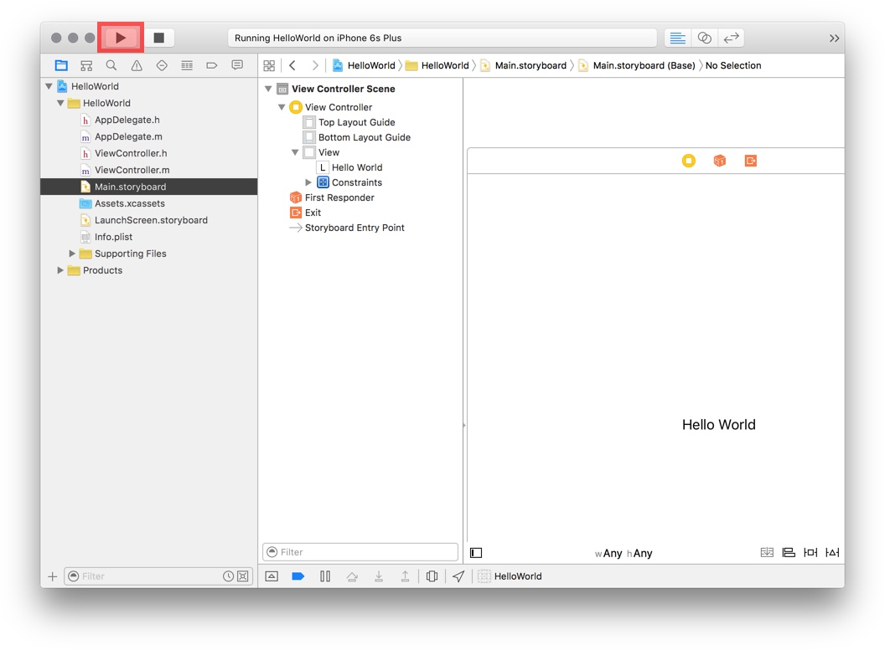
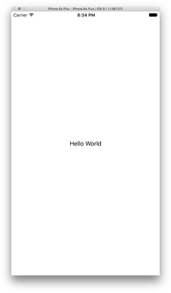
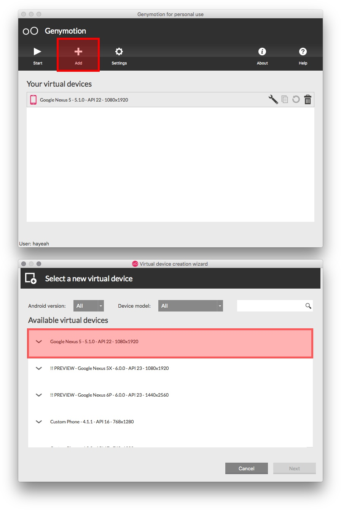
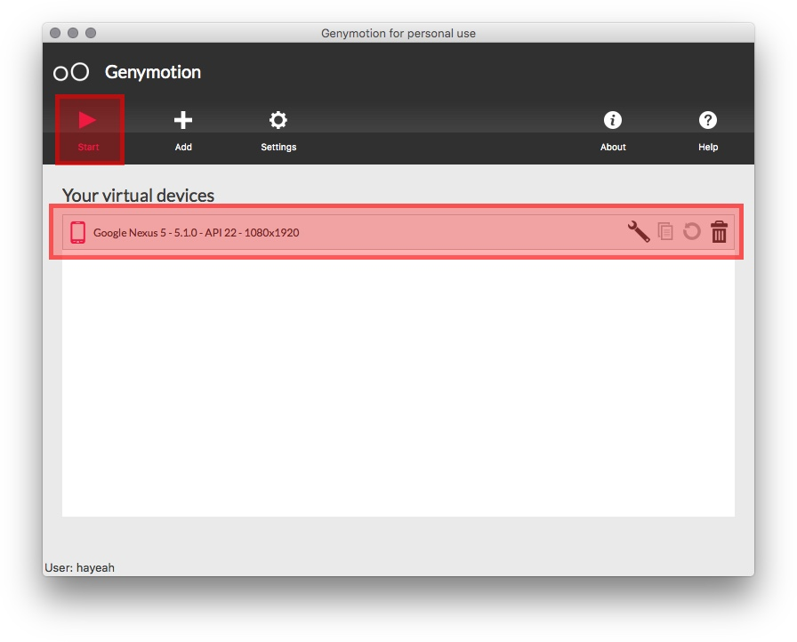
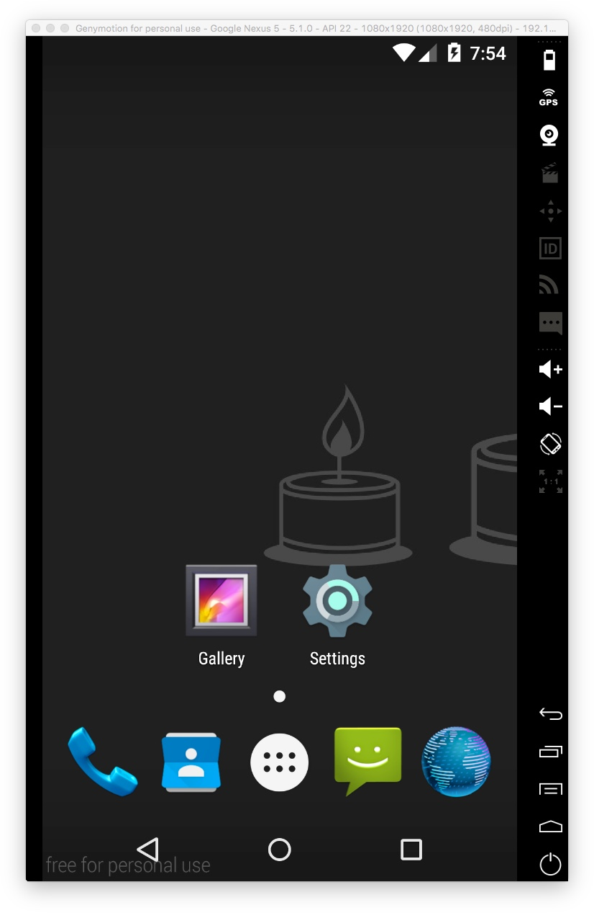
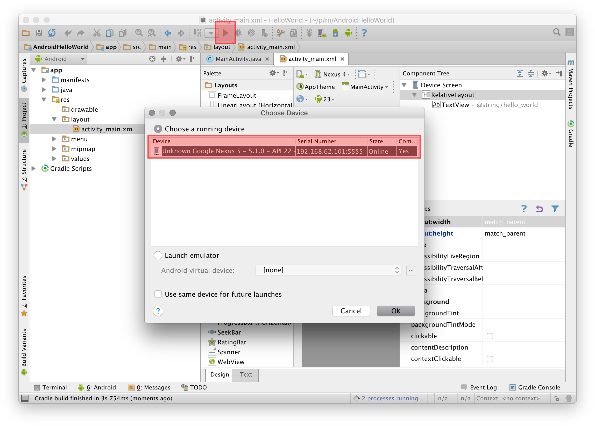
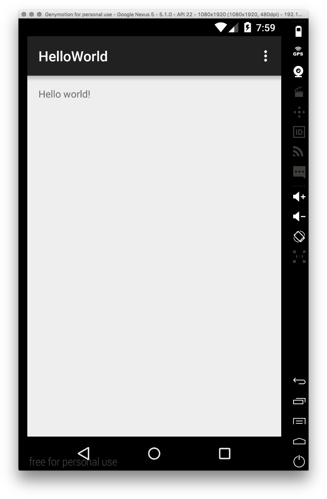

# Installing Xcode and Android SDK

We'll make sure that the development environment is working by running "hello world" apps in Xcode and Android Studio.

### iOS Hello World

Clone the HelloWorld Xcode project:

```
git clone https://github.com/hayeah/ios-HelloWorld.git
```

Install Xcode 7.2: https://developer.apple.com/xcode/download/

Click `HelloWorld.xcodeproj` to open the project in Xcode. Then click the play button (or hot key `cmd-r`):



You should see:



### Hello World Android

Clone the Android HelloWorld Project:

```
git clone https://github.com/hayeah/android-HelloWorld.git
```

Install Android SDK: http://facebook.github.io/react-native/docs/android-setup.html

安装 Android SDK：http://react-native.cn/docs/android-setup.html

Install GenyMotion, and add the Google Nexus 5 virtual device:



Before you can run the app, you need to run laucn the virtual device:



The empty emulator looks like:



Open the HelloWorld project with Android Sutdio. Run the app:



You should see:

