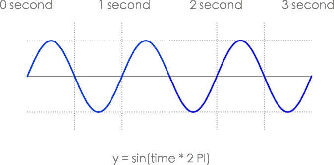
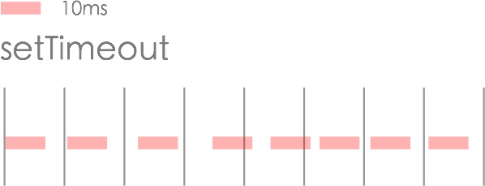
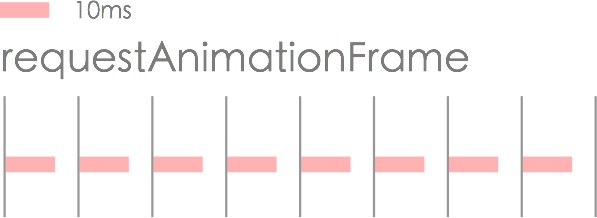
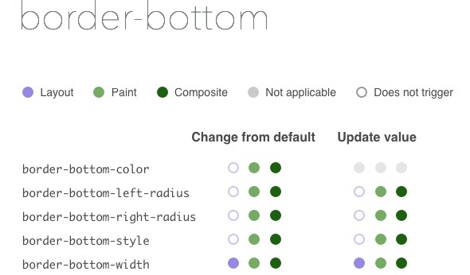

# JavaScript Bling Bling

In this lesson we are going to use JavaScript to add animation effects.

<cn>

# JavaScript Bling Bling

在这部分我们将使用 JavaScript 添加动画效果。

</cn>

### A Floating React Logo

<video src="react-logo-yoyo-float.mp4" controls autoplay loop></video>

### Shaking Android Robot

<video src="android-shakeit.mp4" controls autoplay loop></video>

### Animated Scrolling

<video src="animated-scroll.mp4" controls autoplay loop></video>

<cn>

### 浮动的 React Logo

<video src="react-logo-yoyo-float.mp4" controls autoplay loop></video>

### 让 Android Robot 动起来

<video src="android-shakeit.mp4" controls autoplay loop></video>

### 网页滚动动画

<video src="animated-scroll.mp4" controls autoplay loop></video>

</cn>

# JavaScript Animation VS CSS Animation

Many frontend developers would tell you that you should avoid JavaScript animation and use CSS animation to get better performance (less CPU time) and smoother effects (higher framerate).

However, the reason that JavaScript animation is slow is usually because the library you use isn't optimized for animation. An optimized JavaScript animation engine (e.g. [GreenSock](https://www.greensock.com) or [Velocity.js](http://velocityjs.org/)) has comparable performance to CSS animation. In some cases JS animation could be faster than CSS animation.

<cn>

# JavaScript 动画 VS CSS 动画

很多前端开发者会告诉你，你应该避免使用 JavaScript 动画，使用 CSS 动画来获得更好的性能（更少的 CPU 时间）和更平滑的效果（更高的帧率）。

然而，JavaScript 动画慢得原因经常是你用的库没有为动画进行优化。优化过的 JavaScript 动画引擎（比如 [GreenSock](https://www.greensock.com) 或 [Velocity.js](http://velocityjs.org/)）有堪比 CSS 动画的性能。

</cn>

Let's try the [JavaScript Animation Speed Test](https://www.greensock.com/js/speed.html), comparing different libraries to see their performance difference. For my test, I've set the number of particles to 500. You could try more or fewer particles. The demo looks like:

<video src="particles-flyout-demo.mp4" controls loop autoplay></video>

The test results:

+ jQuery: ~10fps.
+ Zepto: ~16fps.
+ TweenJS: ~28fps.
+ GreenSock (GSAP): 50~60fps.

<cn>

让我们试试 [JavaScript Animation Speed Test](https://www.greensock.com/js/speed.html)，比较不同的库来观察它们的性能差异。在我的测试里，我把粒子数量设为了 500 。你可以尝试更多或更少的粒子。Demo 类似：

<video src="particles-flyout-demo.mp4" controls loop autoplay></video>

测试结果：

+ jQuery: ~10fps.
+ Zepto: ~16fps.
+ TweenJS: ~28fps.
+ GreenSock (GSAP): 50~60fps.

</cn>

You could get 5~6x performance boost just by using another JavaScript library! For a comparison of JavaScript animation and CSS animation performance, see:

+ [CSS animations performance: the untold story](http://greensock.com/css-performance)

So don't worry about performance issues, it's not JavaScript's fault. We will use GreenSock for this project. Later when we implement scrolling effects, GreenSock makes it super easy to play the animation back and forth:

<video src="scrollmagic-scrubbing.mp4" controls loop></video>

Note: See [Animate.css](https://daneden.github.io/animate.css/) for a simple to use CSS animation library.

<cn>

你可以获得 5~6 倍的性能提升，仅仅通过使用其他的 JavaScript 库！对于 JavaScript 动画和 CSS 动画的性能比较，参见：

+ [CSS animations performance: the untold story](http://greensock.com/css-performance)

因此不要担心性能表现，它不是 JavaScript 的问题。我们将为这个项目使用 GreenSock。以后当我们实现滚动效果的时候，GreenSock 把来回播放动画变得极其简单：

<video src="scrollmagic-scrubbing.mp4" controls loop></video>

注：参考 [Animate.css](https://daneden.github.io/animate.css/)，一种使用 CSS 动画库的简易方法。

</cn>

# How JavaScript Animation Works

Let's see how we can implement a JavaScript animation that swings an element horizontally:

<video src="sinewave-animation.mp4"></video>

We can use a sine wave to define its position in time:



Then we use `setTimeout` to schedule a `draw` function, updating the element 60 times a second (or once every 16ms):

<cn>

# JavaScript 动画是如何工作的

让我们看一下如何实现一个在水平方向上摆动元素的 JavaScript 动画：

<video src="sinewave-animation.mp4"></video>

我们可以使用正弦图形来根据时间确定它的位置：


之后我们使用 `setTimeout` 来调度 `draw` 函数，每秒重绘 60 次元素（或者每 16ms 重绘一次）：

</cn>

```js
var deg360 = 2*Math.PI;
var $box = document.getElementById("box");

// 60 ticks a second. Use it as a counter to calculate the current time.
var tick = 0;
function draw() {
  var second = tick / 60;

  // calculate the current position
  var x = Math.sin(second * deg360) * 100;
  $box.style.left = x + "px";

  tick++;

  // set a timer to draw again in 16ms (60fps)
  setTimeout(draw,1000/60);
}


setTimeout(draw,1000/60);
```

<cn>

```js
var deg360 = 2*Math.PI;
var $box = document.getElementById("box");

// 每秒做 60 个记号。把它当做计算当前时间的计数器。
var tick = 0;
function draw() {
  var second = tick / 60;

  // 计算当前位置
  var x = Math.sin(second * deg360) * 100;
  $box.style.left = x + "px";

  tick++;

  // 设置一个计时器在 16ms 后重绘（60fps）
  setTimeout(draw,1000/60);
}


setTimeout(draw,1000/60);
```

</cn>

See: [Codepen Demo](http://codepen.io/hayeah/pen/XmKYxr?editors=011)

However, the browser (or iOS for ReactNative) refreshes the screen at a fixed rate, but a `setTimeout` timer may call `draw` at an unpredictable time. Suppose `draw` takes 10ms, it could sometime finish after the the screen refreshes:



To make sure that `draw` always have enough time to complete, we can use `requestAnimationFrame` to schedule a call to `draw` at the same interval as screen refreshes. The timeline looks like this:



Invokations of `draw` are now in perfect sync with screen refreshes, they *always* finish before the screen actually refresh.

Rewriting the animation loop with `requestAnimationFrame`:

<cn>

参见：[Codepen Demo](http://codepen.io/hayeah/pen/XmKYxr?editors=011)

不过，浏览器（或者 iOS for ReactNative）以一个固定速率刷新屏幕，`setTimeout` 计时器可能在无法预测的时间调用 `draw`。假定 `draw` 花了 10ms，它有时可能在屏幕刷新之后结束：


为了确保 `draw` 总是有足够的时间运行，我们可以使用 `requestAnimationFrame` 来使得 `draw` 方法的执行频率与屏幕刷新频率相同。时间线看起来像这样：


`draw` 的调用现在可以与屏幕刷新完美同步了，它们*经常*在屏幕实际刷新前结束运行。

使用 `requestAnimationFrame` 重写动画循环：

</cn>

```js
var deg360 = 2*Math.PI;
var $box = document.getElementById("box");

var start = null;
function draw(time) {
  // `time` is current time in millisecond
  if(!start) {
    start = time;
  }

  var second = (time - start) / 1000;

  // One sine cycle every second.
  var x = Math.sin(second * deg360) * 100;
  $box.style.left = x + "px";

  // Redraw in sync with browser redraw.
  requestAnimationFrame(draw);
}


requestAnimationFrame(draw);
```

<cn>

```js
var deg360 = 2*Math.PI;
var $box = document.getElementById("box");

var start = null;
function draw(time) {
  // `time` 现在是以毫秒表示的当前时间
  if(!start) {
    start = time;
  }

  var second = (time - start) / 1000;

  // 每秒一个 sin 循环
  var x = Math.sin(second * deg360) * 100;
  $box.style.left = x + "px";

  // 与浏览器同步重绘
  requestAnimationFrame(draw);
}


requestAnimationFrame(draw);
```

</cn>

See: [Codepen Demo](http://codepen.io/hayeah/pen/QjExJZ?editors=011)

Note: ReactNative also supports `requestAnimationFrame`, which is built with [CADisplayLink](http://www.bigspaceship.com/ios-animation-intervals/).

Note: [Layout thrashing](http://wilsonpage.co.uk/preventing-layout-thrashing/) is another reason why naive JavaScript animation is slow. You should know what it is, but don't worry about it. An optimized JavaScript animation engine would avoid layout thrashing.

<cn>

参考：[Codepen Demo](http://codepen.io/hayeah/pen/QjExJZ?editors=011)

注：ReactNative 同样支持 `requestAnimationFrame`，使用 [CADisplayLink](http://www.bigspaceship.com/ios-animation-intervals/) 构建。

注：[Layout thrashing](http://wilsonpage.co.uk/preventing-layout-thrashing/) 是另外一个原生 JavaScript 动画慢得原因。你应该知道它是什么，但是不用担心。优化过的 JavaScript animation 会避免 layout thrashing 。

</cn>

# GreenSock

GreenSock is an awesome animation library with a stupid name. Install it:

<cn>

# GreenSock

GreenSock 是有着愚蠢名字的优秀动画库。安装：

</cn>

```
# (GSAP - GreenSock Animation Platform)
npm install gsap@1.18.0 --save
```

<cn>

```
# (GSAP - GreenSock Animation Platform)
npm install gsap@1.18.0 --save
```

</cn>

For now, we'll use `<script>` tag to load the library. Later we'll learn how to use it as a CommonJS module. The GSAP library is installed at `node_modules/gsap/src/uncompressed/TweenMax.js`. Add to `index.html`:

<cn>

从现在开始，我们会使用 `<script>` 标签加载这个库。之后我们会学习如何将它作为一个 CommonJS 模块使用。GSAP 库被安装在 `node_modules/gsap/src/uncompressed/TweenMax.js`。添加到 `index.html`：

</cn>

```js
<script type="text/javascript" src="node_modules/gsap/src/uncompressed/TweenMax.js"></script>
```

<cn>

```js
<script type="text/javascript" src="node_modules/gsap/src/uncompressed/TweenMax.js"></script>
```

</cn>

From the developer's tool, you should see that TweenMax was loaded, and that it added the global JavaScript object `TweenMax` and `TimelineMax`:


<cn>

从开发者工具里，你应该看到 TweenMax 被加载了，而且它添加了全局 JavaScript 对象 `TweenMax` 和 `TimelineMax`：


</cn>

### TweenMax API

You can use TweenMax to animate CSS properties. The three most important methods are `to`, `from` and `fromTo`.We'll use a centered element called `#box` to illustrate these methods.

+ `TweenMax.to(object,duration,options)` - animate properties from stylesheet CSS values to your values.

<cn>

### TweenMax API

你可以使用 TweenMax 来自定义 CSS 属性动画。三个最重要的方法是 `to`, `from` 和 `fromTo`。我们会使用一个叫 `#box` 的居中的元素来演示这些方法。

+ `TweenMax.to(object,duration,options)` - 自定义属性动画：由 CSS 样式表中的值变化为自定义的值。

</cn>

```js
// Animation the `#box` element for 2 seconds.
TweenMax.to("#box",2,{
  css: {
    // animate multiple CSS properties at the same time
    left: "200px",
    opacity: 0,
  },
});
```

<cn>

```js
// `#box` 元素进行 2 秒的动画
TweenMax.to("#box",2,{
  css: {
    // 在同时更改多个 CSS 属性
    left: "200px",
    opacity: 0,
  },
});
```

</cn>

This is useful for animating an element out:

<video src="TweenMaxTo.mp4" autoplay controls loop></video>

[Codepen Demo](http://codepen.io/hayeah/pen/xwOmEj)

+ `TweenMax.from(object,duration,options)` - animate properties from your values to stylesheet CSS values.

<cn>

对于使用动画把元素移出的情况，这将非常有用：

<video src="TweenMaxTo.mp4" autoplay controls loop></video>

[Codepen Demo](http://codepen.io/hayeah/pen/xwOmEj)

+ `TweenMax.from(object,duration,options)` - 自定义属性动画：由自定义的值变化为 CSS 样式表中的值。

</cn>

```js
// Animation the `#box` element for 2 seconds.
TweenMax.from("#box",2,{
  css: {
    // animate multiple CSS properties at the same time
    left: "-200px",
    opacity: 0,
  },
});
```
<cn>

```js
// `#box` 元素进行 2 秒的动画
TweenMax.from("#box",2,{
  css: {
    // 在同时更改多个 CSS 属性
    left: "-200px",
    opacity: 0,
  },
});
```

</cn>

This is useful for animating an element in:

<video src="TweenMaxFrom.mp4" autoplay controls loop></video>

[Codepen Demo](http://codepen.io/hayeah/full/NGreMb/)

+ `TweenMax.fromTo(object,duration,optionsFrom,optionsTo)` - animate properties from your starting values your final values.

<cn>

对于使用动画把元素移入的情况，这将非常有用：

<video src="TweenMaxFrom.mp4" autoplay controls loop></video>

[Codepen Demo](http://codepen.io/hayeah/full/NGreMb/)

+ `TweenMax.fromTo(object,duration,optionsFrom,optionsTo)` - 自定义属性动画：由自定义初始值变化为自定义终值。

</cn>

```js
TweenMax.fromTo("#box",1, {
    // from
    css: {
      left: "-200px",
    }
  },{
    // to
    css: {
      left: "200px",
    },

    // option to repeat animation forever
    repeat: -1,

    // option to reverse the animation and rerun
    yoyo: true,
  }
);
```

<cn>

```js
TweenMax.fromTo("#box",1, {
    // from
    css: {
      left: "-200px",
    }
  },{
    // to
    css: {
      left: "200px",
    },

    // 永久重复动画的选项
    repeat: -1,

    // 反转、重新运行动画的选项
    yoyo: true,
  }
);
```

</cn>

<video src="TweenMaxFromToYoyo.mp4"></video>

[Codepen Demo](http://codepen.io/hayeah/full/LpZMBa)

<cn>

<video src="TweenMaxFromToYoyo.mp4"></video>

[Codepen Demo](http://codepen.io/hayeah/full/LpZMBa)

</cn>

### Easing Functions

There are three ease types:

+ `easeIn` - slow in the beginning, the speeds up until the end.
+ `easeOut` - fast in the beginning, then slows down near the end.
+ `easeInOut` - slow in the beginning, speeds up in the middle, then slows down again.

The [Ease Visualizer](http://greensock.com/ease-visualizer) is a great tool to experiment with the different easing functions that are included in GreenSock.

<video src="gsap-visualizer.mp4" controls></video>

You might notice that the yoyo animation is a bit jerky at the start of the animation (near the left). For a looping animation, easeInOut is a better easing type.

<cn>

### Easing 函数

有 3 种 ease 类型：

+ `easeIn` - 开始很慢，结束前加速。
+ `easeOut` - 开始很快，接近结尾时减速。
+ `easeInOut` - 开始很慢，中间加速，然后再次减速。

[Ease Visualizer](http://greensock.com/ease-visualizer) 是测试 easing 函数的不错的工具，这些函数都被包含在了 GreenSock 中。

<video src="gsap-visualizer.mp4" controls></video>

你可能发现 yoyo 动画在开始（接近左侧）时有点儿加速。在循环动画中，easeInOut 是更佳的 easing 类型。

</cn>

```js
TweenMax.fromTo("#box",1, {
    // from
    css: {
      left: "-200px",
    }
  },{
    // to
    css: {
      left: "200px",
    },

    // option to repeat animation forever
    repeat: -1,

    // option to reverse the animation and rerun
    yoyo: true,

    // change easing type
    ease: Power2.easeInOut,
  }
);
```

<cn>

```js
TweenMax.fromTo("#box",1, {
    // from
    css: {
      left: "-200px",
    }
  },{
    // to
    css: {
      left: "200px",
    },

    // 永久重复动画的选项
    repeat: -1,

    // 反转、重新运行动画的选项
    yoyo: true,

    // 改变 easing 类型
    ease: Power2.easeInOut,
  }
);
```

</cn>

<video src="TweenYoyoEaseInOut.mp4" controls></video>

[Codepen Demo](http://codepen.io/hayeah/pen/meEvVE)

<cn>

<video src="TweenYoyoEaseInOut.mp4" controls></video>

[Codepen Demo](http://codepen.io/hayeah/pen/meEvVE)

</cn>

### Exercise: Animate the React Logo

+ Create `js/app.js`. Use a `<script>` tag to load it.
+ Modify `make server` to refresh when `js/app.js` changes.
+ Write the `animateLogo` function.
+ Choose a suitable easing function and animation duration that you like.

<cn>

### 练习：让 React Logo 动起来

+ 创建 `js/app.js`。使用一个 `<script>` 标签来加载它。
+ 修改 `make server`，当 `js/app.js` 改变时，刷新页面。
+ 写出 `animateLogo` 函数。
+ 选择适合的 easing 函数和你喜欢的动画持续时间。

</cn>

```js
// Start animating when the page is ready.
window.onload = function() {
  animateLogo();
};
```

<cn>

```js
// 当页面加载完毕时开始动画。
window.onload = function() {
  animateLogo();
};
```

</cn>

Your result:

<video src="react-logo-yoyo-float.mp4" controls></video>

<cn>

你的结果：

<video src="react-logo-yoyo-float.mp4" controls></video>

</cn>

# Rendering Monitor

You can use the Chrome developer tool to see how well your animation is performing.

<video src="rendering-fps-monitor.mp4" controls></video>

You can see that we are running 60fps, as promised.

The "Show paint rectangles" shows you some green rectangles. These are areas where the browser are repainting. We can see three areas where elements are being repainted:

+ The Logo is repainting.
+ When you scroll, the srollbar is repainting.
+ The fixed "slider control" is repainting when we scroll.

Repainting is expensive because the browser is using the CPU to recreate a bitmap for that rectangle. In other words, it's not "hardware accelerated" by the GPU.

For more info about the rendering tab see [DevTools - Rendering Settings](https://developer.chrome.com/devtools/docs/rendering-settings).

<cn>

# 渲染监控器

你可以使用 Chrome 开发者工具来查看你动画的表现是多么好。

<video src="rendering-fps-monitor.mp4" controls></video>

你可以看到正在以 60fps 运行，像之前承诺的一样。

"Show paint rectangles" 展示给你一些绿色的矩形。这些是浏览器在重绘的区域。我们可以看到三个元素正在被重绘的区域：

+ Logo 在重绘。
+ 当你滚动时，滚动条在重绘。
+ 当我们滚动时，固定的 "slider control" 在重绘。

重绘的代价很高昂，因为浏览器使用 CPU 来重建那个矩形的点阵。换句话说，它没有被 GPU “硬件加速”。

更多关于 rendering 标签的信息，参见：[DevTools - Rendering Settings](https://developer.chrome.com/devtools/docs/rendering-settings)。

</cn>

# GPU Acceleration

You can think of a web page as a bunch of rectangles. The layout and drawing are done by the CPU:

1. CPU calculate layout of the rectangles. Where are the rectangles? How big are they?
2. CPU render a rectangle as bitmap.

Then if possible, rectangles are sent to the GPU for better performance:

3. CPU uploads the bitmap to GPU as texture.
4. Send instruction to GPU to manipulate the bitmap. Translate/scale/rotation, transparency, etc.

<cn>

# GPU 加速

你可以把一个网页想象为一堆矩形。布局和绘图都是由 CPU 完成的：

1. CPU 计算这些矩形的布局。矩形在哪里？它们有多大？
2. CPU 把矩形渲染成点阵位图（bitmap）。

之后如果可能的话，矩形被送到 GPU 以获得更好的性能：

3. CPU 以点阵位图的形式上传到 GPU 中。
4. 给 GPU 发送指令来处理这些位图。可能有平移/缩放/旋转，修改透明度，等等。

</cn>

So how is the GPU faster than the GPU? Suppose we want to combine a red bitmap with a green bitmap, the CPU has to do it one pixel at a time:

<video src="CPU-composite.mp4" controls autoplay loop></video>

The GPU can combine all the pixels in parallel:

<video src="GPU-composite.mp4" controls autoplay loop></video>

To enable GPU acceleration, use the following four properties for animation:


Basically only CSS3 transform can be accelerated by the GPU. Any of the box model properties (top, left, width, height, padding, margin, border...) would trigger relayout and repaint.

So changing our TweenMax code to use CSS transform:

<cn>

GPU 如何比 CPU 快呢？假设我们把一个红色点阵和一个绿色点阵结合，CPU 不得不一个一个像素地做：

<video src="CPU-composite.mp4" controls autoplay loop></video>

GPU 可以平行地组合所有像素：

<video src="GPU-composite.mp4" controls autoplay loop></video>

为了启用 GPU 加速，使用下面四个动画属性：


基本上只有 CSS3 transform 可以被 GPU 加速。任何盒模型属性（top, left, width, height, padding, margin, border...）都会触发重新布局和重绘。

因此修改我们 TweenMax 的代码，来使用 CSS transform：

</cn>

```js
TweenMax.fromTo("#box",1, {

  css: {
    // Uses CSS3 transform
    x: "-200px",
  }
},{

  css: {
    x: "200px",
  },


  repeat: -1,
  yoyo: true,
  ease: Power2.easeInOut,
}
```

<cn>

```js
TweenMax.fromTo("#box",1, {

  css: {
    // 使用 CSS3 transform
    x: "-200px",
  }
},{

  css: {
    x: "200px",
  },


  repeat: -1,
  yoyo: true,
  ease: Power2.easeInOut,
}
```

</cn>

[Codepen Demo](http://codepen.io/hayeah/full/YyGzva/)

TweenMax animates the `transform3d` property to enable GPU acceleration. Using the rendering monitor, you can see that the "green rectangles" are gone, there is no more browser repaint. Futhermore, turn on "show composited layer border", you'd see that the element has an orange border, meaning that it's a 3D layer, accelerated by the GPU:

<video src="show-composited-layer.mp4" controls></video>

In summary, there are three possible costs when changing CSS properties:

1. Relayout (CPU. most expensive).
2. Repaint (CPU).
3. Transform, rotate, scale, opacity (GPU, cheapest).

[CSS Triggers...](http://csstriggers.com/) has a chart of which CSS property triggers what costs. Let's take a look at border-bottom:



+ Changing `border-color` triggers repaint. Makes sense, it has to change the color.
+ Changing `border-width` triggers relayout. Makes sense, it could change the size and position of other elements.

To learn more see: [High Performance Animations](http://csstriggers.com/)

<cn>

[Codepen Demo](http://codepen.io/hayeah/full/YyGzva/)

TweenMax 通过使用 `transform3d` 属性来启用 GPU 加速。使用 rendering 监控器，你可以看到“green rectangles”没了，不再有浏览器重绘了。此外，启用“show composited layer border”，你会看到元素有一个橙色边框，意为它是个 3D 图层，被 GPU 加速：

<video src="show-composited-layer.mp4" controls></video>

总得来说，当修改 CSS 属性时，有三种可能的开销：

1. 重排（CPU。代价最高）。
2. 重绘（CPU）。
3. 变换, 旋转, 缩放, 透明度（GPU，代价最低）。

</cn>

### Exercise: Animate The Logo With GPU Acceleration

Your result:

<video src="react-logo-composited.mp4" autoplay loop controls></video>

<cn>

### 练习：使用 GPU 加速让 Logo 动起来

你的结果：

<video src="react-logo-composited.mp4" autoplay loop controls></video>

</cn>

# Animate Robot

TweenMax animates from a starting point to an end point. To build more complex animations, you can use [TimeLineMax](https://greensock.com/docs/#/HTML5/GSAP/TimelineMax/) to animate from A to B to C to D.

You can specify a different duration for each step. Here's an example:

<video src="TimelineMax.mp4" controls autoplay loop></video>

<cn>

# 让 Robot 动起来

TweenMax 可以执行单个步骤、从某一个起始点变化到终点的动画。为了构建更复杂的动画，你可以使用 [TimeLineMax](https://greensock.com/docs/#/HTML5/GSAP/TimelineMax/) 来构建更加复杂、多步骤的动画。

</cn>

```js
var t = new TimelineMax();
t.to("#box",1,{x: 200})
  .to("#box",0.5,{rotation: "360deg"})
  .to("#box",1,{y: 100})
  .to("#box",0.5,{rotation: "-=360deg"});
```

<cn>

```js
var t = new TimelineMax();
t.to("#box",1,{x: 200})
  .to("#box",0.5,{rotation: "360deg"})
  .to("#box",1,{y: 100})
  .to("#box",0.5,{rotation: "-=360deg"});
```

</cn>

[Codepen Demo](http://codepen.io/hayeah/full/YyGzva/)

If you need `repeat` and `yoyo`, pass them as options to the TimelineMax constructor:

<cn>

[Codepen Demo](http://codepen.io/hayeah/full/YyGzva/)

如果你需要 `repeat` 和 `yoyo`，把它们作为选项值传到 TimelineMax 的构造函数中：

</cn>

```js
// yoyo the timeline animation forever
var t = new TimelineMax({yoyo: true, repeat: -1});
```

<cn>

```js
// 让动画一直执行
var t = new TimelineMax({yoyo: true, repeat: -1});
```

</cn>

[Codepen Demo](http://codepen.io/hayeah/full/OyRVKv)

<cn>

[Codepen Demo](http://codepen.io/hayeah/full/OyRVKv)

</cn>

### Exercise: Shaking Android Robot

<cn>

### 练习： 震动的 Android 机器人

</cn>

```js
function animateRobot() {
}

window.onload = function() {
  // ...
  animateRobot();
}
```

<cn>

```js
function animateRobot() {
}

window.onload = function() {
  // ...
  animateRobot();
}
```

</cn>

Your result:

<video src="android-shakeit.mp4" controls autoplay loop></video>

<cn>

你的结果：

<video src="android-shakeit.mp4" controls autoplay loop></video>

</cn>

# Pro - Slider Control & Animated Scrolling

This section is optional. There are two additional features we'll implement:

1. Update the slider control to reflect the current scroll position.
2. When user click on the slider control to jump to a section, scroll there smoothly.

<video src="animated-scroll.mp4" controls loop autoplay></video>

Note: Use jQuery if you want to, but this is a good chance to practice using the DOM API.

<cn>

# 高级 - 指示器 & 网页滚动动画

这部分是可选的。我们要实现两个额外的特性：

1. 更新指示器状态来反映当前滚动的位置。
2. 当用户点击指示器跳转到一部分时，平滑地滚动到那里。

<video src="animated-scroll.mp4" controls loop autoplay></video>

注：如果你想要的话，使用 jQuery，但是这是一个练习使用 DOM API 的好机会。

</cn>

### Exercise: Update slider control on scroll event

Whenever the the window scrolls you should use `window.scrollY` to figure out which section the window is showing.

There are four sections. You should make sure that the section ids and the the `href` property of the slider control links match up:

<cn>

### 练习：滚动事件发生时更新指示器状态

不论何时当窗口滚动时你应该使用 `window.scrollY` 来算出窗口正在展示的是哪一部分。

有四部分。你应该确保这些部分的 id 和指示器的 `href` 属性链接保持一致：

</cn>

```html
<div id="intro-section" class="section">
</div>
<div id="native" class="section">
</div>
<div id="touch" class="section">
</div>
<div id="android" class="section">
</div>

<div id="slider-control">
  <a href="#intro-section">
    <div class="dot"></div>
  </a>

  <a href="#native">
    <div class="dot"></div>
  </a>

  <a href="#touch">
    <div class="dot"></div>
  </a>

  <a href="#android">
    <div class="dot"></div>
  </a>
</div>
```

<cn>

```html
<div id="intro-section" class="section">
</div>
<div id="native" class="section">
</div>
<div id="touch" class="section">
</div>
<div id="android" class="section">
</div>

<div id="slider-control">
  <a href="#intro-section">
    <div class="dot"></div>
  </a>

  <a href="#native">
    <div class="dot"></div>
  </a>

  <a href="#touch">
    <div class="dot"></div>
  </a>

  <a href="#android">
    <div class="dot"></div>
  </a>
</div>
```

</cn>

Complete the following code fragment:

<cn>

完成下面的代码片段：

</cn>

```js
function updateSliderControl() {
  // get all the slider links
  var links = document.querySelectorAll("#slider-control a")

  for(var i = 0; i < links.length; i++) {
    var link = links[i];

    // Get the section pointed to by the link
    var section = document.querySelector(...);
    var sectiontTop = ...
    var sectionBottom = ...

    // Check if window.scrollY is between the section.
    if(window.scrollY >= sectionTop && window.scrollY < sectionBottom) {
      link.className = "active";
    } else {
      link.className = "";
    }
  }
}

// Use the onscroll callback to update slider.
window.onscroll = function() {
  // ...
  updateSliderControl();
}

// Update the slider for the first time when the page is loaded.
window.onload = function() {
  // ...
  updateSliderControl();
};
```

<cn>

```js
function updateSliderControl() {
  // 获得所有的 slider 链接
  var links = document.querySelectorAll("#slider-control a")

  for(var i = 0; i < links.length; i++) {
    var link = links[i];

    // 获取被链接指向的部分
    var section = document.querySelector(...);
    var sectiontTop = ...
    var sectionBottom = ...

    // 检查 window.scrollY 是否在这部分中
    if(window.scrollY >= sectionTop && window.scrollY < sectionBottom) {
      link.className = "active";
    } else {
      link.className = "";
    }
  }
}

// 使用 onscroll 回调函数来更新 slider
window.onscroll = function() {
  // ...
  updateSliderControl();
}

// 当页面首次加载的时候更新 slider
window.onload = function() {
  // ...
  updateSliderControl();
};
```

</cn>

+ Use querySelector and querySelectorAll to get elements by CSS selector.
+ To get the attributes of an element,
  + See: [MDN - Element.attributes](https://developer.mozilla.org/en-US/docs/Web/API/Element/attributes)
  + See: [MDN - NamedNodeMap](https://developer.mozilla.org/en-US/docs/Web/API/NamedNodeMap)
+ To find the top of an element relative to the document, see: http://stackoverflow.com/a/21880020

Your result:

<video src="slider-control-update.mp4" controls></video>

<cn>

+ 使用 querySelector 和 querySelectorAll 通过 CSS 选择器获取元素
+ 获取一个元素的属性，
  + 参考：[MDN - Element.attributes](https://developer.mozilla.org/en-US/docs/Web/API/Element/attributes)
  + 参考：[MDN - NamedNodeMap](https://developer.mozilla.org/en-US/docs/Web/API/NamedNodeMap)
+ 获取一个元素相对于文档的高度，参考：http://stackoverflow.com/a/21880020

你的结果：

<video src="slider-control-update.mp4" controls></video>

</cn>

### Exercise: Animated scrolling

When you click on the links in the slider control, the browser jumps immediately to the section targeted by the `href` property of the link. Now we want to use GreenSock to animate smoothly to the targeted section instead.

The [ScrollToPlugin](https://greensock.com/ScrollToPlugin) provides the extra functionality to animate scroll.

Let's include the scroll plugin. It must be loaded after `TweenMax.js`:

<cn>

### 练习：网页滚动动画

当你点击指示器的链接时，浏览器立即跳转到被链接 `href` 属性定位的部分。现在我们想要使用 GreenSock 来平滑滚动到被定为到的部分。

[ScrollToPlugin](https://greensock.com/ScrollToPlugin) 提供了额外的功能来实现网页滚动的动画效果。

让我们引入 scroll 插件。它必须在 `TweenMax.js` 之后加载：

</cn>

```html
<script type="text/javascript" src="node_modules/gsap/src/uncompressed/TweenMax.js"></script>
<script type="text/javascript" src="node_modules/gsap/src/uncompressed/plugins/ScrollToPlugin.js"></script>
```

<cn>

```html
<script type="text/javascript" src="node_modules/gsap/src/uncompressed/TweenMax.js"></script>
<script type="text/javascript" src="node_modules/gsap/src/uncompressed/plugins/ScrollToPlugin.js"></script>
```

</cn>

Complete the code fragment:

<cn>

完成代码片段：

</cn>

```js
function scrollToElement(element) {
  var topOfElement = ...

  TweenMax.to(window,1,{
    scrollTo: {
      y: topOfElement,
    },

    ease: Power2.easeInOut,
  });
}

function addSmoothScrolling() {
  var links = ...

  for(...) {
    var link = links[i];

    link.addEventListener("click",function(event) {
      // `event` is the mouse click event

      // BUG WARNING! Fix with a closure or ES6 `let`.
      var href = link.blahblahblah;

      scrollToElement(...);
    });
  }
}

window.onload = function() {
  // ...
  addSmoothScrolling();
};
```

<cn>

```js
function scrollToElement(element) {
  var topOfElement = ...

  TweenMax.to(window,1,{
    scrollTo: {
      y: topOfElement,
    },

    ease: Power2.easeInOut,
  });
}

function addSmoothScrolling() {
  var links = ...

  for(...) {
    var link = links[i];

    link.addEventListener("click",function(event) {
      // `event` 是鼠标点击事件

      // BUG 警告！使用闭包或者 ES6 `let` 修复。
      var href = link.blahblahblah;

      scrollToElement(...);
    });
  }
}

window.onload = function() {
  // ...
  addSmoothScrolling();
};
```


</cn>

+ You need to cancel the link's default behaviour.
  + See: [MDN - Event.preventDefault()](https://developer.mozilla.org/en-US/docs/Web/API/Event/preventDefault)
+ The event listener bug is very very common.
  + See: [adding 'click' event listeners in loop](http://stackoverflow.com/questions/8909652/adding-click-event-listeners-in-loop)

Your result:

<video src="animated-scroll.mp4" controls></video>

<cn>

+ 你需要取消链接的默认行为
  + 参考： [MDN - Event.preventDefault()](https://developer.mozilla.org/en-US/docs/Web/API/Event/preventDefault)
+ 事件侦听器 bug 非常非常普遍
  + 参考： [adding 'click' event listeners in loop](http://stackoverflow.com/questions/8909652/adding-click-event-listeners-in-loop)

你的结果：

<video src="animated-scroll.mp4" controls></video>

</cn>

# Summary

With an optimized animation engine, JavaScript animation can be as fast as CSS animation. Choose whichever that suit your project's needs better.

On ReactNative JavaScript animation is your only choice. Much of the performance tips we've talked about here also apply to ReactNative. The most important are:

+ Avoid triggering layout.
+ Animate properties that the GPU can accelerate.

<cn>

# 总结

通过使用被优化的动画引擎，JavaScript 动画能像 CSS 动画一样快。选择最符合项目的那种吧！

在 ReactNative 中，JavaScript 动画是你唯一的选择。很多我们已经谈到的性能技巧也适用于 ReactNative。最重要的是：

+ 避免引起布局。
+ 动画可以通过 GPU 加速。

</cn>
