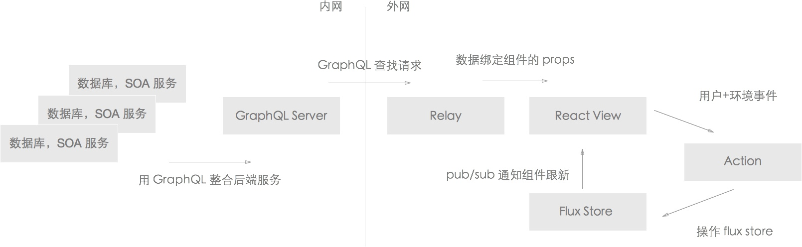

# React 生态圈

第二天课程没有编程练习，只是单纯科普一下响应式设计的思路。觉得太闲的同学可以了解一下 GraphQL 和 Relay。他们分别解决两个不同的问题：

1. GraphQL 服务取代服务器 API。
2. Relay 取代客户端复杂的数据获取和绑定逻辑。

这两项技术很多有趣的想法，但目前还不成熟，建议先观望。

React 只是 View 层。加上 Flux，Relay，GraphQL 这些东西后的架构大概这样：

目前 GraphQL 和 Relay 的官方文档+例子都很渣。最好的学习资源是 ReactEurope 的视频。按下面这个顺序看：

GraphQL 如何替代 REST API：

[Lee Byron - Exploring GraphQL](https://youtu.be/WQLzZf34FJ8)

React 前端对接用 Relay：

[Joseph Savona - Relay](https://youtu.be/IrgHurBjQbg)

GraphQL 只是 API，如何对接数据和内部服务：

[Creating a GraphQL Server](https://youtu.be/gY48GW87Feo)