# Getting Started With React Native

In this lesson we are going to get React Native up and running. It's a tedious process to get everything installed, and you'd probably trip up by missing environmental variables here and there...

Once you've got it all working, it's a fabulous development environment.

# Setup Xcode and Android SDK

+ [Installing Xcode and Android SDK](installing-xcode-and-android)

# Create React Native Project

+ [Create ReactNative Project Quickly](create-react-native-project-quickly)

# Running ReactNative Packager

Instead of using an existing tool like Webpack, ReactNative has its own project building tool. Thankfully you can use the tool right out of the box-- there is no setting up necessary.

The ReactNative build tool is called the packager. It has some features that are the same as Webpack:

+ ES6 support.
+ Modules bundling.
+ Source map for debugging.

And it has some features specifically built for ReactNative development:

+ Loading platform specific source files. (i.e. `foo.android.js` and `foo.ios.js`)
+ Static image assets for apps.
+ Live-reload.

In development mode the packager is a web server, and your ReactNative app loads the bundled JavaScript project from the packager by making a web request:

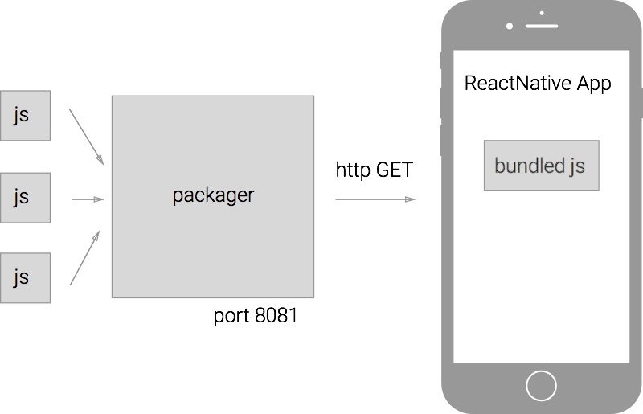

By default the packager will listen on port 8081. To start the packager, run the following command at the root of the project:

```
$ react-native start
 ┌────────────────────────────────────────────────────────────────────────────┐
 │  Running packager on port 8081.                                            │
 │                                                                            │
 │  Keep this packager running while developing on any JS projects. Feel      │
 │  free to close this tab and run your own packager instance if you          │
 │  prefer.                                                                   │
 │                                                                            │
 │  https://github.com/facebook/react-native                                  │
 │                                                                            │
 └────────────────────────────────────────────────────────────────────────────┘
Looking for JS files in
   ~/projects/Timer

[9:49:16 PM] <START> Building Dependency Graph
[9:49:16 PM] <START> Crawling File System
[9:49:16 PM] <START> Loading bundles layout
[9:49:16 PM] <END>   Loading bundles layout (0ms)

React packager ready.

[9:49:20 PM] <END>   Crawling File System (3956ms)
[9:49:20 PM] <START> Building in-memory fs for JavaScript
[9:49:23 PM] <END>   Building in-memory fs for JavaScript (3026ms)
[9:49:23 PM] <START> Building in-memory fs for Assets
[9:49:27 PM] <END>   Building in-memory fs for Assets (3447ms)
[9:49:27 PM] <START> Building Haste Map
[9:49:29 PM] <START> Building (deprecated) Asset Map
[9:49:30 PM] <END>   Building (deprecated) Asset Map (1104ms)
[9:49:31 PM] <END>   Building Haste Map (4003ms)
[9:49:31 PM] <END>   Building Dependency Graph (14440ms)
```

Test to see if you can get the bundled project from the packager:

```js
# Download the iOS project for development mode
$ curl "http://localhost:8081/index.ios.bundle?platform=ios&dev=true"
if(componentOrElement==null){
return null;}

if(componentOrElement.nodeType===1){
return componentOrElement;}

if(ReactInstanceMap.has(componentOrElement)){
return ReactMount.getNodeFromInstance(componentOrElement);}

invariant(
componentOrElement.render==null||
typeof componentOrElement.render!=='function',
'findDOMNode was called on an unmounted component.');

invariant(
false,
'Element appears to be neither ReactComponent nor DOMNode (keys: %s)',
Object.keys(componentOrElement));}


module.exports=findDOMNode;
});
;require("InitializeJavaScriptAppEngine");
;require("App/index.ios.js");
...
```

You can change the URL query parameters to download a different version of the project. If you want the production build for iOS:

```
curl "http://localhost:8081/index.ios.bundle?platform=ios&dev=false"
```

If we want the Android project:

```
curl "http://localhost:8081/index.android.bundle?platform=android&dev=true"
```

### Running ReactNative iOS

Open the Xcode project and run the app, you should see:

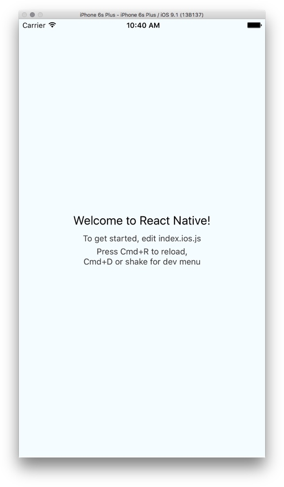

In `AppDelegate.m` you'd see that the app is configured to load the project bundle from `localhost:8081`:

```objc
NSURL *jsCodeLocation;

jsCodeLocation =
  [NSURL URLWithString:@"http://localhost:8081/index.ios.bundle?platform=ios&dev=true"];

RCTRootView *rootView = [[RCTRootView alloc] initWithBundleURL:jsCodeLocation
                                                    moduleName:@"App"
                                             initialProperties:nil
                                                 launchOptions:launchOptions];
```

For production (later), we'll need to configure the app to load from static resource that's bundled with the app itself.

### Running ReactNative Android

You can run the Android app from Android Studio, or you can use the command line tool:

```
$ react-native run-android
JS server already running.
Building and installing the app on the device (cd android && ./gradlew installDebug)...
:app:preBuild
:app:preDebugBuild
:app:checkDebugManifest
:app:preReleaseBuild
...
:app:assembleDebug
:app:installDebug
Installing APK 'app-debug.apk' on 'Google Nexus 5 - 5.1.0 - API 22 - 1080x1920 - 5.1'
Installed on 1 device.

BUILD SUCCESSFUL

Total time: 2 mins 7.441 secs

Starting the app (/Users/howard/Library/Android/sdk/platform-tools/adb shell am start -n com.app/.MainActivity)...
Starting: Intent { cmp=com.app/.MainActivity }
```

The `run-android` command is essentially invoking "gradlew", the official Android build tool to compile and deploy the app.

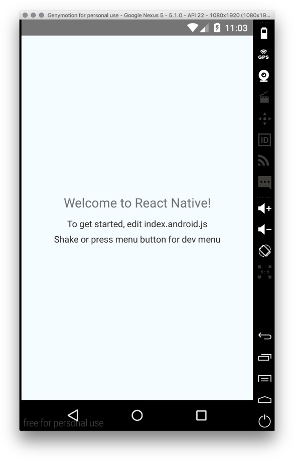

# ReactNative Development Tools

ReactNative has excellent development tools to make you more productive.

### Live Reload

For even a small to medium sized project, it could take a painful 30~60 seconds to rebuild an app to test the changes you've made. ReactNative's packager is fast, so you can see the changes you've made instantaneously.

For iOS, Hit `cmd-d` to bring up the dev menu, and enable live reload.

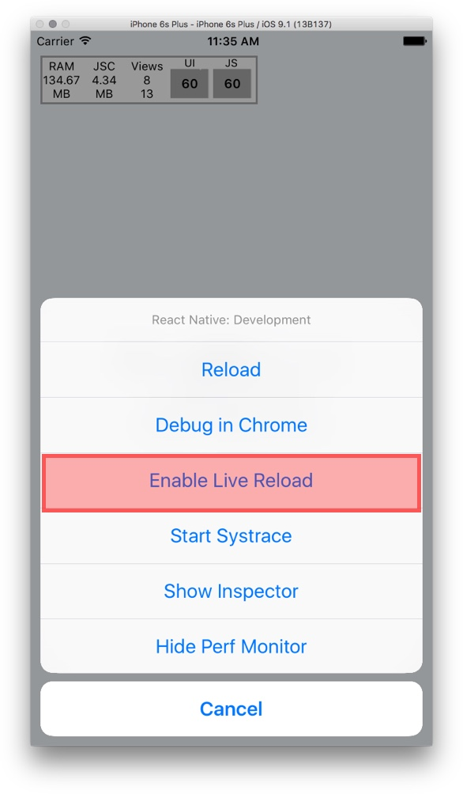

Try making changes to `index.ios.js`, you should see the new result immediately.

To enable live-reload for Android:

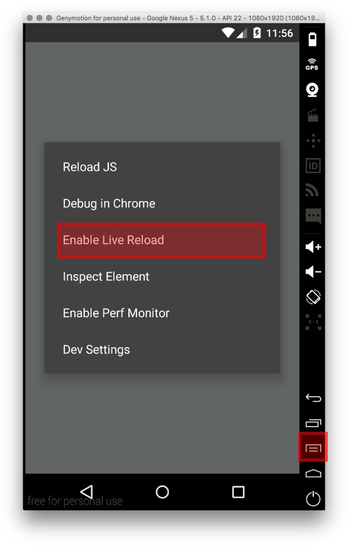

Try making changes to `index.android.js`, you should see the new result immediately.

### console.log

Let's try to log "Hello React" once every second, and see where it goes. Add to both `index.ios.js` and `index.android.js`:

```js
setInterval(() => {
  console.log("Hello React:" + new Date());
},1000);
```

In Xcode you should see:

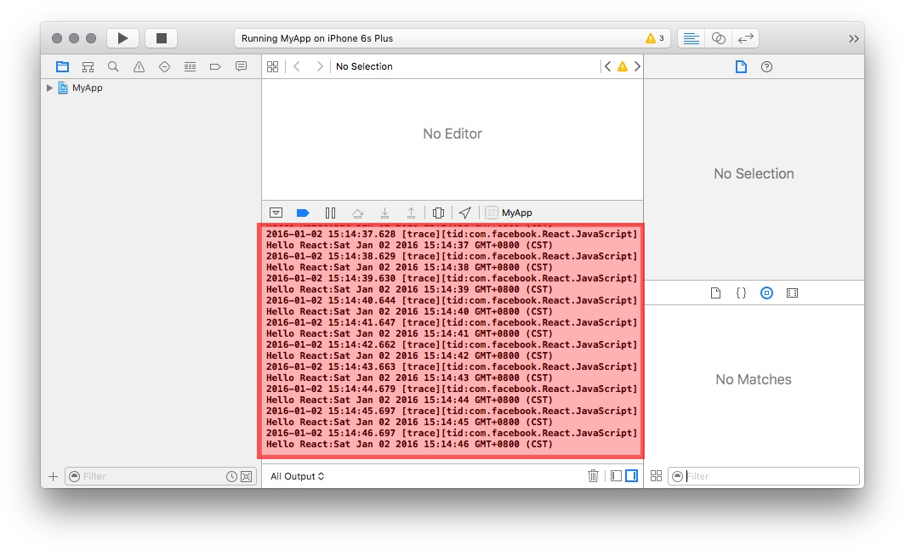

For Android, use the `adb logcat` command to dump logs from device.

+ The `-s` option is a filter to select only log entries emitted by ReactNative.
+ The adb command is at `$ANDROID_HOME/platform-tools`. You can add this directory to your `$PATH`.

```
$ adb logcat -s ReactNativeJS:V
I/ReactNativeJS( 1996): Hello React:Sat Jan 02 2016 02:34:13 GMT-0500 (EST)
I/ReactNativeJS( 1996): Hello React:Sat Jan 02 2016 02:34:14 GMT-0500 (EST)
I/ReactNativeJS( 1996): Hello React:Sat Jan 02 2016 02:34:15 GMT-0500 (EST)
I/ReactNativeJS( 1996): Hello React:Sat Jan 02 2016 02:34:16 GMT-0500 (EST)
I/ReactNativeJS( 1996): Hello React:Sat Jan 02 2016 02:34:17 GMT-0500 (EST)
I/ReactNativeJS( 1996): Hello React:Sat Jan 02 2016 02:34:18 GMT-0500 (EST)
...
```

If you use Android Studio to run the project, you can find the log here:

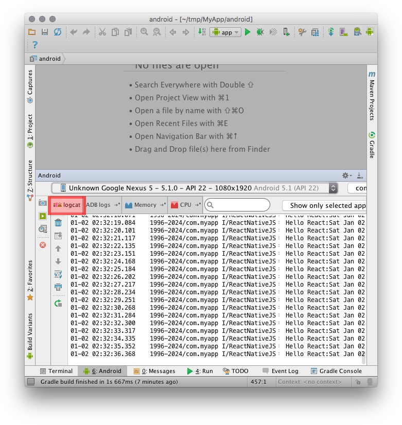

### Error Screen

If your app throws an error, ReactNative shows you the famous "Red Screen of Death" (instead of crashing).

Try throwing an error in the render method:

```js
render: function() {
  throw new Error("boom!");
}
```

You should see the error stacktrace. It tells you the exact line and file where the error originated. This stacktrace is often enough to help you pinpoint the error.

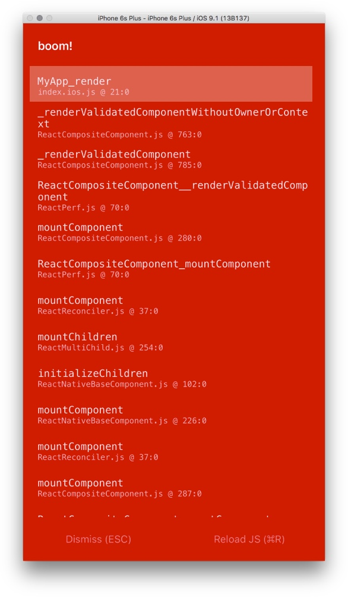

Try Android.

### Debugging

The debugger is not just useful for debugging.

Frequently the ReactNative documentation may not be detailed enough, and reading the source code may be the best way to understand how something works. The debugger can be a powerful aid, taking you step by step through the source code.

(Enabling the debugger will make your app much slower, so remember to disable it when you are done.)

Enable the debugger from the development menu:

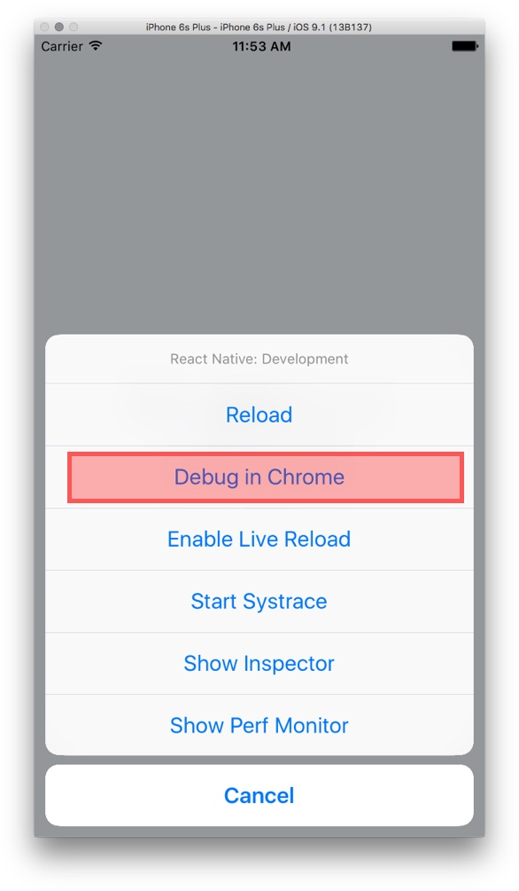

A Chrome window will pop open. Next, open the Chrome debugger:

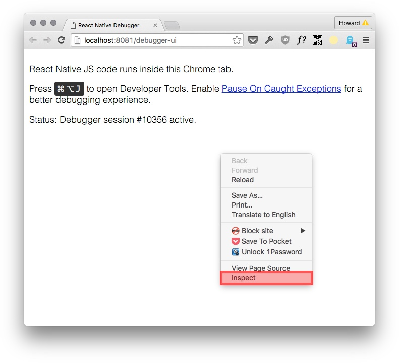

Let's try setting a breakpoint.

1. Go to the `Sources` tab.
2. Find `index.ios.js`.
3. Set a breakpoint at the `render` method.
4. `Cmd-R` to reload the app, so we trigger the breakpoint.
5. The app should pause.

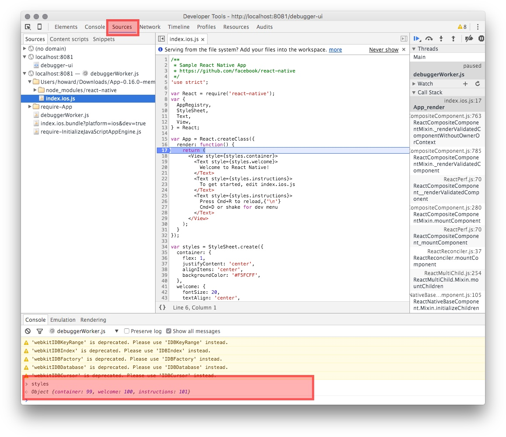

You can examine the variables, or evaluating JavaScript. Evaluating `styles` should return:

```js
Object {container: 99, welcome: 100, instructions: 101}
```

So the `StyleSheet.create` method replaces the style objects with integer IDs!

# Summary

+ `react-native start` to start the project packager.
+ Enable live-reload to speed up development.
+ console.log goes to the system log (Xcode or `adb logcat`).
