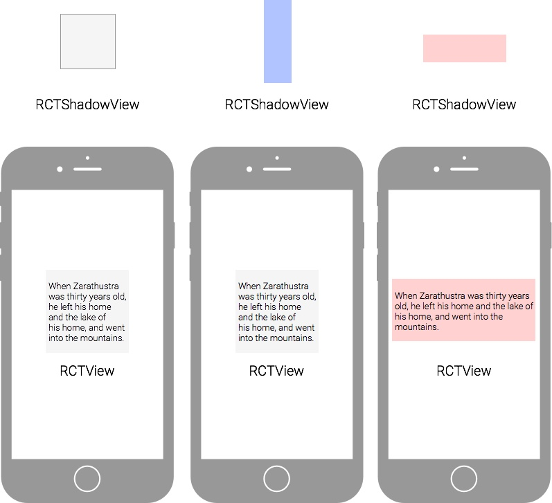
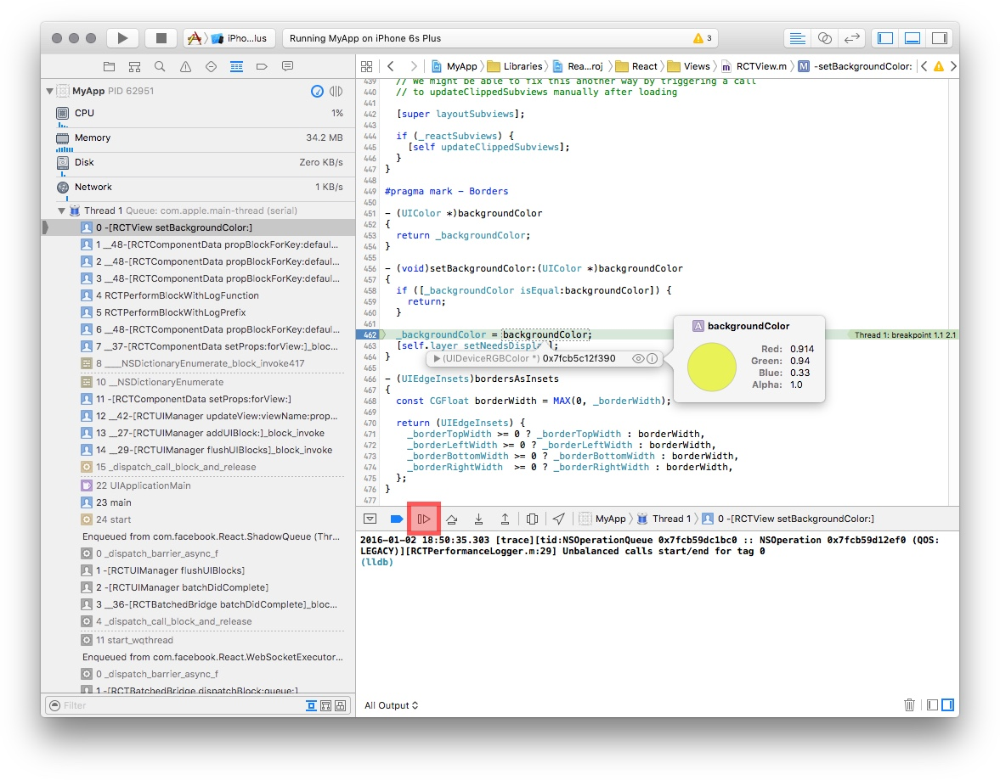
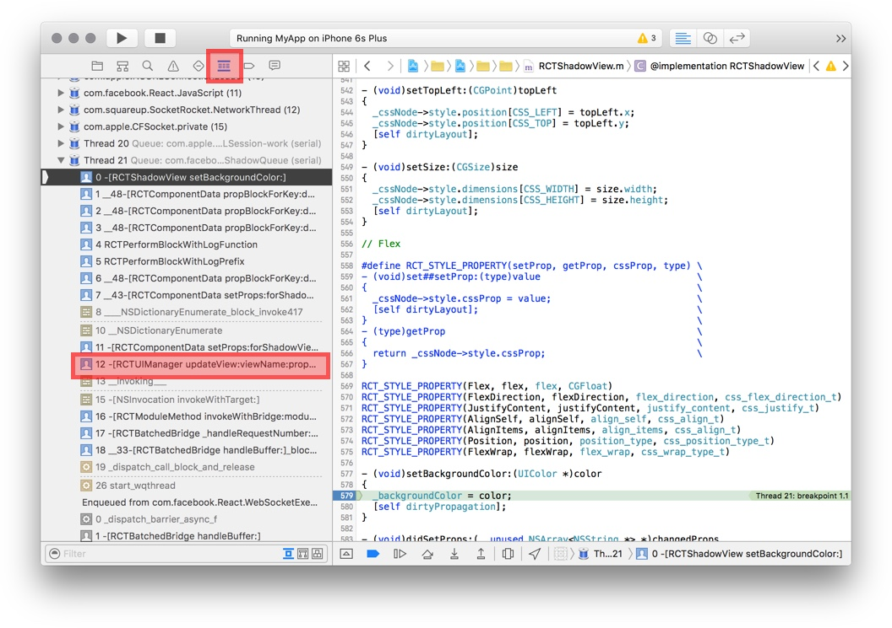
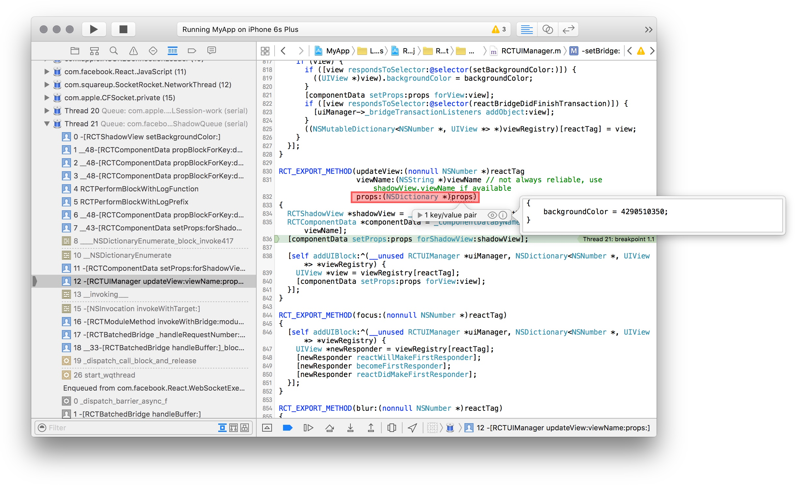
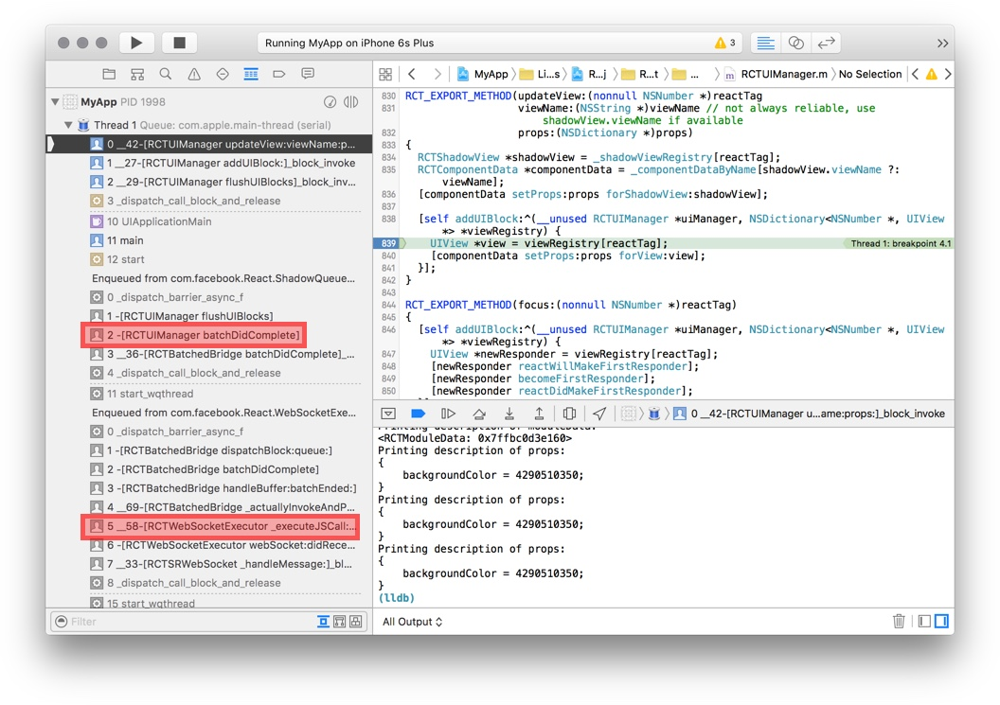
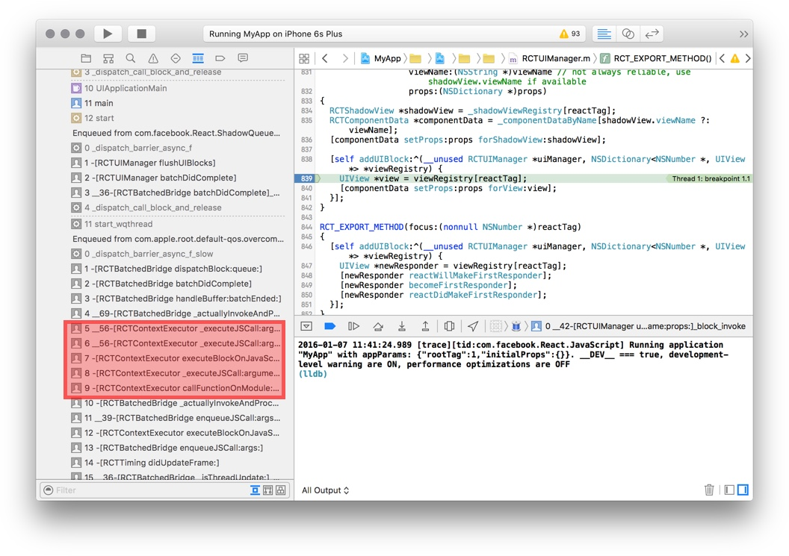
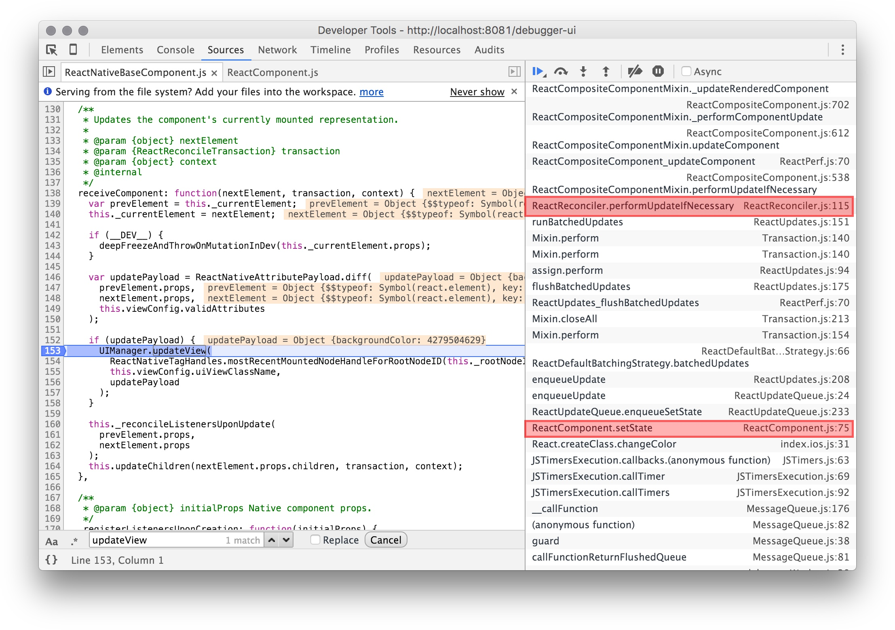

# The ReactNative Update Cycle

ReactNative really is native! There is no browser/webview and there is no DOM.

When you set the properties of a View component in React, the values go to the native side through a bridge, and update the associated native view.


In order to keep the UI smooth, it's important to avoid doing too much work on the UI thread. Otherwise the UI could stutter. For this reason, the bridge processes UI changes asynchronously in its own thread to avoid slowing down the UI thread.

Careful coordination of the UI thread with worker threads is a difficult problem, but is essential for building a performant app. With ReactNative, the bridge does the hard work, and you get smooth UI updates for free!

The update cycle goes roughly as follows.

**JavaScript Side:**

1. Component setState triggers update.
2. React reconciliation to figure out what changed.
3. Sends updates to the Native side by calling `UIManager.updateView`.
  + React web would update the DOM instead.

**JS-Native Bridge:**

1. The bridge processes the native call asynchronously.
2. The bridge converts JSON to native data type.

**Native Side:**

1. The shadow views are updated first, to avoiding changing the views.
2. At the end of an update cycle, just before the screen refreshes, the actual views are updated.

And after all this, the screen finally changes!

### Why Shadow View?

Shadow views are used to avoid unnecessary calculation of layout.

Because updates are processed in batches by the bridge, in one update cycle there could be more than one updates to the same view. For example, in one update cycle, we could:

1. Set a textbox to be a vertical rectangle (blue background).
2. Set a textbox to be a horizontal rectangle (red background).

Both of these updates changes the shadow view, which are simple data object holding the properties of the view. It is cheap to change them.

Only the last update changes the actual view view, and the text would reflow only once (not twice):



In this example the updates are made to the same view. But layout may depends on many views, we'd want to wait until all the updates have been made to the shadow views, and calculate layout **once** at the very end.

This mechanism is similar to a DOM performance optimization technique to avoid redundant layout. See [Preventing 'layout thrashing'](http://wilsonpage.co.uk/preventing-layout-thrashing/).

The three native classes that are reponsible for this mechanism are:

1. `RCTView` - It is a subclass of the [iOS UIView](https://developer.apple.com/library/ios/documentation/WindowsViews/Conceptual/ViewPG_iPhoneOS/WindowsandViews/WindowsandViews.html). Changing its property changes the UI.
2. `RCTShadowView` - Every `RCTView` has a shadow view.
3. `RCTUIManager` - Manages the view hierarchy by adding and removing children. Calculates layout. Keeping shadow view hierarchy and the actual view hierarchy in sync. This is the UI engine of ReactNative.

# Tracing The Update Cycle

Now let's use the debugger to trace through an update cycle to see how a change you make eventually updates a native view.

Don't worry if how the code works seems a bit hazy. The goal is to make you comfortable with digging through native code.

We'll go through the update cycle backward, from the native view back to the JavaScript React component.

The simple demo we will trace changes the background to a random color every second:

<video src="demo-background-disco.mp4" controls='true'></video>

Paste the following code into your project:

```js
function randomColor() {
  return '#'+Math.random().toString(16).substr(-6);
}

var MyApp = React.createClass({
  componentDidMount() {
    setInterval(this.changeColor,1000);
  },

  getInitialState() {
    return {
      backgroundColor: randomColor(),
    };
  },

  changeColor() {
    this.setState({backgroundColor: randomColor()});
  },

  render: function() {
    const {backgroundColor} = this.state;

    return (
      <View style={[styles.container,{backgroundColor}]}>
        <Text>Hello React</Text>
      </View>
    );
  }
});
```

### Exercise: Tracing RCTView in Xcode

First we pause at RCTView, the end of the update cycle.

Set a breakpoint at `setBackgroundColor` method in `RCTView.m`. Use the `cmd-shift-o` keyboard shortcut.

<video src="finding-file-setting-breakpoing.mp4" controls="true"></video>

+ Hover over the `backgroundColor` variable, you should see an UIColor object.



Disable the breakpoint and continue execution.

### Exercise: Tracing RCTShadowView

+ Set a breakpoint at `-[RCTShadowView setBackgroundColor:(UIColor *)color]`. `
 + Hint: `cmd-shift-o`.

Since RCTShadowView is a simple data object, there is just a write to the property `_backgroundColor`. Nothing much to see.

The stacktrace, however, gives you a list of possibly interesting classes. It's useful to click through each method call in the stacktrace to discover important classes. Digging through the code this way is much more efficient than randomly opening source files.

At 12, we see RCTUIManager:



Question: Take a look at the method `dirtyPropogation`. `cmd-click` on the method name to jump to it. What does it do?

### Exercise: Tracing RCTUIManager

So we've seen RCTUIManager in the stacktrace  (this is how I discovered RCTUIManager). There is where the magic comes together.

The method we are interested in is:


```objc
RCT_EXPORT_METHOD(updateView:(nonnull NSNumber *)reactTag
                  viewName:(NSString *)viewName
                  props:(NSDictionary *)props)
```

The `RCT_EXPORT_METHOD` macro allows JavaScript to call this method through the bridge.

1. Set a breakpoint. It's just a normal Objective-C method, so in Xcode you can still use `cmd-shift-o` to find it by name. See [Native Modules iOS](https://facebook.github.io/react-native/docs/native-modules-ios.html).
2. Inspect the `props` argument.



The code is as follows:

```objc
// Sets RCTShadowView
RCTShadowView *shadowView = _shadowViewRegistry[reactTag];
RCTComponentData *componentData = _componentDataByName[shadowView.viewName ?: viewName];
[componentData setProps:props forShadowView:shadowView];

[self addUIBlock:^(__unused RCTUIManager *uiManager, NSDictionary<NSNumber *, UIView *> *viewRegistry) {
  // Sets RCTView. Later.
  UIView *view = viewRegistry[reactTag];
  [componentData setProps:props forView:view];
}];
```

If ObjectiveC looks like gibberish to you... here's pseudo code in JS:

```
/**
  @param reactTag (number) Each React component has a unique ID.
  @param viewName (string) The name of a component. e.g. "ScrollView".
  @param props (JSON) Properties to set.
*/
function updateview(reactTag,viewName,props) {
  // This object converts JSON to native types. One per component class.
  let componentData = this.dataConverterForComponent(viewName);

  let shadowView = this.findShadowView(reactTag);
  componentData.setProps(props,shadowView);

  this.addUIBlock(() => {
    let view = this.findNativeView(reactTag);
    componentData.setProps(props,view);
  });
}
```

So this method updates the shadow view, then adds a callback to update the native view some time later.

### Exercise: Tracing JS-Native Bridge

Let's see when exactly the addUIBlock callback gets called.

+ Set a breakpoint inside the UI block.

You should see:



At the end of the update cycle, `batchDidComplete` is called:


```
- (void)batchDidComplete
{
  // Set up next layout animation
  ...
  // Perform layout
  ...
  // Clear layout animation
  ...
  // Update native views
  [self flushUIBlocks];
}
```

Further up the stack trace, we see the JS call!

```
[RCTWebSocketExecutor _executeJSCall:
        (NSString *) method
        arguments:(NSArray *) arguments
        callback:(RCTJavaScriptCallback) onComplete]
```

WebSocket? That's strange.

Normally JavaScript runs inside the app. Because we've opened the debugger, the JavaScript actually runs in the browser, communicating with the native side through a web socket.

With the JavaScript debugger disabled, you should see RCTContextExecutor instead. This uses the native JavaScript engine.



Pretty cool right?

### Exercise: Search Code With Ack

Another useful trick to find interesting classes is to use the `ack` command to search through the code.

Reading [Native Modules iOS](https://facebook.github.io/react-native/docs/native-modules-ios.html), we know that the JavaScript side calls RCTUIManager like this:

```js
UIManager.updateView(...)
```

Knowing what to search for is the hard part.

+ Use `ack` to find everywhere the method call appears. It may take ~10 seconds to finish.

```
$ ack 'UIManager\.updateView' node_modules/react-native
node_modules/react-native/Libraries/ReactIOS/NativeMethodsMixin.js
123:    UIManager.updateView(

node_modules/react-native/Libraries/ReactNative/ReactNativeBaseComponent.js
153:      UIManager.updateView(

node_modules/react-native/Libraries/ReactNative/ReactNativeTextComponent.js
60:        UIManager.updateView(

node_modules/react-native/Libraries/ReactNative/UIManagerStatTracker.js
41:    var updateViewOrig = UIManager.updateView;
42:    UIManager.updateView = function(tag, className, props) {
```

At this point, you'd simply look at each one of these files. It turns out that `ReactNativeBaseComponent` is the one we are interested in.

<video src="ReactNativeBaseComponent-breakpoint.mp4" controls="true"></video>

You can see that the `updatePayload` variable is the `props` argument being sent to RCTUIManager.

Again, we can look at the stack trace to find interesting stuff.



These calls seem interesting...

+ ReactReconciler.performUpdateIfNecessary
+ ReactUpdateQueue.enqueueSetState
+ ReactComponent.setState

The class name `ReactUpdateQueue` suggest that there's a queue in the system. Like the native side, updates at JavaScript side are also processed in batches.

And look, we are back at setState!

## Bonus: Tracing Android

If you feel adventurous, you could try to trace the update cycle in Android Studio (or in your favourite IDE).

You can start by finding the `updateView` method of `com.facebook.react.uimanager.UIImplementation`:

<video src="AndroidStudio-find-updateView.mp4" controls="true"></video>

# Testing On Real Device

You should start testing on real devices as soon as possible, for two reasons:

1. To make sure that the app feels smooth.
2. Clicking buttons in the emulator dosen't give you an adequate sense of what the app feels like.

And also, hardware features (e.g. camera) only work on a real device...

[Running on iPhone](https://facebook.github.io/react-native/docs/running-on-device-ios.html#content)

[Running on Android](https://facebook.github.io/react-native/docs/running-on-device-android.html#content)

# Summary

We've got ReactNative running, yay!

You should be familiar with the development environment:

+ The packager is the JavaScript project builder.
+ Use live-reload to develop app.
+ Be familiar with both the Xcode debugger and Chrome debugger.

You should know how an update cycle works:

+ RCTShadowView helps to prevent unnecessary layout.
+ Component updates are queued, and processed asynchronously in batches.
+ The JavaScript debugger runs in the browser, and communicates with the native side through websocket.

