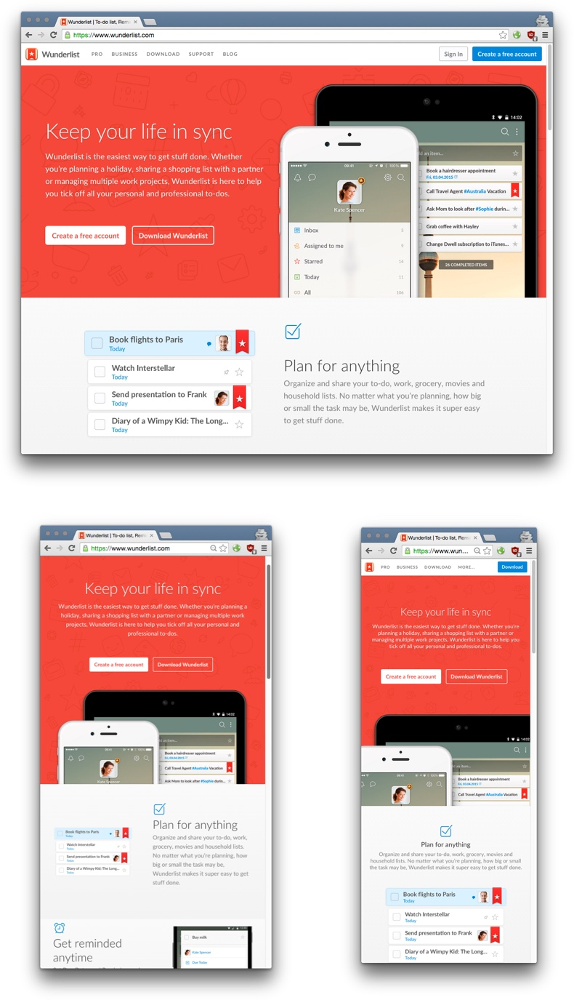
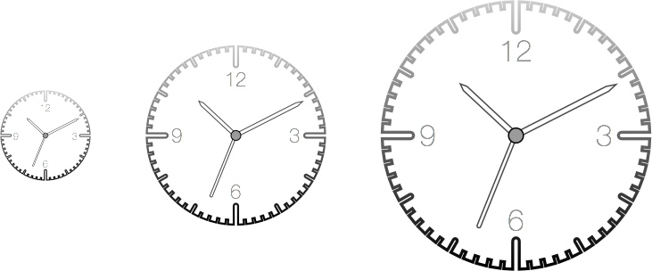
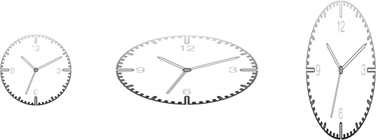
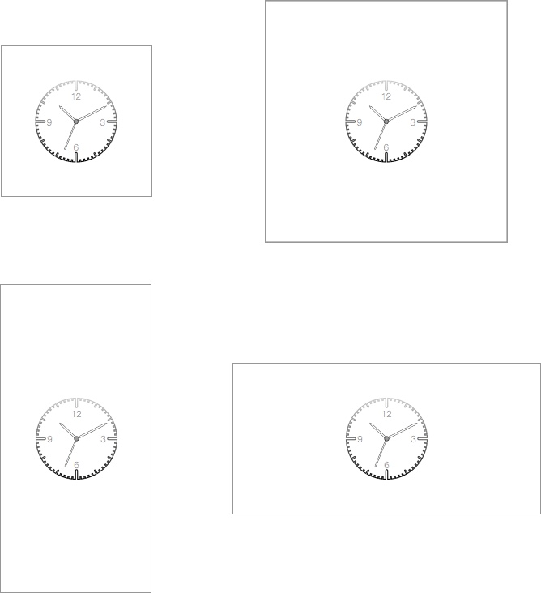
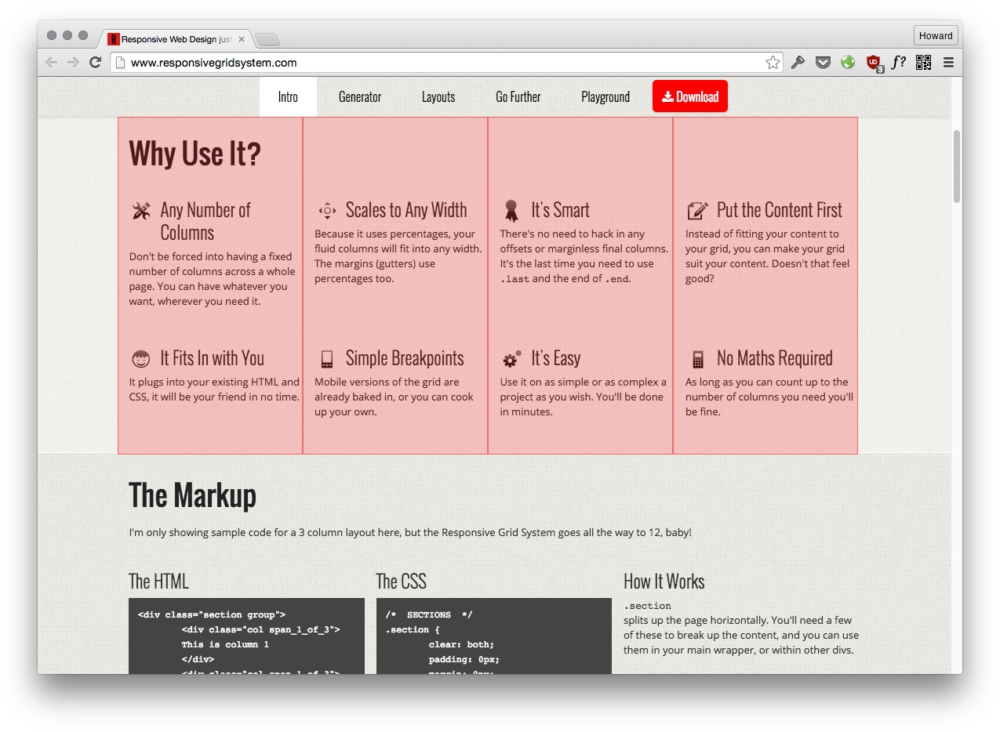
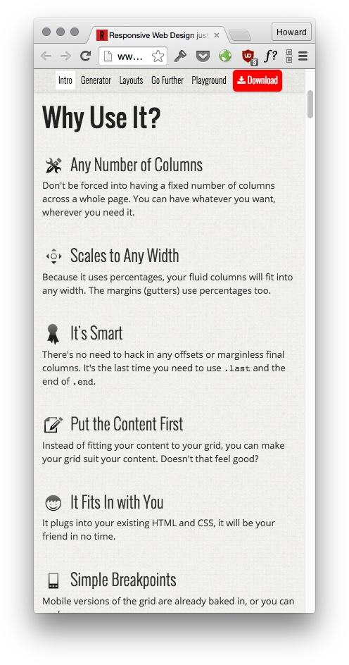
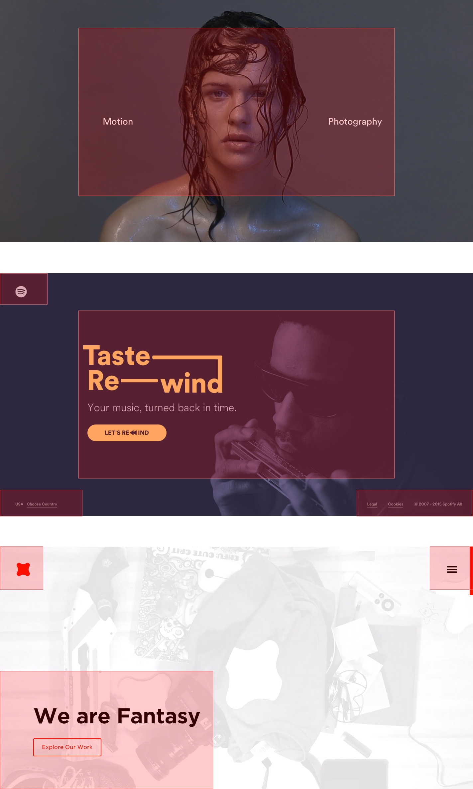
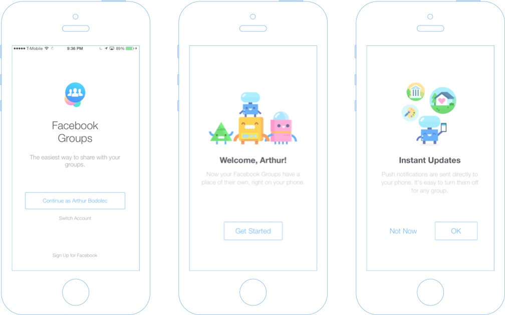

# What Is Responsive Design?

When you get a design from a designer to implement, it's usually fixed to a particular width. At best, the designer might provide you with several versions of the same design at different widths and heights:

<cn>

# 响应式设计是什么？

当你从一位设计师哪里得到一份设计去实现的时候，它经常被固定到一个特别的宽度。最好的情况是，设计师可以提供给你同一设计的不同宽度和高度的几个版本。

</cn>

(Design By [Wunderlist](https://www.wunderlist.com))

<cn>

（由 [Wunderlist](https://www.wunderlist.com) 设计）

</cn>

But the static design is never enough. You need to figure out what the design should look like for *every* possible widths and heights:

<video src="wunderlist-resize.mp4"></video>
女士
<cn>

但是静态设计远远不够。你需要弄清设计在每个可能的宽度和高度下的样子。

<video src="wunderlist-resize.mp4"></video>

</cn>

That's why it's important for us to understand the ideas behind a responsive design, not just the implementation techniques.

Let's use a clock as an example. A clock is scalable. You can make it as big as you like, and it looks fine:

<cn>

这就是为什么对我们来说，理解响应式设计背后的思想很重要，而不只是实现技术。

咱们用一个时钟作为例子。时钟是可缩放的。你可以随心所欲地让它变大，而且它看起来不错：

</cn>

But responsive design isn't just about making the clock bigger or smaller as necessary. If the height and the width of the screen are not the same, the clock is skewed:

<cn>

但是响应式设计不只是关于根据需求让时钟变大或变小。如果屏幕的长宽不同，时钟就扭曲了：

</cn>

The simplest way to make this a responsive design is to put the clock right at the center for any width or height:

The key idea behind this responsive design strategy is "centering". It doesn't matter what the size of the clock is. There are, of course, many other responsive design strategies other than centering.

<cn>

最简单创造响应式设计的方法是把时钟正好放在任意宽高的中央：

这种响应式设计策略背后的关键思想是“居中”。时钟的大小无所谓。当然，除了居中之外，还有很多其他的响应式设计策略。

</cn>

### The Responsive Elevator Metaphor

<cn>

### 用电梯来比喻响应式设计

</cn>

Responsive design is about arranging objects neatly given any amount of space. That's a pretty abstract idea, so we'll use a real world metaphor to illustrate it. Let's start with an empty elevator:

<cn>

响应式设计就是在可任意变大变小的空间里整齐地布置物件。这是个相当抽象的概念，因此我们会用一个现实世界的比喻来说明。让我们从一个空电梯开始：

</cn>

The first guy that comes in would stand right in the middle ("it's all mine!"):

<cn>

第一个来的家伙会正好站在中间（“这里都是我的！”）：

</cn>

Another guy comes in, they'd want to put as much distance as possible between each other ("stay away from me..."):

·

<cn>

另外一个家伙进来了，他们会在彼此之间留尽可能多的距离（“离我远点...”）：

</cn>

A women comes in, because the elevator is pretty small, she feels more comfortable standing in the corner. The guys, out of courtesy, move back to give her more space:

<cn>

一位男士进来了，因为这台电梯相当小，她觉得站在角落里更舒服一些。男士们出于礼貌，后退给她更多空间：

</cn>

If the elevator magically becomes wider, she might decide to stand between the two guys, because there's now more space:

This is what responsive design is like. As the size of the screen (elevator) changes, the objects in it arrange themselves to "feel comfortable".

<cn>

如果电梯神奇地变宽了，她可能决定站在两个男士之间，因为现在有更多的空间了：

这就是响应式设计的样子。当屏幕（电梯）的大小改变的时候，里面的物件重新排列，从而“觉得舒服”。

</cn>

# Responsive Design Methods

There are 2 popular methods to create reponsive designs. One is to design with a grid system, and the other is full-page design.

<cn>

# 响应式设计方法

有两种有流行的方法来创造响应式设计。一种是用网格系统（grid system）来设计，另一种是整版（full-page）设计。

</cn>

## Responsive Grid

A responsive grid is easy to use. A popular frontend framework like Bootstrap would have a responsive grid system built in. To design with it,  fill your grid as you would fill a bookshelf:

(Source: [Responsive Grid System](http://www.responsivegridsystem.com/))

<cn>

## 响应式网格（Responsive Grid）

响应式网格很易用。类似 Bootstrap 的流行前端框架会有内建的响应式网格系统。设计的方法，就是像填满一个书架一样填满你的网格。

（资源： [Responsive Grid System](http://www.responsivegridsystem.com/)）

</cn>

As the size of the window changes, the width of the grid columns changes, resizing the items in the grid. There is usually a maximum width to prevent the columns from getting too wide.

<video src="responsive-grid-resize.mp4" controls></video>

<cn>

窗口尺寸改变时，网格列的宽度也改变了，同时调整了网格中项目的大小。经常有一个最大宽度来避免这些列变得太宽。

<video src="responsive-grid-resize.mp4" controls></video>

</cn>

Also, grid design originated from the print world. The printed page is usually 12 columns (12 is easy to divide into 2, 3, 4, 6 equal parts). That's fine if you have enough space for 12 columns, for example on the desktop, tablet, or in a printed book.

On mobile though, the screen is not wide enough for multiple columns, so the grid system degenerates to one single column, and everything is stacked vertically:

<cn>

而且，网格设计起源于印刷界。印刷的页面经常有 12 个列（12 很容易被分成 2，3，4，6 等份）。如果你有容得下 12 列的空间，那就没问题，比如在桌面端，平板电脑上或者在一本印刷书籍上。

可是在移动端上，屏幕就没有容得下多个列的足够宽度了，因此网格系统退化为单栏，每个东西都垂直堆放：

</cn>

Because responsive grid systems are super popular for the web, and most these grid systems degenerate to one single column on mobile, the mobile web experience is often uninspired.

A responsive grid design is suitable for information-rich pages. But if not used well, the grid underlying the design can show through, making your page seems stiff, rigid, and blocky, like a brick wall.

<cn>

因为响应式网格系统在 web 领域特别流行，而且在移动端大多数响应式网格系统退化成了单栏，移动端的 web 体验经常很没创意。

响应式网格设计适合信息丰富的页面，但是如果用不好，背后的网格就会显露出来，使得你的网页看起来呆板，僵化，块状，犹如一道砖墙。

</cn>

## Full Page Design

Another popular method for responsive design is to divide your content into pages, and for each page fill the entire screen. It's like designing for a PowerPoint presentation.

<video src="fullpage-demo.mp4" controls></video>

(Source: [TakeIt](http://www.takeitapp.co/en))

<cn>

## 整版设计

另一种流行的响应式设计方法是，把你的内容分成几页，每一页填满整个屏幕。这就像设计 PowerPoint 演示一样。

<video src="fullpage-demo.mp4" controls></video>

(资源： [TakeIt](http://www.takeitapp.co/en))

</cn>

These pages usually have very little content in them. A page may only have a title, 2~3 lines of text, and a few buttons. Everything is either centered, or stuck to the edge of the screen:

Sources

+ [Christopher Ireland](http://christopherireland.net/)
+ [Spotify - Taste Rewind](http://spotify-tasterewind.com/)
+ [Fantasy.co](http://fantasy.co/)

<cn>

这些页面通常没啥内容。页面可能只有一个标题，2~3 行文字，和几个按钮。每个物件都被居中，或者贴到屏幕边缘上。

资源

+ [Christopher Ireland](http://christopherireland.net/)
+ [Spotify - Taste Rewind](http://spotify-tasterewind.com/)
+ [Fantasy.co](http://fantasy.co/)

</cn>

There is usually not much you need to do to make these pages responsive. One common adjustment for smaller screen sizes is using a smaller font-sizes title and text:

<video src="fantasyco-adjust-title-size.mp4" controls></video>

<cn>

通常你不需要做很多事情来把页面变成响应式的。对于小尺寸屏幕，有一种常见适配方式是使用小字体的标题和文字。

<video src="fantasyco-adjust-title-size.mp4" controls></video>

</cn>

As said previously, the mobile screen is too narrow for grid design. Full page design is frequently used in mobile apps for [user onboarding](http://uxarchive.com/tasks/onboarding) flow:

<cn>

之前有说到，移动端屏幕对网格设计来说太小了。整版设计经常被用在移动应用 [新用户引导](http://uxarchive.com/tasks/onboarding) 界面上：

（资源： Facebook Groups）

</cn>

A great full page design is from [notion.so](http://early-access.notion.so/):

<video src="notion-so-demo.mp4" controls></video>

Each section is the same width and height of the window, but the designer chose to allow you to scroll the page like a normal web page. The simplicity of the design does not distract, but help to focus your attention on the product itself.

<cn>

一个来自 [notion.so](http://early-access.notion.so/) 优秀的整版设计:

<video src="notion-so-demo.mp4" controls></video>

每个部分都和窗口的宽高相同，但是设计师选择允许你像滚动普通网页一样滚动页面。这种设计的简化并没有引起混乱，反而帮助你把注意力集中在产品本身上。

</cn>

